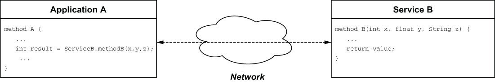
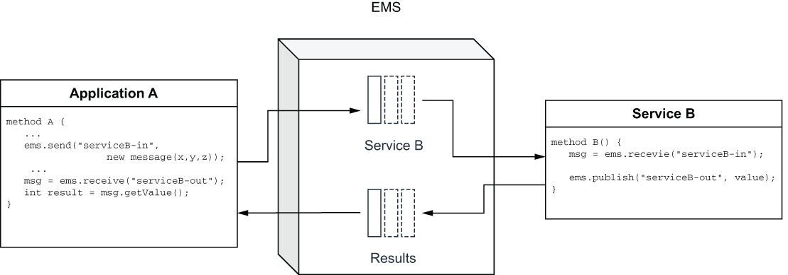

## 1.1 Enterprise messaging systems

*Messaging* is a broad term that is used to describe the routing of data between producers and consumers. Consequently, there are several different technologies and protocols that have evolved over the years that provide this capability. Most people are familiar with messaging systems such as email, text messaging, and instant messaging applications, including WhatsApp and Facebook Messenger. Messaging systems within this category are designed to transmit text data and images over the internet between two or more parties. More-advanced instant messaging systems support Voice over IP (VoIP) and video chat capabilities as well. All of these systems were designed to support person-to-person communication over ad hoc channels.

Another category of messaging system that people are already familiar with is video on demand streaming services, such as Netflix or Hulu, that stream video content to multiple subscribers simultaneously. These video streaming services are examples of one-way broadcast (one message to many consumers) transmissions of data to consumers that subscribe to an existing channel in order to receive the content. While these types of applications might be what comes to mind when using the terms *messaging systems* or *streaming*, for the purposes of this book, we will be focusing on enterprise messaging systems.

An *enterprise messaging system (EMS)* is the software that provides the implementation of various messaging protocols, such as data distribution service (DDS), advanced message queuing protocol (AMQP), Microsoft message queuing (MSMQ), and others. These protocols support the sending and receiving of messages between distributed systems and applications in an asynchronous fashion. However, asynchronous communication wasn’t always an option, particularly during the earliest days of distributed computing when both client/server and remote procedure call (RPC) architectures were the dominant approach. Prime examples of RPC were the simple object access protocol (SOAP) and representational state transfer (REST) based web services that interacted with one another through fixed endpoints. Within both of these styles, when a process wanted to interact with a remote service, it needed to first determine the service’s remote location via a discovery service and then invoke the desired method remotely, using the proper parameters and types, as shown in figure 1.1.

\

Figure 1.1 Within an RPC architecture, an application invokes a procedure on a service that is running on a different host and must wait for that procedure call to return before it can continue processing.

The calling application would then have to wait for the called procedure to return before it could continue processing. The synchronous nature of these architectures made applications based upon them inherently slow. In addition, there was the possibility that the remote service was unavailable for a period of time, which would require the application developer to use defensive programming techniques to identify this condition and react accordingly.

Unlike the point-to-point communication channels used in RPC programming, where you had to wait for the procedure calls to provide a response, an EMS allows remote applications and services to communicate with one another via an intermediate service rather than directly with one another. Rather than having to establish a direct network communication channel between the calling/receiving applications over which the parameters are exchanged, an EMS can be used to retain these parameters in message form, and they are guaranteed to be delivered to the intended recipient for processing. This allows the caller to send its request asynchronously and await a response from the service they were trying to invoke. It also allows the service to communicate its response back in an asynchronous manner as well by publishing its result to the EMS for eventual delivery to the original caller. This decoupling promotes asynchronous application development by providing a standardized, reliable intra-component communication channel that serves as a persistent buffer for handling data, even when some of the components are offline, as you can see in figure 1.2.

\

Figure 1.2 An EMS allows distributed applications and services to exchange information in an asynchronous fashion.

An EMS promotes loosely coupled architectures by allowing independently developed software components that are distributed across different systems to communicate with one another via structured messages. These message schemas are usually defined in language-neutral formats, such as XML, JSON, or Avro IDL, which allows the components to be developed in any programming language that supports those formats.

## 子目录

- [1.1.1 Key capabilities](<1.1-enterprise-messaging-systems/1.1.1-key-capabilities.md>)
