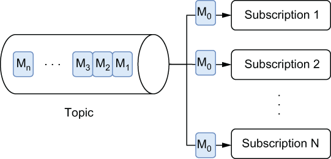

### 1.2.1 Publish-subscribe messaging

In publish and subscribe messaging, producers publish messages to named channels, known as *topics*. Consumers can then subscribe to those topics to receive the incoming messages. A publish-subscribe (pub-sub) message channel receives incoming messages from multiple producers and stores them in the exact order that they arrive. However, it differs from message queuing on the consumption side because it supports multiple consumers receiving each message in a topic via a subscription mechanism, as shown below in figure 1.3.

\

Figure 1.3 With pub-sub message consumption, each message is delivered to each and every subscription that has been established on the topic. In this case, message M0 was delivered to subscriptions through N inclusive.

Publish-subscribe messaging systems are ideally suited for use cases that require multiple consumers to receive each message or those in which the order in which the messages are received and processed is crucial for maintaining a correct system state. Consider the case of a stock price service that can be used by a large number of systems. Not only is it important that these services receive all the messages, but it is also equally important that the price changes arrive in the correct order.
