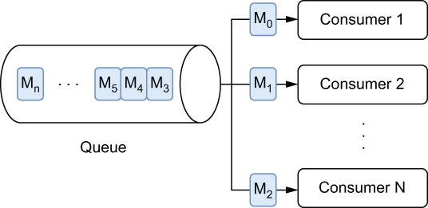

### 1.2.2 Message queuing

Queues, on the other hand, provide first in, first out (FIFO) message delivery semantics to one or more competing consumers, as shown in figure 1.4. With queues, the messages are delivered in the order they are received, and only one message consumer receives and processes an individual message, rather than all of them. These are perfect for queuing up messages that represent events that trigger some work to be performed, such as orders into a fulfillment center for dispatch. In this scenario, you want each order processed just once.

Message queues can easily support higher rates of consumption by scaling up the number of consumers in the event of a high number of backlogged messages. To ensure that a message is processed exactly once, each message must be removed from the queue after it has been successfully processed and acknowledged by the consumer. Due to its exactly-once processing guarantees, message queuing is ideal for work queue use cases.

\

Figure 1.4 With queue-based message consumption, each message is delivered to exactly one consumer. In this case, message M0 was consumed by consumer 1, M1 by consumer 2, etc.

In the event of consumer failures (meaning no acknowledgment is received within a specified timeframe), the message will be resent to another consumer. In such a scenario, the message will most likely be processed out of order. Therefore, message queues are well suited for use cases where it is critical that each message is processed exactly once, but the order in which the messages are processed is not important.
