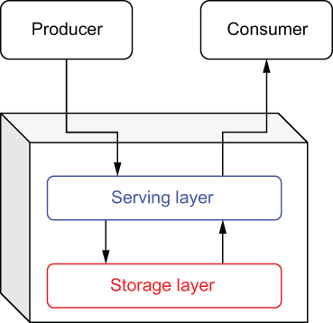

### 1.3.1 Generic messaging systems

Before I jump into specific messaging systems, I wanted to present a simplified representation of a messaging system in order to highlight the underlying components that all messaging systems have. Identifying these core features will provide a basis for comparison between messaging systems over time.

As you can see in figure 1.5, every messaging system consists of two primary layers, each with its own specific responsibilities that we will explore next. We will examine the evolution of messaging systems across each of these layers in order to properly categorize and compare different messaging systems, including Apache Pulsar.

\

Figure 1.5 Every messaging system can be separated into two distinct architectural layers.

Serving layer

The serving layer is a conceptual layer within an EMS that interacts directly with the message producers and consumers. Its primary purpose is to accept incoming messages and route them to one or more destinations. Therefore, it communicates via one or more of the supported messaging protocols, such as DDS, AMQP, or MSMQ. Consequently, this layer is heavily dependent on network bandwidth for communication and CPU for message protocol translation.

Storage layer

The storage layer is the conceptual layer within an EMS that is responsible for the persistence and retrieval of the messages. It interacts directly with the serving layer to provide the requested messages and is responsible for retaining the proper order of the messages. Consequently, this layer is heavily dependent on the disk for message storage.
