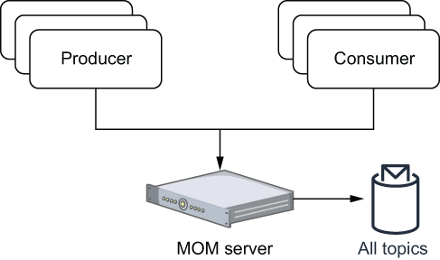
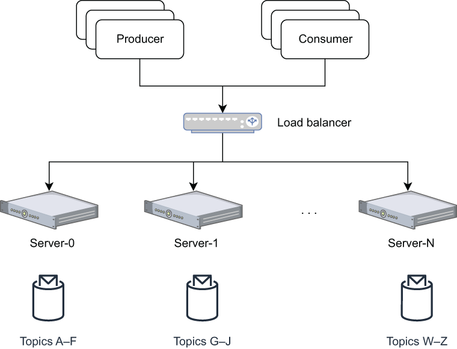

### 1.3.2 Message-oriented middleware

The first category of messaging systems is often referred to as message-oriented middleware (MOM), which was designed to provide inter-process communication and application integration between distributed systems running on different networks and operating systems. One of the most prominent MOM implementations was IBM WebSphere MQ, which debuted in 1993.

The earliest implementations were designed to be deployed on a single machine that was often located deep within the company’s datacenter. Not only was this a single point of failure, it also meant that the scalability of the system was limited to the physical hardware capacity of the host machine because this single server was responsible for handling all client requests and storing all messages, as shown in figure 1.6. The number of concurrent producers and consumers these single-server MOM systems could serve was limited by the bandwidth of the network card, and the storage capacity was limited by the physical disk on the machine.

\

Figure 1.6 Message-oriented middleware was designed to be hosted on a single server and therefore hosted all of the message topics and handled requests from all clients.

To be fair, these limitations were not limited to just IBM, but are rather a limitation of all messaging systems that were designed to be hosted on a single machine, including RabbitMQ and RocketMQ, among many others. In fact, this limitation wasn’t limited to just messaging systems of this era, but rather was pervasive across all types of enterprise software that were designed to run on one physical host.

Clustering

Eventually these scalability issues were addressed though the addition of clustering capabilities to these single-server MOM systems. This allowed multiple single-service instances to share the processing of the messages and provide some load balancing, as shown in figure 1.7. Even though the MOM was clustered, in reality it just meant that each single-service instance was responsible for serving and storing messages for a subset of all the topics. A similar approach, called *sharding*, was taken by relational databases during this period to address this scalability issue.

\

Figure 1.7 Clustering allowed the load to be spread across multiple servers instead of just one. Each server in the cluster was responsible for handling only a portion of the topics.

In the event of topic “hot-spots,” the unlucky server assigned that particular topic could still become a bottleneck or potentially run out of storage capacity as well. In the event that any one of these servers in the cluster were to fail, it would take all of the topics it was serving down with it. While this did minimize the impact of the failure on the cluster as a whole (i.e., it continued to run) it was a single point of failure for the particular topics/queues it was serving.

This limitation required organizations to meticulously monitor their message distribution in order to align their topic distribution to match their underlying physical hardware and ensure that the load was evenly distributed across the cluster. Even then, there was still the possibility that a single topic could be problematic. Consider the scenario where you work for a major financial institution, and you want a single topic to store all the trade information for a particular stock and provide this information to all the trade desk applications within your organization. The sheer number of consumers and volume of data for this one topic could easily overwhelm a single server that was dedicated to serving just that topic. What was needed in such a scenario was the ability to distribute the load of a single topic across multiple machines, which, as we shall see, is exactly what distributed messaging systems do.
