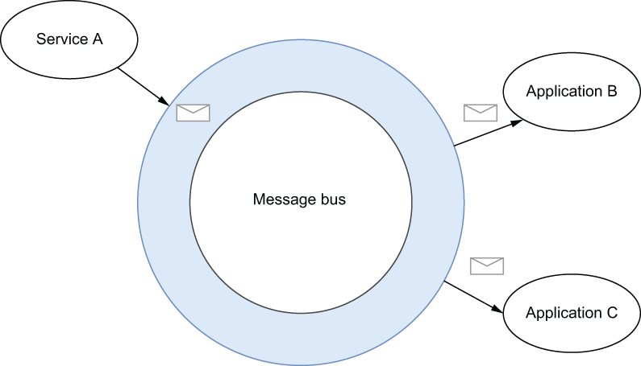
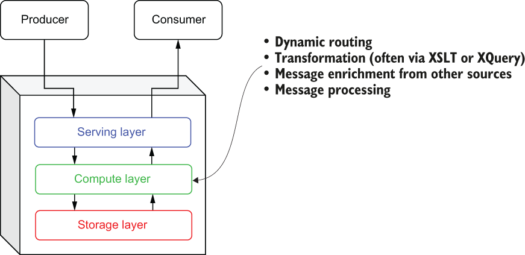
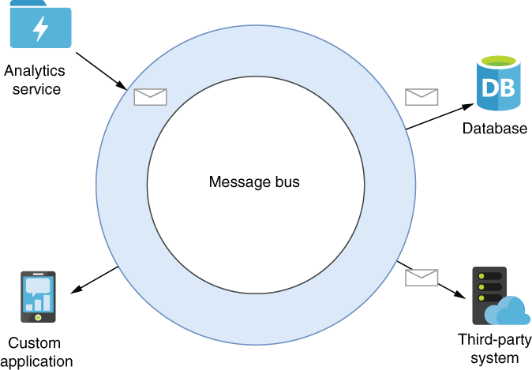

### 1.3.3 Enterprise service bus

Enterprise service buses (ESB) emerged during the early part of this century when XML was the preferred message format used for implementing service-oriented architecture (SOA) applications using SOAP-based web services. The core concept of ESBs was the *message bus*, as shown in figure 1.8, which served as a communication channel between all applications and services. This centralized architecture is in direct contrast to the point-to-point integration previously used by other message-oriented middleware.

\

Figure 1.8 The core concept of ESBs is the use of a message bus in order to eliminate the need for point-to-point communication. Service A merely publishes its message to the bus, and it is automatically routed to applications B and C.

With an ESB, each application or service would send and receive all its messages over a single communication channel, rather than having to specify the specific topic names they wanted to publish and consume from. Each application would register itself with the ESB and specify a set of rules used to identify which messages it was interested in, and the ESB would handle all of the logic necessary to dynamically route messages from the bus that matched those rules. Similarly, each service was no longer required to know the intended target(s) of its messages beforehand and could simply publish its messages to the bus and allow it to route the messages.

Consider the scenario where you have a large XML document that contains hundreds of individual line items within a single customer order, and you want to route only a subset of those items to a service based upon some criteria within the message itself (e.g., by product category or department). An ESB provided the capability to extract those individual messages (based on the results of an XQuery) and route them to different consumers based on the content of the message itself.

In addition to these dynamic routing capabilities, ESBs also took the first evolutionary step down the road of *stream processing* by emphasizing the capabilities to process the messages inside the messaging system itself, rather than having the consuming applications perform this task. Most ESBs provided message transformation services, often via XSLT or XQuery, which handled the translation of message formats between the sending and receiving services. They also provided message enrichment and processing capabilities into the message system itself, which up until that point had been performed by the applications receiving the messages. This was a fundamentally new way of thinking about messaging systems that had previously been used almost exclusively as a transportation mechanism.

One could argue that the ESB was the first category of EMS to introduce a third layer to the basic architecture of messaging systems, as shown in figure 1.9. In fact, today most modern ESBs support more advanced computing capabilities, including process choreography for managing business process flows, complex event processing for event correlation and pattern matching, and out-of-the-box implementations of several enterprise integration patterns.

\

Figure 1.9 The ESB’s emphasis on dynamic routing and message processing represented the first time stream processing capabilities were added to a messaging system. This introduced a whole new architectural layer to the base messaging system architecture.

The ESB’s other significant contribution to the evolution of the messaging system was its focus on integration with external systems, which forced messaging systems to support a wide variety of non-messaging protocols for the first time. While ESBs still fully support AMQP and other pub-sub messaging protocols, a key differentiator of ESB was its ability to move data onto and off of the bus from non-message-oriented systems, such as email, databases, and other third-party systems. In order to do this, ESBs provided software development kits (SDKs) that allowed developers to implement their own adapters to integrate with their system of choice.

As you can see in figure 1.10, this allowed data to be more readily exchanged between systems, which simplified the integration of a variety of systems. In this role, the ESB served as both the message-passing infrastructure as well as the mediator between the systems that provided the protocol transformation.

\

Figure 1.10 ESBs supported the integration of non-message-based systems into the message bus, thereby expanding the messaging capabilities beyond applications and into third-party applications, such as databases.

While ESBs undoubtedly pushed the EMS forward with these innovations and features and are still very popular today, they are centralized systems that are designed to be deployed on a single host. Consequently, they suffer from the same scalability issues as their MOM predecessors.
