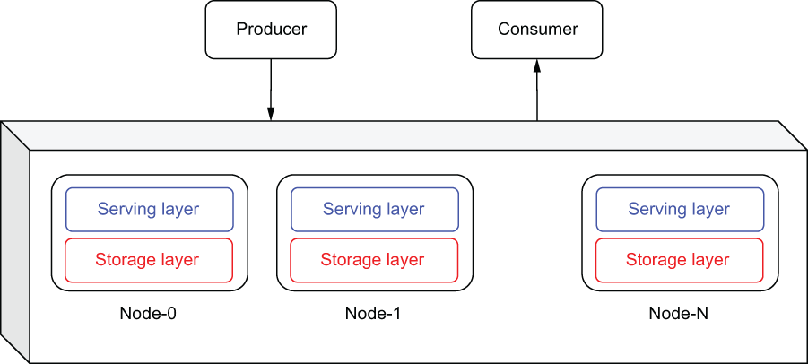
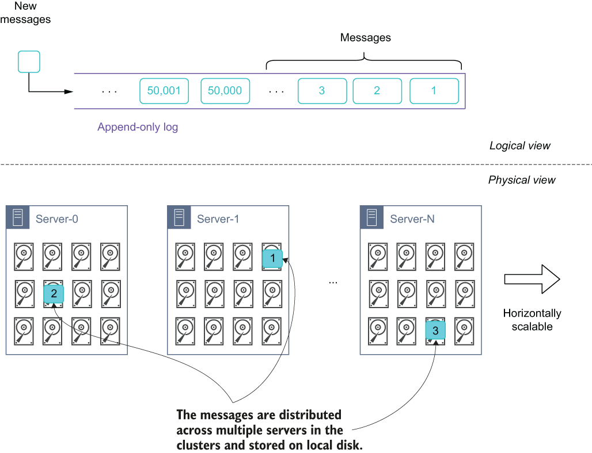
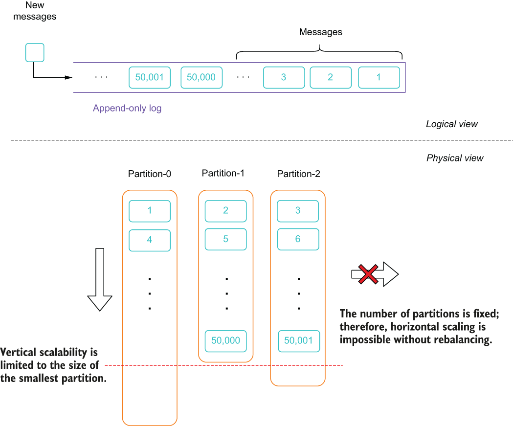
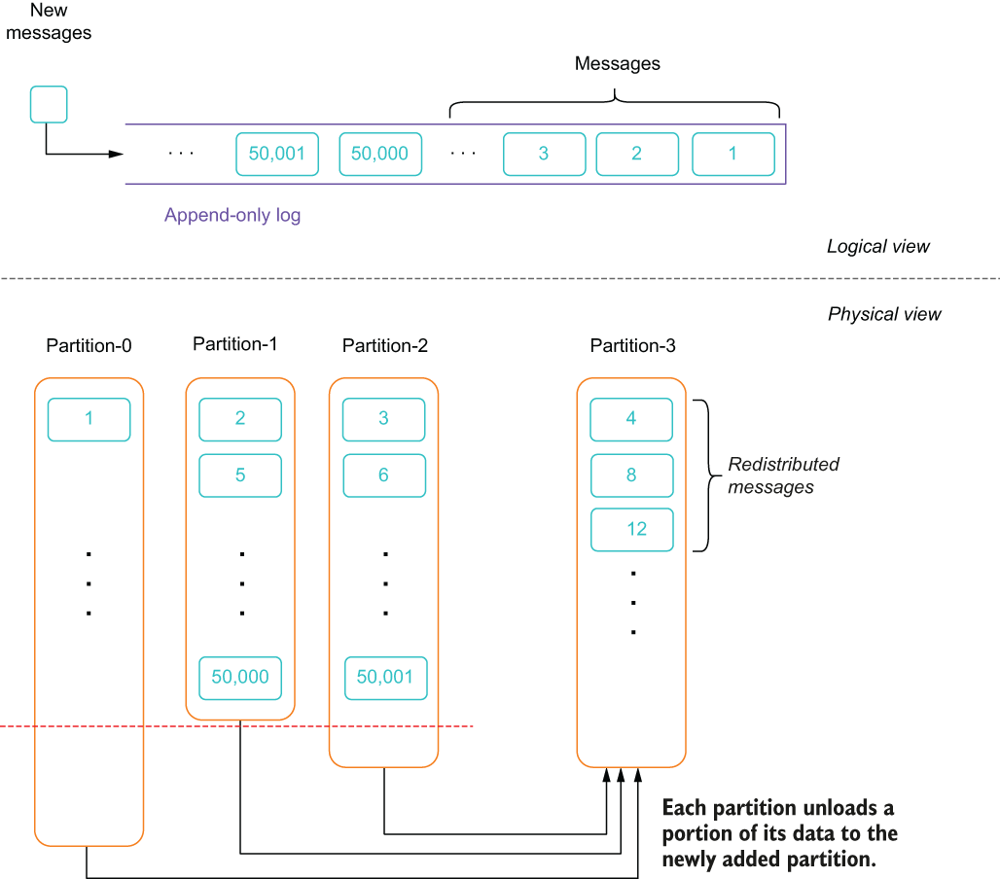
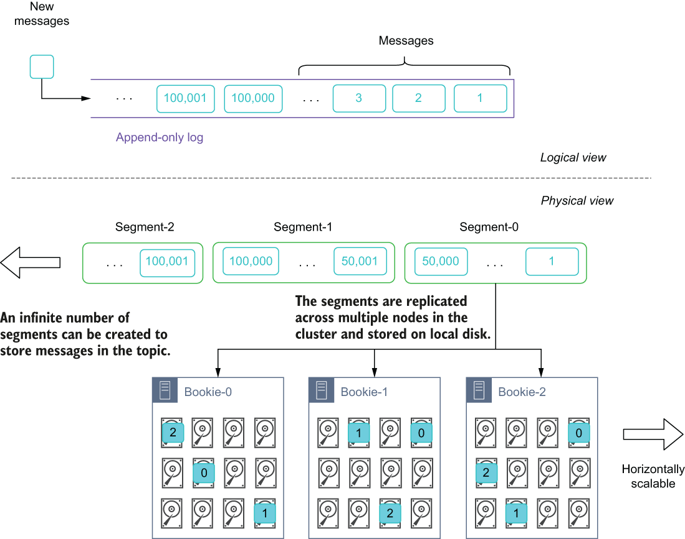

### 1.3.4 Distributed messaging systems

A distributed system can be described as a collection of computers working together to provide a service or feature, such as a filesystem, key-value store, or database, that acts as though they are running on a single computer to the end user. That is to say, the end user isn’t aware of the fact that the service is being provided by a collection of machines working together. Distributed systems have a shared state, operate concurrently, and are able to tolerate hardware failures without affecting the availability of the system as a whole.

When the distributed computing paradigm started becoming widely adopted, as popularized by the Hadoop computing framework, the single-machine constraint was lifted. This ushered in an era where new systems were developed that distributed the processing and storage across multiple machines. One of the biggest benefits of distributed computing is the ability to scale the system horizontally, simply by adding new machines to the system. Unlike their non-distributed predecessors that were constrained to the physical hardware capacity of a single machine, these newly developed systems could now leverage the resources from hundreds of machines easily and cost effectively.

As you can see in figure 1.11, messaging systems, just like databases and computation frameworks, have also made the transition to the distributed computing paradigm as well. Newer messaging systems, with Apache Kafka being the first and, more recently, Apache Pulsar, have adopted the distributed computing model in order to provide the scalability and performance required by modern enterprises.

\

Figure 1.11 Within a distributed messaging system, several nodes act together to behave as a single logic system from the perspective of the end user. Internally, the data storage and message processing are distributed across all the nodes.

Within a distributed messaging system, the contents of a single topic are distributed across multiple machines in order to provide horizontally scalable storage at the message layer, which is something that was not possible with previous messaging systems. Distributing the data across several nodes in the cluster also provides several advantages, including redundancy and high availability of the data, increased storage capacity for messages, increased message throughput due to the increased number of message brokers, and the elimination of a single point of failure within the system.

The key architectural difference between a distributed messaging system and a clustered single-node system is the way in which the storage layer is designed. In the previous single-node systems, the message data for any given topic was all stored together on the same machine, which allowed the data to be served quickly from a local disk. However, as we mentioned earlier, this limited the size of the topic to the capacity of the local disk on that machine. Within a distributed messaging system, the data is distributed across several machines within the cluster. This distribution of data across multiple machines allowed us to retain messages within an individual topic that exceeded the storage capacity of an individual machine. The key architectural abstraction that makes this distribution of data possible is the *write-ahead log*, which treats the contents of a message queue as a single append-only data structure that messages can be stored in.

As you can see in figure 1.12, from a logical perspective, when a new message is published to the topic, it is appended to the end of the log. However, from a physical perspective, the message can be written to any server within the cluster.

\

Figure 1.12 The key architectural concept underlying distributed messaging systems is the append-only log (aka the write-ahead log). From a logical perspective, the messages within a topic are all stored sequentially, but are stored in a distributed fashion across multiple servers.

This provides distributed messaging systems with a far more scalable storage capacity layer than the previous generations of messaging systems. Another benefit of the distributed messaging architecture is the ability of more than one broker to serve the messages for any given topic, which increases the message production and consumption throughput by spreading the load across multiple machines. For example, messages published to the topic shown in figure 1.12 would be handled by three separate servers, each with its own write path to disk. This would result in a higher write rate, since the load is spread across multiple disks rather than just a single disk, as it was in the previous generation of messaging systems. There are two distinct approaches taken when it comes to how the data is distributed across the nodes in the cluster: partition-based and segment-based.

Partition-centric storage in Kafka

When using the partition-based strategy within a messaging system, the topic is divided into a fixed number of groupings known as partitions. Data that is published to the topic is distributed across the partitions, as shown in figure 1.13, with each partition receiving a portion of the messages published to the topic. The total storage capacity of the topic is now equal to the number of partitions in the topic times the size of each partition. Once this limit is reached, no more data can be added to the topic. Simply adding more brokers to the cluster will not alleviate this issue because you will also need to increase the number of partitions in the topic, which must be performed manually. Furthermore, increasing the number of partitions also requires a rebalance to be performed, which, as I will discuss, is an expensive and time-consuming process.

\

Figure 1.13 Message storage in a partition-based messaging system

Within a partition-centric storage-based system, the number of partitions is specified when the topic is created, as this allows the system to determine which nodes will be responsible for storing which partition, etc. However, predetermining the number of partitions has a few unintended side effects, including the following:

- A single partition can only be stored on a single node within the cluster, so the size of the partition is limited to the amount of free disk space on that node.

- Since the data is evenly distributed across all partitions, each partition is limited to the size of the smallest partition in the topic. For instance, if a topic is distributed across three nodes with 4 TB, 2 TB, and 1 TB of free disk, respectively, then the partition on the third node can only grow to 1 TB in size, which in turn means all partitions in the topic can only grow to 1 TB as well.

- Although it isn’t strictly required, each partition is usually replicated multiple times to different nodes to ensure data redundancy. Therefore, the maximum partition size is further restricted to the size of the smallest replica.

In the event that you run into one of these capacity limitations, your only remedy is to increase the number of partitions in the topic. However, this capacity expansion process requires rebalancing the entire topic, as shown in figure 1.14. During this rebalancing process, the existing topic data is redistributed across all of the topic partitions in order to free up disk space on the existing nodes. Therefore, when you add a fourth partition to an existing topic, each partition should have approximately 25% of the total messages once the rebalancing process has completed.

\

Figure 1.14 Increasing the storage capacity of a partition-based topic incurs the cost of rebalancing, in which a portion of the data from the existing partitions is copied over to the newly added partition(s) in order to free up disk space on the existing nodes.

This recopying of data is expensive and error prone, as it consumes network bandwidth and disk I/O directly proportional to the size of the topic (e.g., rebalancing a 10 TB topic would result in 10 TB of data being read from disk, transmitted over the network, and written to disk on the target brokers). Only after the rebalancing process has completed can the previously existing data be deleted and the topic resume serving clients. Therefore, it is advisable to choose your partition sizing wisely, as the cost to rebalance cannot be easily dismissed.

In order to provide redundancy and failover for the data, you can configure the partitions to be replicated across multiple nodes. This ensures that there is more than one copy of the data available on disk even in the event of a node failure. The default replica setting is three, which means that the system will retain three copies of each message. While this is a good trade-off in terms of space for redundancy, you need to account for this additional storage requirement when you size your Kafka cluster.

Segment-centric storage in Pulsar

Pulsar relies upon the Apache BookKeeper projects to provide the persistent storage of its messages. BookKeeper’s logical storage model is based on the concept of boundless stream entries stored as a sequential log. As you can see in figure 1.15, within BookKeeper each log is broken down into smaller chunks of data, known as segments, which in turn are comprised of multiple log entries. These segments are then written across a number of nodes, known as bookies, in the storage layer for redundancy and scale.

\

Figure 1.15 Message storage in a segment-centric messaging system is done by writing a predetermined number of messages into a “segment” and then storing multiple replicas of the segment across different nodes in the storage layer.

As you can see from figure 1.15, the segments can be placed anywhere on the storage layer that has sufficient disk capacity. When there isn’t sufficient storage capacity in the storage layer for new segments, new nodes can be easily added and used immediately for storing data. One of the key benefits of segment-centric storage architecture is true horizontal scalability as segments can be created indefinitely and stored anywhere, unlike partition-centric storage which imposes artificial limitations to both vertical and horizontal scaling based on the number of partitions.
