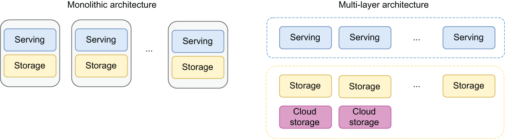

### 1.4.1 Multilayered architecture

Apache Pulsar’s multilayered architecture completely decouples the message-serving layer from the message-storage layer, allowing each to scale independently. Traditional distributed messaging technologies, such as Kafka, have taken the approach of co-locating data processing and data storage on the same cluster nodes or instances. That design choice offers a simpler infrastructure and some performance benefits due to reducing the transfer of data over the network, but at the cost of a lot of tradeoffs that impact scalability, resiliency, and operations.

\

Figure 1.16 Monolithic distributed architectures co-locate the serving and storage layers, while Pulsar uses a multilayer architecture that decouples the storage and serving layers from one another, which allows them to scale independently.

Pulsar’s architecture takes a very different approach—one that’s starting to gain traction in a number of cloud-native solutions and that is made possible in part by the significant improvements in network bandwidth that are commonplace today: namely the separation of compute and storage. Pulsar’s architecture decouples data serving and data storage into separate layers: data serving is handled by stateless *broker nodes*, while data storage is handled by *bookie nodes*, as shown in figure 1.16. This decoupling has several benefits, including dynamic scalability, zero downtime upgrades, and infinite storage capacity upgrades, just to name a few. Further, this design is container-friendly, making Pulsar the ideal technology for hosting a cloud-native streaming system.

Dynamic scaling

Consider the case where we have a service that is CPU-intensive and whose performance starts to degrade when the requests exceed a certain threshold. In such a scenario, we need to horizontally scale the infrastructure to provide new machines and instances of the application to distribute the load when the CPU usage goes above 90% on the current machine. Rather than relying on a monitoring tool to alert your DevOps team to this condition and having them perform this process manually, it would be preferable to have the entire process automated.

Autoscaling is a common feature of all public cloud providers, such as AWS, Microsoft Azure, Google Cloud, and Kubernetes. It allows autoscaling of the infrastructure horizontally based on resource utilization metrics, such as CPU/memory, without any human interaction. While it is true that this capability is not exclusive to Pulsar and can be leveraged by any other messaging platforms to scale up during high traffic conditions, it is much more useful in a multitiered architecture such as Pulsar’s for two reasons we will discuss.

Pulsar’s stateless brokers in the serving layer also enable the ability to scale the infrastructure down once the spike has passed, which translates directly into cost savings in a public cloud environment. Other messaging systems that use a monolithic architecture cannot scale down the nodes due to the fact that the nodes contain data on their attached hard drives. Removal of the excess nodes can only be done once that data has been completely processed or has been moved to another node that will remain in the cluster. Neither of these can be performed in an automated fashion easily.

Secondly, in a monolithic architecture, such as Apache Kafka, the broker can only serve requests for data that is stored on an attached disk. This limits the usefulness of autoscaling the cluster in response to traffic spikes, because the newly added nodes to the Kafka cluster *will not have any data to serve* and, therefore, will not be able to handle any incoming requests to read existing data from the topics. The newly added nodes will only be able to handle write requests.

Lastly, in a monolithic architecture such as Apache Kafka, horizontal scaling is achieved by adding new nodes that have both storage and serving capacity, regardless of which metric you are tracking and responding to. Therefore, when you scale up your serving capacity in response to high CPU usage, you are also scaling up your storage capacity whether you actually need additional storage or not and vice-versa

Auto-recovery

Before you move your messaging platform into production, you will need to understand how to recover from various failure scenarios, starting with a single node failure. In a multitiered architecture such as Pulsar, the process is very straightforward. Since the broker nodes are stateless, they can be replaced by spinning up a new instance of the service to replace the one that failed without a disruption of service or any other data replacement considerations. At the storage layer, multiple replicas of the data are distributed across multiple nodes, which can be easily replaced with new nodes in the event of a failure. In either scenario, Pulsar can rely on cloud-provider mechanisms, such as autoscaling groups, to ensure that a minimum number of nodes are always running. Monolithic architectures, such as Kafka, will suffer again from the fact that newly added nodes to the Kafka cluster *will not have any data to serve* and, therefore, will only be able to handle incoming write requests.
