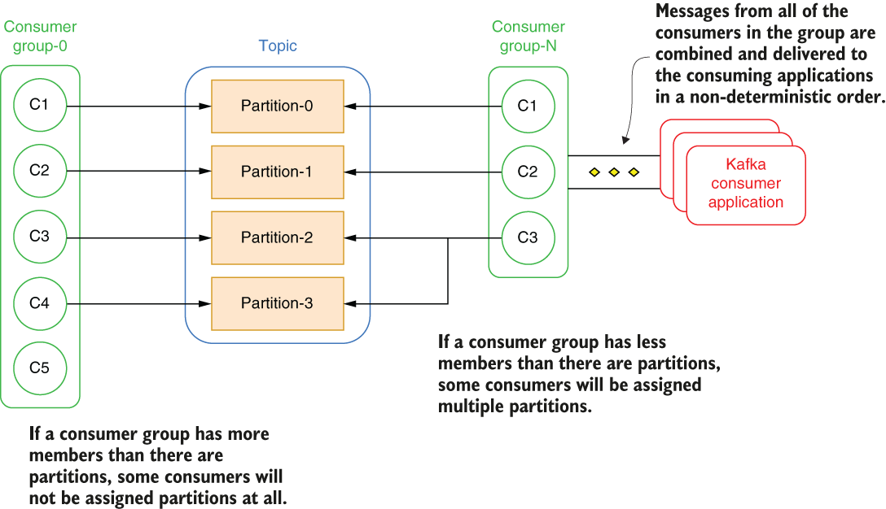

### 1.4.2 Message consumption

Reading messages from a distributed messaging system is a bit different from reading them from a legacy messaging system, as distributed messaging systems were designed to support a large number of concurrent consumers. The way in which the data is consumed is driven in large part by the way it is stored inside the system itself, with both partition-centric and segment-centric systems having their own unique way of supporting pub-sub semantics for consumers.

Message consumption in Kafka

Within Kafka, all consumers belong to what is referred to as a consumer group, which forms a single *logical subscriber* for a topic. Each group is composed of many consumer instances for scalability and fault tolerance, so if one instance fails, the remaining consumers will take over. By default, a new consumer group is created whenever an application subscribes to a Kafka topic. An application can leverage an existing consumer group by providing the group.id as well.

According to the Kafka documentation, “The way consumption is implemented in Kafka is by dividing up the partitions in the log over the consumer instances so that each instance is the exclusive consumer of a ‘fair share’ of partitions at any point in time” (https://docs.confluent.io/5.5.5/kafka/introduction.html). In layman’s terms, this means that each partition within a topic can only have one consumer at a time, and the partitions are distributed evenly across the consumers within the group. As shown in figure 1.17, if a consumer group has less members than partitions, then some consumers will be assigned to multiple partitions, but if you have more consumers than partitions, the excess consumers will remain idle and only take over in the event of a consumer failure.

\

Figure 1.17 Kafka’s consumer groups are closely tied to the partition concept. This limits the number of concurrent topic consumers to the number of topic partitions.

One important side effect of creating exclusive consumers is that within a consumer group, the number of active consumers can never exceed the number of partitions in the topic. This limitation can be problematic, as the only way of scaling data consumption from a Kafka topic is by adding more consumers to a consumer group. This effectively limits the amount of parallelism to the number of partitions, which in turn limits the ability to scale up data consumption in the event that your consumers cannot keep up the topic producers. Unfortunately, the only remedy to this is to increase the number of topic partitions, which as we discussed earlier, is not a simple, fast, or cheap operation.

You can also see in figure 1.17 that all of the individual consumers’ messages are combined and sent back to the Kafka client. Therefore, message ordering is not maintained by the consumer group. Kafka only provides a total order over records within a partition, not between different partitions in a topic.

As I mentioned earlier, consumer groups act as a cluster to provide scalability and fault tolerance. This means they dynamically adapt to the addition or loss of consumers within the group. When a new consumer is added to the group, it starts consuming messages from partitions previously consumed by another consumer. The same thing happens when a consumer shuts down or crashes; it leaves the group, and the partitions it used to consume will be consumed by one of the remaining consumers. This shuffling of partition ownership with a consumer group is referred to as *rebalancing*, and can have some undesirable consequences, including the potential for data loss if consumer offsets aren’t saved before the rebalancing occurs.

It is very common to have multiple applications that need to read data from the same topic. In fact, this is one of the primary features of a messaging system. Consequently, topics are shared resources among multiple consuming applications that may have very different consumption needs. Consider a financial services company that streams in real time stock market quote information into a topic named “stock quotes” and wants to share that information across the entire enterprise. Some of their business-critical applications, such as their internal trading platforms, algorithmic trading systems, and customer-facing websites, will all need to process that topic data as quickly as it arrives. This would require a high number of partitions in order to provide the necessary throughput to meet these tight SLAs.

On the other hand, the data science team may want to feed the stock topic data through some of their machine learning models in order to train or validate their models using real stock pricing data. This would require processing the records in exactly the order they were received, which requires a single partition topic to ensure global message ordering.

The business analytics team will develop reports using KSQL that join the stock topic data with other topic(s) based on a particular key, such as the stock ticker, which would benefit from having the topic partitioned by the ticker symbol.

Efficiently providing the stock topic data for these applications with such vastly different consumption patterns would be difficult, if not impossible, given how to dependent the consumer groups are tied to the partition number, which is a fixed decision that cannot be easily changed. Typically, in such a scenario, your only realistic option is to maintain multiple copies of the data in different topics, each configured with the correct number of partitions for the application.
