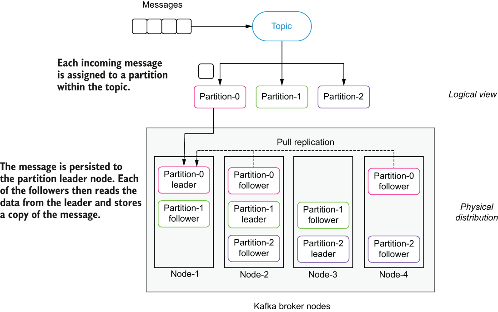
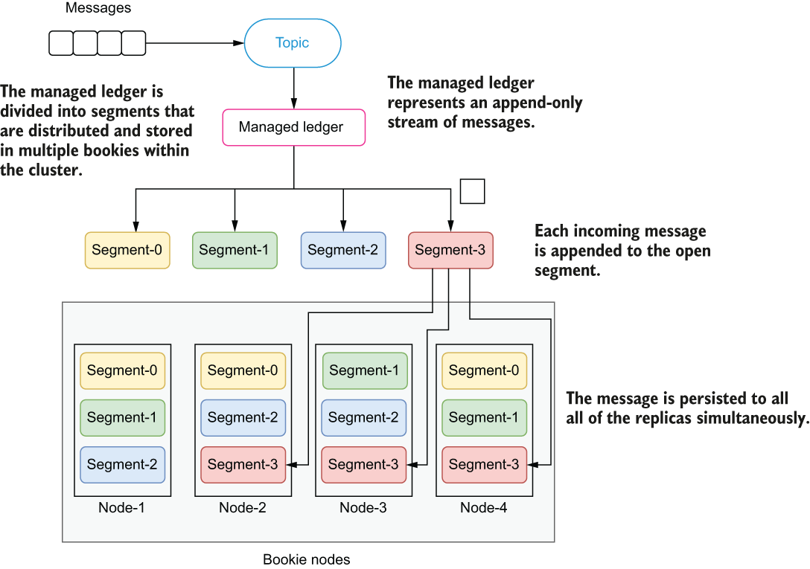

### 1.4.3 Data durability

Within the context of messaging systems, the term data durability refers to the guarantees that messages that have been acknowledged by the system will survive even in the event of a system failure. In a distributed system with many nodes, such as Pulsar or Kafka, failures can occur at many levels; therefore, it is important to understand how the data is stored and what durability guarantees the system provides.

When a producer publishes a message, an acknowledgment is returned from the messaging system to indicate that the message on the topic was received. This acknowledgment signals to the producer that the message is safe, and that the producer can discard it without worrying about it getting lost. As we shall see, the strength of these guarantees is much greater in Pulsar than Kafka.

Data durability in Kafka

As we discussed earlier, Apache Kafka takes a partition-centric storage approach to message storage. In order to ensure data durability, multiple replicas of each partition are maintained within a cluster to provide a configurable level of data redundancy.

\

Figure 1.18 Kafka’s partition replication mechanism

When Kafka receives an incoming message, a hashing function is applied to the message to determine which of the topic’s partitions the message should be written to. Once that has been determined, the message contents are written to the page cache (not the disk) of the partition *leader replica*. Once the message has been acknowledged by the leader, each of the *follower replicas* are responsible for retrieving the message contents from the partition leader in a pull manner (i.e., they act as consumers and read the messages from the leader), as shown in figure 1.18. This overall approach is what is referred to as an eventually consistent strategy in which there is one node in a distributed system that has the most recent view of the data, which is eventually communicated to other nodes until they all achieve a consistent view of the data. While this approach has the advantage of decreasing the amount of time required to store an incoming message, it also introduces two opportunities for data loss; first, in the event of a power outage or other process termination event on the leader node, any data that was written to the page cache that had not been persisted to local disk will be lost. The second opportunity for data loss is when the current leader process fails and another one of the remaining followers is selected as the new leader. In the leader failover scenario, any messages that were acknowledged by the previous leader but not yet replicated to the newly elected leader replica will be lost as well.

By default, messages are acknowledged once the leader has written it to memory. However, this behavior can be overridden to withhold the acknowledgment until all of the replicas have received a copy of the message. This does not impact the underlying replication mechanism in which the followers must pull the information across the network and send a response back to the leader. Obviously, this behavior will incur a performance penalty, which is often hidden in most published Kafka performance benchmarks, so you are advised to do your own performance testing with this configuration in order to get a better understanding of what the expected performance will be.

The other side effect of this replication strategy is that only the leader replica can serve both producers and consumers, as it is the only one guaranteed to have the most recent and correct copy of the data. All of the follower replicas are passive nodes that cannot alleviate any of the load from the leader during traffic spikes.

Data durability in Pulsar

When Pulsar receives an incoming message, it saves a copy in memory and also writes the data to a write-ahead log (WAL), which is forced onto disk *before* an acknowledgment is sent back to the message publisher, as shown in figure 1.19. This approach is modelled after traditional database atomicity, consistency, isolation, and durability (ACID) transaction semantics, which ensures that the data is not lost even if the machine fails and comes back online in the future.

\

Figure 1.19 Pulsar’s replication occurs when the message is initially written to the topic.

The number of replicas required for a topic can be configured in Pulsar based on your data replication needs, and Pulsar guarantees that the data that has been received and acknowledged by a quorum of servers before an acknowledgment is sent to the producer. This design ensures that data can only be lost in the highly unlikely event of simultaneous fatal errors occurring on all bookie nodes to which the data was written. This is why is it recommended to distribute the bookie nodes across multiple regions and use rack-aware placement policies to ensure a copy of the data is stored in more than one region or data center.

More importantly, this design eliminates the need for a secondary replication process that is responsible for ensuring that the data is kept in sync between replicas and eliminates any data inconsistency issues due to any lag in the replication process.
