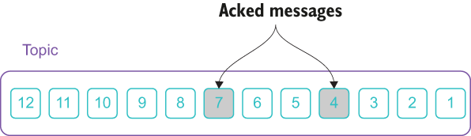

### 1.4.4 Message acknowledgment

Within a distributed messaging system, failures are to be expected. In a distributed message system such as Pulsar, both the consumers consuming the messages and the message brokers serving the messages can fail. When such a failure occurs, it is imperative to resume consumption from exactly the point where the consumers left off once everything recovers to ensure that messages aren’t skipped or reprocessed. This point from which the consumer should resume consumption is often called the topic *offset*. Kafka and Pulsar take different approaches with respect to maintaining these offsets, which have a direct impact on data durability.

Message acknowledgment in Kafka

The resume point is referred to as the consumer offset in Apache Kafka, which is controlled entirely by the consumer. Typically, a consumer increments its offset in a sequential manner as it reads records from the topic to indicate message acknowledgment. However, keeping this offset solely in the consumer’s memory is dangerous. Therefore, these offsets are also stored as messages in a separate topic named `__consumer_offsets`. Each consumer commits a message containing its current position into that topic at periodic intervals, which is every five seconds if you use Kafka’s auto-commit capability. While this strategy is better than keeping the offsets solely in memory, there are consequences to this periodic update approach.

Consider a single-consumer scenario where automatic commits occur every five seconds and a consumer dies exactly three seconds after the most recent commit to the offset topic. In this case, the offset read from the topic will be three seconds old, so all the events that arrived in that three-second window will be processed twice. While it is possible to configure the commit interval to a smaller value and reduce the window in which records will be duplicated, it is impossible to completely eliminate them.

The Kafka consumer API provides a method that enables committing the current offset at a point that makes sense to the application developer rather than based on a timer. Therefore, if you really wanted to eliminate duplicate messaging processing, you could use this API to commit the offset after every successfully consumed message. However, this pushes the burden of ensuring accurate recovery offsets onto the application developer and introduces additional latency to the message consumers who now have to commit each offset to a Kafka topic and await an acknowledgment.

Message acknowledgment in Pulsar

Apache Pulsar maintains a ledger inside of Apache BookKeeper for each subscriber that is referred to as the cursor ledger for tracking message acknowledgments. When a consumer has read and processed a message, it sends an acknowledgment to the Pulsar broker. Upon receipt of this acknowledgment, the broker immediately updates the cursor ledger for that consumer’s subscription. Since this information is stored on a ledger in BookKeeper, we know that it has been fsynced to disk and multiple copies exist across multiple bookie nodes. Keeping this information on disk ensures that the consumers will not receive the message again even if they crash and restart at a later point in time.

In Apache Pulsar, there are two ways that messages can be acknowledged: selectively or cumulatively. With cumulative acknowledgment, the consumer only needs to acknowledge the last message it receives. All the messages in the topic partition up to and including the given message ID will be marked as acknowledged and will not be redelivered to the consumer again. Cumulative acknowledgment is effectively the same as offset update in Apache Kafka.

The differentiating feature of Apache Pulsar over Kafka is the ability of consumers to acknowledge messages individually (i.e., selective acknowledgment). This capability is critical in supporting multiple consumers per topic because it allows for message redelivery in the event of a single consumer failure.

Let’s consider the single-consumer failure scenario again where the consumer individually acknowledges messages after it has successfully processed them. During the time leading up to the failure, the consumer was struggling to process some of the messages while successfully processing others. Figure 1.20 shows an example where only two of the messages (4 and 7) were successfully processed and acknowledged.

\

Figure 1.20 Individual message acknowledgment in Pulsar

Given the fact that Kafka’s offset concept treats consumer groups’ offsets as a high-water mark that marks the point up to which all messages are considered acknowledged, in this scenario the offset would have been updated to seven, since that is the highest number message ID that was acknowledged. When the Kafka consumer is restarted on that topic it would start at message 8 and continue onward, skipping messages 1-3, 5, and 6, making them effectively lost because they are never processed.

Under the same scenario with Pulsar’s selective acks, all of the unacknowledged messages would be redelivered, including messages 1-3, 5, and 6, when the consumer is restarted, thereby avoiding message loss due to consumer offset limitations.
