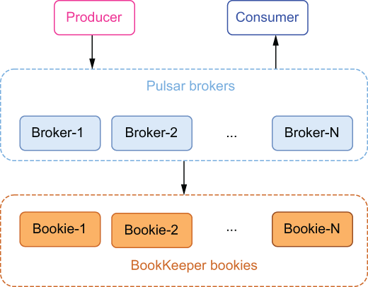

### 1.5.2 Infinite scalability

In order to better understand the scalability of Pulsar, let’s look at a typical Pulsar installation. As you can see from figure 1.21, a Pulsar cluster is composed of two layers: a stateless serving layer, which is made up of a set of brokers for handling client requests, and a stateful persistence layer, which is made up of a set of bookies for persisting the messages.

\

Figure 1.21 A typical Pulsar cluster

This architectural pattern, which separates the storage of the messages from the layer that serves the messages, differs significantly from traditional messaging systems which have historically chosen to co-locate these two services. This decoupled approached has several advantages when it comes to scalability. For starters, making the brokers stateless allows you to dynamically increase or decrease the number of brokers to meet the demands of the client applications.

Seamless cluster expansion

Any bookies that are added to the storage layer are automatically discovered by the brokers, which will then immediately begin to utilize them for message storage. This is unlike Kafka, which requires repartitioning the topics to distribute the incoming messages to the newly added brokers.

Unbounded topic partition storage

Unlike Kafka, the capacity of a topic partition is not limited by the capacity of any smallest node. Instead, topic partitions can scale up to the total capacity of the storage layer, which itself can be scaled up by simply adding additional bookies. As we discussed earlier, partitions within Kafka have several limitations on their size, whereas no such restrictions apply to Pulsar.

Instant scaling without data rebalancing

Because message serving and storage are separated into two layers, moving a topic partition from one broker to another can happen almost instantly and without any data rebalancing (recopying the data from one node to the other). This characteristic is crucial to many things, such as cluster expansion and fast failure reaction to broker and bookie failures.
