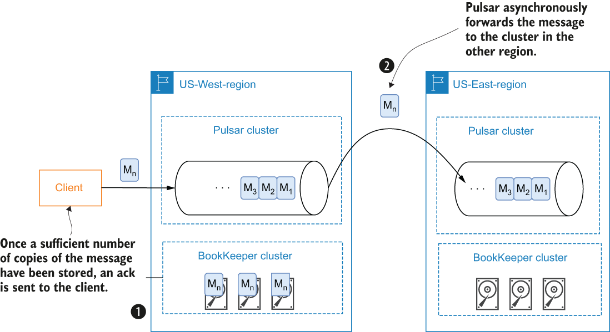
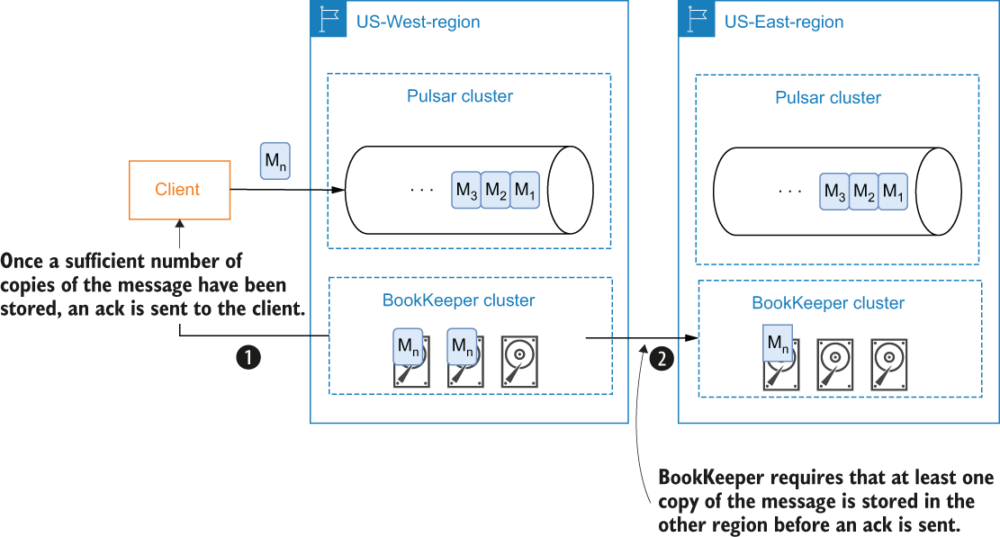

### 1.5.5 Geo-replication and active failover

Apache Pulsar is a messaging system that supports both synchronous geo-replication within a single Pulsar cluster and asynchronous geo-replication across multiple clusters. It has been deployed globally in more than 10 data centers at Yahoo! since 2015 with full 10 x 10 mesh replication for mission critical services, such as Yahoo! Mail and Finance.

Geo-replication is a common practice used to provide disaster recovery capabilities for enterprise systems by distributing a copy of the data to different geographical locations. This ensures that your data, and the systems that rely upon it, will be able to withstand any unforeseen disasters, such as natural disasters. The geo-replication mechanisms used in different data systems can be classified as either synchronous or asynchronous. Apache Pulsar allows you to easily enable asynchronous geo-replication using just a few configuration settings.

With asynchronous geo-replication, the producer doesn’t wait for an acknowledgment from the other data centers that they have received the message. Instead, the producing client receives an acknowledgment immediately after the message has been successfully persisted within the local BookKeeper cluster. The data is then replicated from the source cluster to the other data centers in an asynchronous fashion, as shown in figure 1.22.

\

Figure 1.22 When using asynchronous geo-replication in Apache Pulsar, the message is stored locally within the BookKeeper cluster running in the same region that receives the message. The message is asynchronously forwarded in the background to the Pulsar cluster in the other region.

Asynchronous geo-replication provides lower latency because the client doesn’t have to wait for responses from the other data centers. However, it also results in weaker consistency guarantees due to asynchronous replication. Since there is always a replication lag in asynchronous replication, there is always some amount of data that hasn’t been replicated from source to destination.

Synchronous geo-replication is a bit more complicated to achieve with Apache Pulsar than asynchronous, as it requires some manual configuration to properly ensure that a message will only be acknowledged when a majority of the data centers have issued a confirmation that the message data has been persisted to disk. While I will save the details of exactly how synchronous geo-replication can be achieved with Apache Pulsar for appendix B, I can tell you that it is made possible due to Pulsar’s two-tiered architecture design and the ability for an Apache BookKeeper cluster to be composed of both local and remote nodes, particularly ones in different geographical regions, as shown in figure 1.23.

\

Figure 1.23 You can exploit BookKeeper’s ability to use remote nodes in order to achieve synchronous geo-replication to ensure that a copy of the message is stored in the remote region.

Synchronous geo-replication provides the highest availability, where all of your physically available data centers form a global logical instance for your data system. Your applications can run everywhere at any data center and still be able to access the data. It also guarantees stronger data consistency between different data centers, which your applications can easily rely on without any manual operations involved when data center failures occur.

Unlike other messaging systems that rely on external services, Pulsar offers geo-replication as a built-in feature. Users can easily enable replication of message data between Pulsar clusters in different geographical regions. Once replication is configured, data is continuously replicated to the remote clusters without any interaction on the part of the producers or consumers. I cover to how configure geo-replication in greater detail in appendix B.
