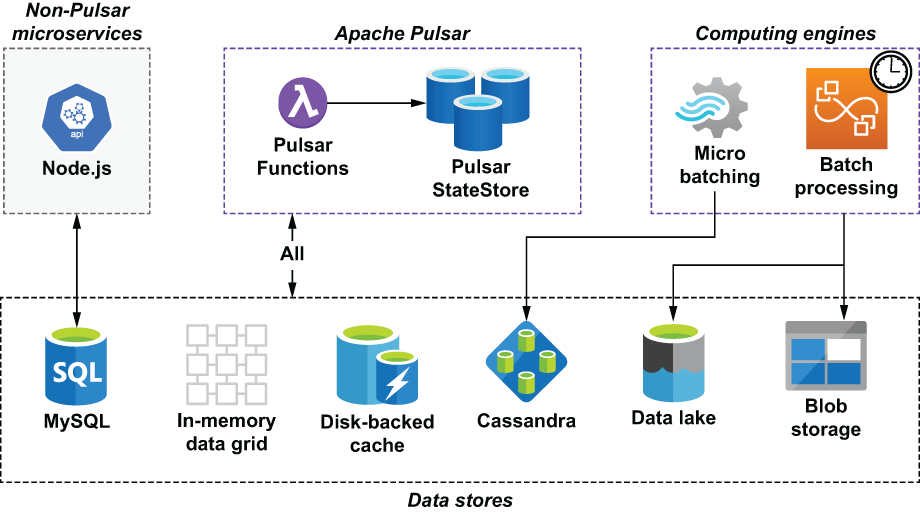

## 10.1 Data sources

The GottaEat application that we have been developing thus far is hosted within the context of a much larger enterprise architecture that consists of multiple technologies and data storage platforms, as shown in figure 10.1. These data storage platforms are used by multiple applications and computing engines within the GottaEat organization and act as a single source of truth for the entire enterprise.

As you can see, Pulsar Functions can access data from a variety of data sources, from low-latency in-memory data grids and disk-backed caches to high-latency data lakes and blob storage. These data stores allow us to access information supplied by other applications and computing engines. For instance, the GottaEat application we have been developing has a dedicated MySQL database it uses to store customer and driver information, such as their login credentials, contact information, and home address. This information is collected by some of the non-Pulsar microservices shown in figure 10.1 that provide non-streaming services, such as user login, account update, etc.

Figure 10.1 The enterprise architecture of the GottaEat organization will be comprised of various computing engines and data storage technologies. Therefore, it is critically important that we can access these various data repositories from our Pulsar functions.

Within the GottaEat enterprise architecture there are distributed computing engines, such as Apache Spark and Apache Hive, which perform batch processing of extremely large datasets stored inside the data lake. One such dataset is the driver location data, which contains the latitude and longitude coordinates of every driver that is logged into our application. The GottaEat mobile application automatically records the driver’s location every 30 seconds and forwards it to Pulsar for storage in the data lake. This dataset is then used in the development and training of the company’s machine learning models. Given sufficient information, these models can accurately predict various key business metrics, such as estimated delivery times of placed orders or the areas within a city most likely to have the most food orders in the next hour, so we can position drivers accordingly. These computing engines are scheduled to run periodically to calculate various data points that are required by the machine learning models and store them inside the Cassandra database so they can be accessed by the Pulsar functions that are hosting the ML models to provide real-time predictions.
