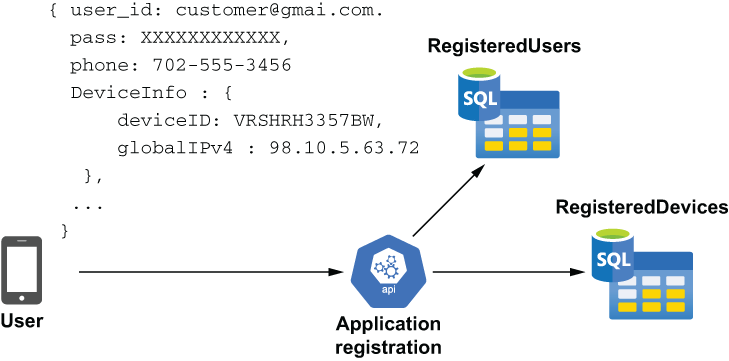
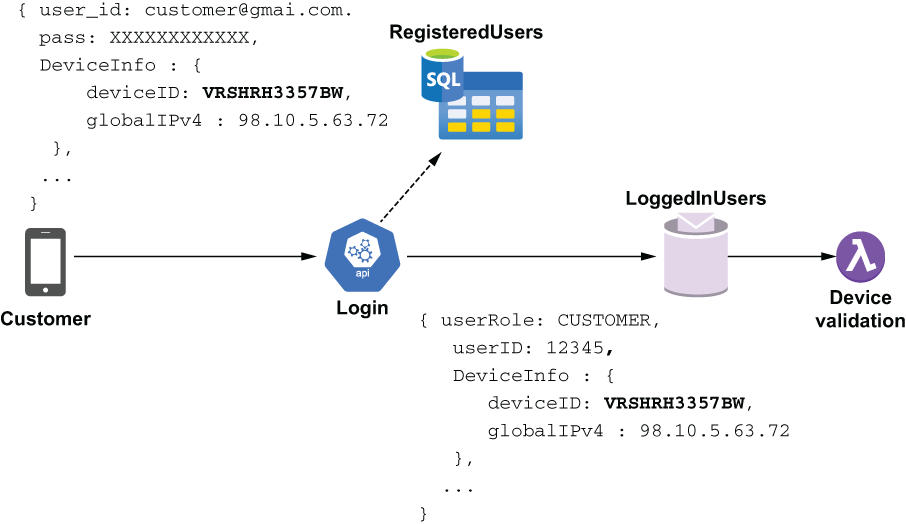
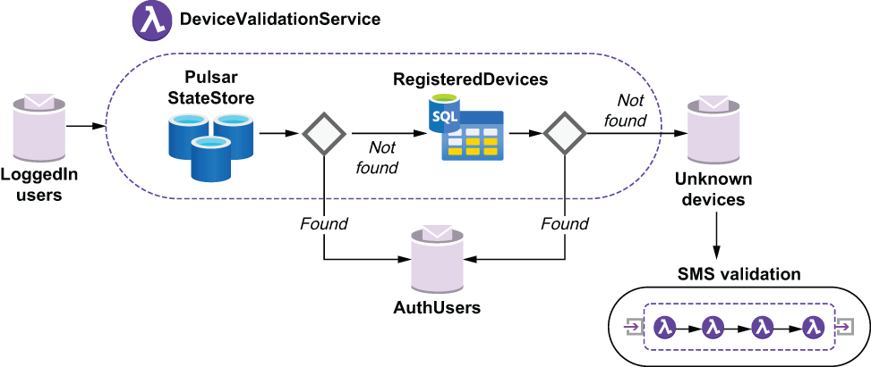
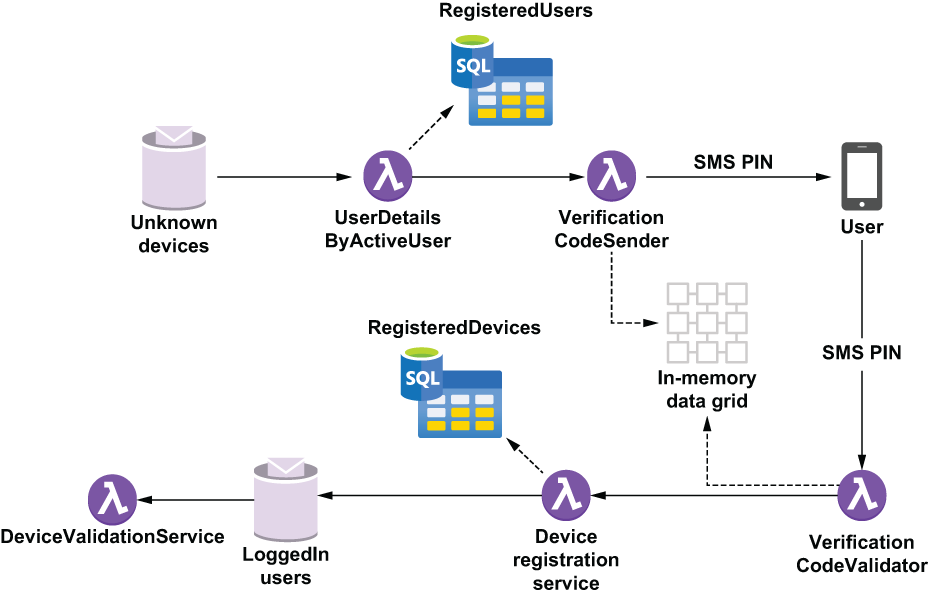

### 10.2.1 Device validation

When a customer first downloads the GottaEat mobile application from the App Store and installs it on their phone, the customer needs to create an account. The customer chooses an email/password to use for their login credentials and submits them along with the mobile number and device ID used to uniquely identify the device. As you can see from figure 10.2, this information is then stored in the MySQL database to be used to authenticate the user whenever they log in in the future.

Figure 10.2 A non-Pulsar microservice handles the application registration use case and stores the provided user credentials and device information in the MySQL database.

When a user logs into the GottaEat application, we will use the information stored in the database to validate the provided credentials and authenticate the device they are using to connect with. Since we recorded the device ID when the user first registered, we can compare the device ID provided when the user logged in with the one on record. This acts like a cookie does for a web browser and allows us to confirm that the user is using a trusted device. As you can see in figure 10.3, after we validate the user’s credentials against the values stored in the RegisteredUsers table, we place the user record in the LoggedInUsers topic for further processing by the DeviceValidation function to ensure that the user is using a trusted device.

Figure 10.3 The device ID is provided when the customer logs into the mobile application; we then cross-reference it against known devices that we have previously associated with the user.

This provides an additional level of security and prevents identity thieves from placing fraudulent orders using stolen customer credentials because it also requires the would-be fraudsters to provide the correct device ID in order to place an order. You might be asking yourself: What happens if the customer is simply using a new or different device? This is a perfectly valid scenario that we need to handle for situations where they buy a new cell phone or log into their account from a different device. In such a scenario, we will use SMS-based two-factor authentication in which we send a randomly-generated 5-digit PIN code to the mobile number that the customer provided when they registered and wait for them to respond back with that code. This is a very common technique used to authenticate users of mobile applications.

Figure 10.4 Inside the DeviceValidationService, we compare the given device ID with the device most recently used by the customer, and if it is the same, we authorize the user. Otherwise, we check to see if it is on the list of known devices for the user and initiate two-factor authentication if necessary.

As you can see in figure 10.4, the device validation process first attempts to retrieve the customer’s most recently used device ID from Pulsar’s internal state store, which, as you may recall from chapter 4, is a key-value store that can be used by stateful Pulsar functions to retain stateful information. The Pulsar state store uses Apache BookKeeper for storage to ensure that any information written to it will be persisted to disk and replicated. This ensures that the data will outlive any associated Pulsar function instance that is reading the data.

However, this reliance on BookKeeper for storage comes at a performance cost, since the data has to be written to disk. Therefore, even though the state store provides the same key-value semantics as other data stores, such as the IMDG, it does so at a much higher latency rate. Consequently, it is *not* recommended to use the state store for data that will be read and written frequently. It is better suited for infrequent read/write use cases, such as the device ID, which is only called once per user session.

Listing 10.1 shows the logical flow of the DeviceValidationService as it attempts to locate the device ID from two different data sources. The base class contains all of the source code related to connecting to the MySQL database and is also used by the DeviceRegistrationService to update the database if the SMS authentication is successful.

Listing 10.1 The DeviceValidationService

public class DeviceValidationService extends DeviceServiceBase implements \
➥ Function\<ActiveUser, ActiveUser\> {\
 \
  ...\
    \
  @Override\
  public ActiveUser process(ActiveUser u, Context ctx) throws Exception {\
    boolean mustRegister = false;\
        \
    if (StringUtils.isBlank(u.getDevice().getDeviceId())) {                ❶\
      mustRegister = true;\
    } \
        \
    String prev = getPreviousDeviceId(\
         u.getUser().getRegisteredUserId(), ctx);                          ❷\
        \
    if (StringUtils.equals(prev, EMPTY_STRING)) {\
      mustRegister = true;                                                 ❸\
    } else if (StringUtils.equals(prev, u.getDevice().getDeviceId())) {\
      return u;                                                            ❹\
    } else if (isRegisteredDevice(u.getUser().getRegisteredUserId(), \
           u.getDevice().getDeviceId().toString())) {                      ❺\
      ByteBuffer value = ByteBuffer.allocate(\
             u.getDevice().getDeviceId().length());\
      value.put(u.getDevice().getDeviceId().toString().getBytes());\
      ctx.putState("UserDevice-" + u.getDevice().getDeviceId(), value);    ❻\
    }\
        \
    if (mustRegister) {\
     ctx.newOutputMessage(registrationTopic, Schema.AVRO(ActiveUser.class))\
        .value(u)\
        .sendAsync();                                                      ❼\
       return null;\
    } else {\
       return u;\
    }\
  }\
 \
  private String getPreviousDeviceId(long registeredUserId, Context ctx) {\
    ByteBuffer buf = ctx.getState("UserDevice-" + registeredUserId);       ❽\
    return (buf == null) ? EMPTY_STRING : \
         new String(buf.asReadOnlyBuffer().array());\
    }\
    \
  private boolean isRegisteredDevice(long userId, String deviceId) {\
    try (Connection con = getDbConnection();\
          PreparedStatement ps = con.prepareStatement( "select count(\*) "\
           + "from RegisteredDevice where user_id = ? "\
          + " AND device_id = ?")) {\
      ps.setLong(1, userId); \
      ps.setNString(2, deviceId); \
      ResultSet rs = ps.executeQuery(); \
      if (rs != null && rs.next()) { \
        return (rs.getInt(1) \> 0);                                         ❾\
      } \
    } catch (ClassNotFoundException \| SQLException e) { \
      // Ignore these \
    } \
    return false;  \
  }\
...\
}

❶ If the user didn’t provide a device ID at all

❷ Get the previous device ID for this user from the state store.

❸ There is no previous device ID for this user.

❹ The provided device ID matches the value in the state store.

❺ See if the device id is in the list of known devices for the user.

❻ This is a known device, so update the state store with the provided device ID.

❼ This is an unknown device, so publish a message in order to perform SMS validation.

❽ Look up the device ID in the state store using the user ID.

❾ Return true if the provided device ID is associated with the user.

If the device cannot be associated with the current user, a message will be published to the UnknownDevices topic that is used to feed the SMS validation process. As you may have noticed in figure 10.4, the SMS validation process is comprised of a sequence of Pulsar functions that must coordinate with one another to perform the two-factor authentication.

Figure 10.5 The SMS validation process is performed by a collection of Pulsar Functions that send a 5-digit code to the user’s registered mobile number and validate the code sent back from the user.

The first Pulsar function within the SMS validation process reads messages off the UnknownDevices topic and uses the registered user ID to retrieve the mobile number we will be sending the SMS validation code to. This is a very straightforward data access pattern in which we use the primary key to retrieve information from a relational database and forward it to another function. While this approach is typically considered an anti-pattern because it violates the encapsulation principle I mentioned earlier, I decided to break it out into its own function for the two reasons. The first is reusability of the code itself, as there are multiple use cases in which we will need to retrieve all of the information about a particular user, and I want to have that logic contained within a single class, rather than spread across multiple functions, so it is easy to maintain. The second reason is that we will need some of this information later on within the DeviceRegistration service, so I decided to pass all of the information along rather than perform the same database query twice to reduce processing latency.

As you can see from the next listing, the UserDetailsByActiveUser function provides the registered user ID to the UserDetailsLookup class, which performs the database query to retrieve the data and return a UserDetails object.

Listing 10.2 The UserDetailsByActiveUser function

public class UserDetailsByActiveUser implements \
   Function\<ActiveUser, UserDetails\> {\
 \
  private UserDetailsLookup lookupService = new UserDetailsLookup();   ❶\
    \
  @Override\
  public UserDetails process(ActiveUser input, Context ctx) throws Exception{\
    return lookupService.process(\
      input.getUser().getRegisteredUserId(),                           ❷\
      ctx);                                                            ❸\
  }\
}

❶ Create an instance of the class that performs the database lookup.

❷ Pass in the primary key field used in the lookup.

❸ Pass in the context object so that lookup class can access the database credentials, etc.

This pattern of extracting just the primary key from the incoming message and passing it to a different class that performs the lookup can be reused for any use case, and in the case of the GottaEat application, it is used by a different Pulsar function flow to retrieve the user information for a given food order, as shown in the following listing.

Listing 10.3 The UserDetailsByFoodOrder function

public class UserDetailsByFoodOrder implements \
  Function\<FoodOrder, UserDetails\> {\
 \
  private UserDetailsLookup lookupService = new UserDetailsLookup();   ❶\
    \
  @Override\
  public UserDetails process(FoodOrder order, Context ctx) throws Exception {\
    return lookupService.process(\
     order.getMeta().getCustomerId(),                                  ❷\
     ctx);                                                             ❸\
  }\
}

❶ Create an instance of the class that performs the database lookup.

❷ Pass in the primary key field used in the lookup.

❸ Pass in the context object so that lookup class can access the database credentials, etc.

The underlying lookup class used to provide the information is shown in listing 10.4 and encapsulates the logic required to query the database tables to retrieve all of the information. This data access pattern can be used to retrieve data from any relational database table that you need to access from your Pulsar functions.

Listing 10.4 The UserDetailsLookup function

public class UserDetailsLookup implements Function\<Long, UserDetails\> {\
    \
  . . .\
  private Connection con;\
  private PreparedStatement stmt;\
  private String dbUrl, dbUser, dbPass, dbDriverClass;\
 \
  @Override\
  public UserDetails process(Long customerId, Context ctx) throws Exception {\
        \
    if (!isInitalized()) {                                               ❶\
      dbUrl = (String) ctx.getUserConfigValue(DB_URL_KEY);\
      dbDriverClass = (String) ctx.getUserConfigValue(DB_DRIVER_KEY);\
      dbUser = (String) ctx.getSecret(DB_USER_KEY);\
      dbPass = (String) ctx.getSecret(DB_PASS_KEY);\
    }\
 \
    return getUserDetails(customerId);\
  }  \
 \
  private UserDetails getUserDetails(Long customerId) {\
    UserDetails details = null;\
 \
    try (Connection con = getDbConnection();\
         PreparedStatement ps = con.prepareStatement("select ru.user_id, \
          + " ru.first_name, ru.last_name, ru.email, "\
          + "a.address, a.postal_code, a.phone, a.district,"\
          + "c.city, c2.country from GottaEat.RegisteredUser ru "\
          + "join GottaEat.Address a on a.address_id = c.address_id "\
          + "join GottaEat.City c on a.city_id = c.city_id "\
          + "join GottaEat.Country c2 on c.country_id = c2.country_id "\
          + "where ru.user_id = ?");) {                                  ❷\
 \
    ps.setLong(1, customerId);                                           ❸\
    \
    try (ResultSet rs = ps.executeQuery()) {\
      if (rs != null && rs.next()) { \
         details = UserDetails.newBuilder()                            \
     .setEmail(rs.getString("ru.email"))\
     .setFirstName(rs.getString("ru.first_name"))\
     .setLastName(rs.getString("ru.last_name"))\
     .setPhoneNumber(rs.getString("a.phone"))                    \
     .setUserId(rs.getInt("ru.user_id"))\
     .build();                                                           ❹\
      }\
    } catch (Exception ex) {\
      // Ignore\
    }        \
  } catch (Exception ex) {\
    // Ignore\
  }\
 \
  return details;\
  }\
 \
  . . .\
 \
}

❶ Ensure we have all the required properties from the user context object.

❷ Perform the lookup for the given user ID.

❸ Use the user ID in the first parameter in the prepared statement.

❹ Map the relational data to the UserDetails object.

The UserDetailsByActiveUser function passes the UserDetails to the VerificationCodeSender function, which in turn sends the validation code to the customer and records the associated transaction ID in the IMDG. This transaction ID is required by the VerificationCodeValidator function to validate the PIN sent back by the user; however, as you can see from figure 10.5, there isn’t an intermediate Pulsar topic between the VerificationCodeSender function and the VerificationCodeValidator, so we cannot pass this information inside a message. Instead we have to rely on this external data store to pass along this information.

The IMDG is perfect for this task since the information is short lived and does not need to be retained for longer than the time the code is valid. If the PIN sent back by the user is valid, the next function will add the newly authenticated device to the RegisterdDevices table for future reference. Finally, the user will be sent back to the LoggedInUser topic so that the device ID can by updated in the state store.

Since the VerificationCodeSender and VerificationCodeValidator functions use the IMDG to communicate with one another, I decided to have them share a common base class, which provides connectivity to the shared cache, as shown in the following listing.

Listing 10.5 The VerificationCodeBase

public class VerificationCodeBase {\
 \
  protected static final String API_HOST = "sms-verify-api.com";    ❶\
    \
  protected IgniteClient client;                                    ❷\
  protected ClientCache\<Long, String\> cache;                        ❸\
  protected String apiKey;    \
  protected String datagridUrl; \
  protected String cacheName;                                       ❹\
    \
  protected boolean isInitalized() {\
    return StringUtils.isNotBlank(apiKey);\
  }\
    \
  protected ClientCache\<Long, String\> getCache() {\
    if (cache == null) {\
     cache = getClient().getOrCreateCache(cacheName);\
   }\
    return cache;\
  }\
    \
  protected IgniteClient getClient() {\
    if (client == null) {\
     ClientConfiguration cfg = \
     new ClientConfiguration().setAddresses(datagridUrl);\
     client = Ignition.startClient(cfg);                            ❺\
    }\
    return client;\
  }\
}

❶ The hostname of the third-party service used to perform the SMS verification

❷ Apache Ignite thin client

❸ Apache Ignite cache used to store the data

❹ The name of the Cache both services will be accessing

❺ Connect the thin client to the in-memory data grid.

The VerificationCodeSender uses the mobile phone number from the UserDetails object provided by the UserDetailsByActiveUser function to call the third-party SMS validation service, as shown in the following listing.

Listing 10.6 The VerificationCodeSender function

public class VerificationCodeSender extends VerificationCodeBase \
  implements Function\<ActiveUser, Void\> {\
 \
private static final String BASE_URL = "https://" + RAPID_API_HOST + \
  ➥ "/send-verification-code";                                           ❶\
  private static final String REQUEST_ID_HEADER = "x-amzn-requestid";\
 \
  @Override\
  public Void process(ActiveUser input, Context ctx) throws Exception {\
    if (!isInitalized()) {                                               ❷\
     apiKey = (String) ctx.getUserConfigValue(API_KEY);\
     datagridUrl = ctx.getUserConfigValue(DATAGRID_KEY).toString();\
     cacheName = ctx.getUserConfigValue(CACHENAME_KEY).toString();\
    }\
 \
    OkHttpClient client = new OkHttpClient();\
    Request request = new Request.Builder()\
      .url(BASE_URL + "?phoneNumber=" + toE164FormattedNumber(\
           input.getDetails().getPhoneNumber().toString()) \
           + "&brand=GottaEat")\
      .post(EMPTY_BODY)\
      .addHeader("x-rapidapi-key", apiKey)\
      .addHeader("x-rapidapi-host", RAPID_API_HOST)\
      .build();                                                          ❸\
        \
    Response response = client.newCall(request).execute();               ❹\
    if (response.isSuccessful()) {                                       ❺\
      String msg = response.message();  \
      String requestID = response.header(REQUEST_ID_HEADER);             ❻\
      if (StringUtils.isNotBlank(requestID)) {                           ❼\
        getCache().put(input.getUser().getRegisteredUserId(), requestID);\
      }\
    }\
    return null;\
  }\
}

❶ URL of the third-party service used to send the SMS verification code

❷ Ensure we have all the required properties from the user context object.

❸ Build the HTTP request object for the third-party service.

❹ Send the request object to the third-party service.

❺ Whether the request was successful

❻ Retrieve the request ID from the response object.

❼ If we have a request ID, store it in the IMDG.

If the HTTP call is successful, the third-party service provides a unique request ID value in its response message that can be used by the VerificationCodeValidator function to validate the response sent back by the user. As you can see in listing 10.6, we store this request ID in the IMDG using the user ID as the key. Later, when the user responds with a PIN value, we can then use this value to authenticate the user, as shown in the following listing.

Listing 10.7 The VerificationCodeValidator function

public class VerificationCodeValidator extends VerificationCodeBase \
  implements Function\<SMSVerificationResponse, Void\> {                   ❶\
 \
  public static final String VALIDATED_TOPIC_KEY = "";\
  private static final String BASE_URL = "https://" + RAPID_API_HOST \
     + "/check-verification-code";                                       ❷\
  private String valDeviceTopic;                                         ❸\
    \
  @Override\
  public Void process(SMSVerificationResponse input, Context ctx) \
    throws Exception {\
 \
    if (!isInitalized()) {\
     apiKey = (String) ctx.getUserConfigValue(API_KEY).orElse(null);\
     valDeviceTopic = ctx.getUserConfigValue(VALIDATED_TOPIC_KEY).toString();\
   }\
    \
   String requestID = getCache().get(input.getRegisteredUserId());       ❹\
  \
   if (requestID == null) {\
      return null;                                                       ❺\
    }\
 \
   OkHttpClient client = new OkHttpClient();\
   Request request = new Request.Builder()\
      .url(BASE_URL + "?request_id=" + requestID + "&code=" \
           + input.getResponseCode())\
      .post(EMPTY_BODY)\
      .addHeader("x-rapidapi-key", apiKey)\
      .addHeader("x-rapidapi-host", RAPID_API_HOST)\
      .build();                                                          ❻\
        \
      Response response = client.newCall(request).execute();\
      if (response.isSuccessful()) {                                     ❼\
        ctx.newOutputMessage(valDeviceTopic,\
               Schema.AVRO(SMSVerificationResponse.class))\
         .value(input)\
         .sendAsync();                                                   ❽\
        \
      }\
   return null;\
  }    \
}

❶ Takes in an SMS verification response object

❷ URL of the third-party service used to perform the SMS verification

❸ Pulsar topic to publish validated device info to

❹ Get the request ID from the IMDG.

❺ If there was no request ID found for the user, then we are done.

❻ Construct the HTTP request to the third-party service.

❼ If the user responded with the correct PIN, then the device was validated.

❽ Publish a new message to the validated device topic.

This flow between the two Functions involved in the SMS validation process demonstrates how to exchange information between Pulsar functions that are not connected by an intermediate topic. However, the biggest limitation to this approach is the amount of data that can be retained inside the memory of the data grid itself. For larger datasets that need to be shared across Pulsar functions, a disk-backed cache is a better solution.
