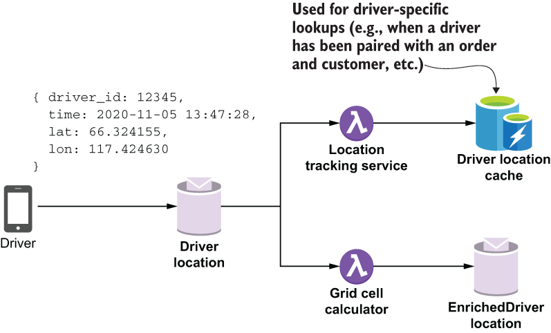
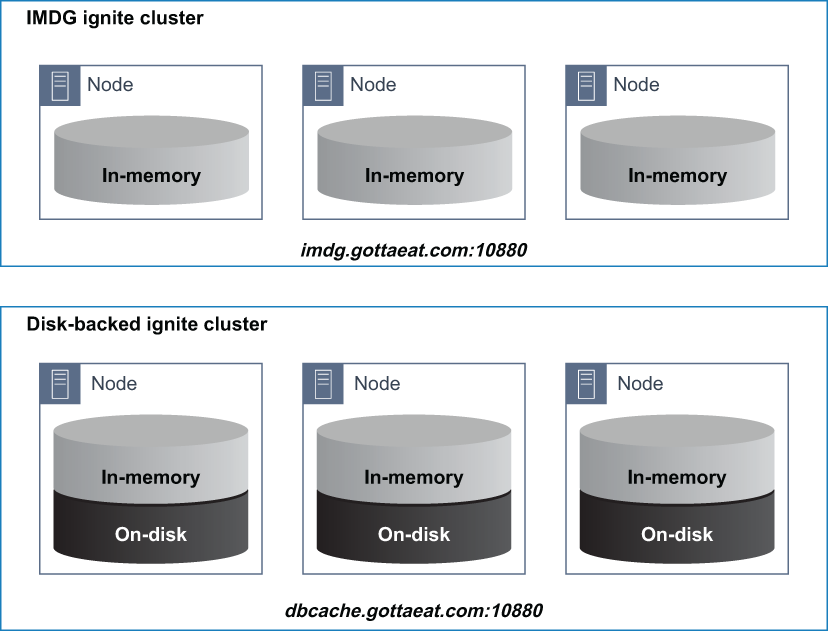
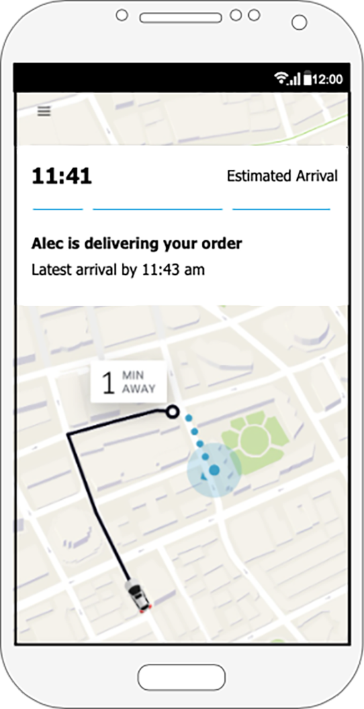
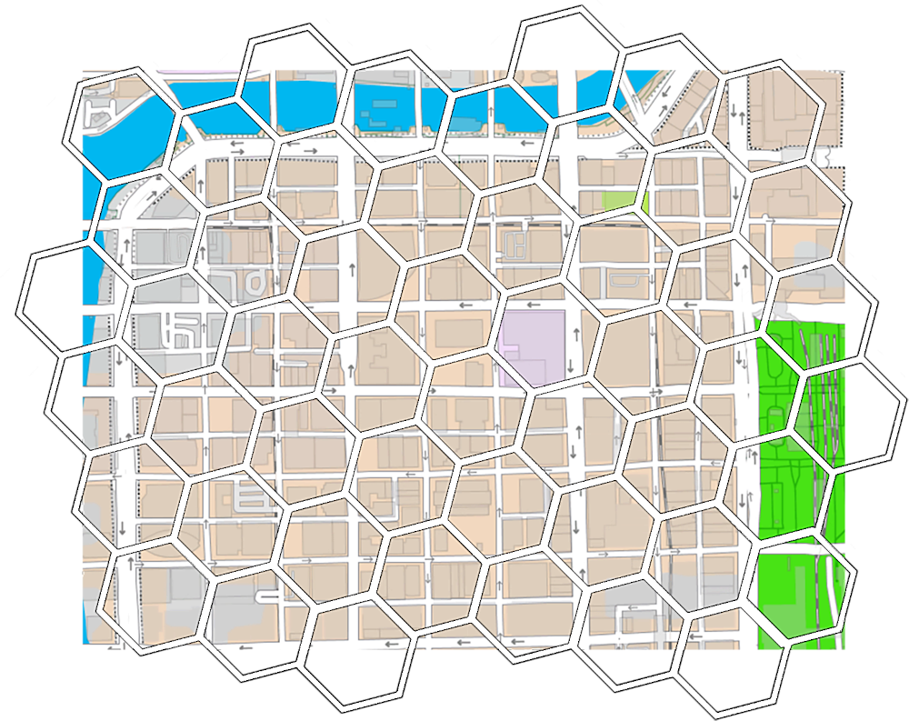
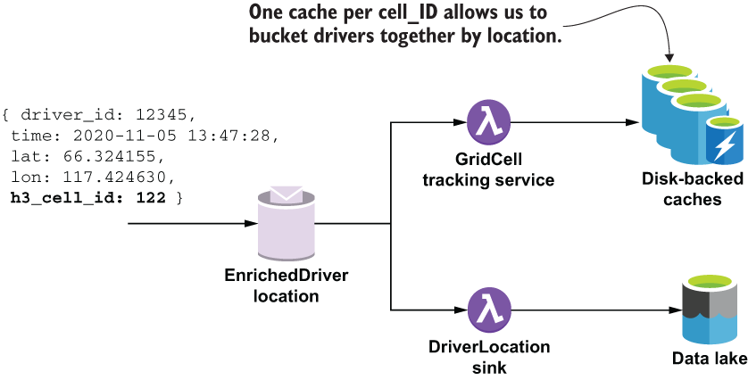

### 10.2.2 Driver location data

Every 30 seconds, a location message is sent from the driver’s mobile application to a Pulsar topic. This driver location data is one of the most versatile and critical datasets for GottaEat. Not only does this information need to be stored in the data lake for training the machine learning models, but it is also useful for several real-time use cases, such as in-route travel time estimation to a pickup or drop-off location, providing driving directions, or allowing the customer to track the location of their order when it is in route to them, just to name a few.

The GottaEat mobile application uses the location services provided by the phone’s operating system to determine the latitude and longitude of the driver’s current location. This information is enriched with the current timestamp and the driver’s ID before it is published to the DriverLocation topic. The driver location information will be consumed in a variety of ways, which in turn dictates how the data should be stored, enriched, and sorted. One of the ways in which the location data will be accessed is directly by driver ID when we want to find the most recent location of a given driver.

As you can see in figure 10.6, the LocationTrackingService consumes these messages and uses them to update the driver location cache, which is a global cache that stores all of the location updates as key/value pairs, where the key is the driver ID and the value is the location data. I have decided to store this information in a disk-backed cache so it is accessible to any Pulsar Function that needs it. Unlike an IMDG, a disk-backed cache will spill any data that it cannot hold in memory to local disk for storage, whereas an IMDG will silently drop the data. Given the anticipated volume of driver location data we are expecting to have once the company is up and running, a disk-backed cache is the best choice for storing this time-critical information, while ensuring that none of it is lost.

Figure 10.6 Each driver periodically sends their location information to the DriverLocation topic. This information is then processed by multiple Pulsar functions before being persisted to a data store.

For simplicity’s sake, we have decided to use the same underlying technology (Apache Ignite) to provide both the IMDG and the disk-backed cache for GottaEat. Not only does this decision reduce the number of APIs that our developers need to learn and use, but it also simplifies life for the DevOps team as well because they only need to deploy and monitor two different clusters running the same software, as shown in figure 10.7. The only difference between the two clusters is the value of a single Boolean configuration setting called persistenceEnabled that enables the storage of cache data to disk, which allows it to store more data.

Figure 10.7 Inside the GottaEat enterprise architecture there are two different clusters running Apache Ignite—one that is configured to persist cache data to disk and one that isn’t.

As you can see in the code in listing 10.8, the data access for both the IMDG and disk-backed cache use the same API (i.e., you read and write values using a single key). The difference is in the expected data lookup time when retrieving the data. For an IMDG, all of the data is guaranteed to be in memory, and thus will provide a consistently fast lookup time. However, the trade-off is that the data is not guaranteed to be available when you attempt to read it.

In contrast, a disk-backed cache will retain only the most recent data in memory and will store a majority of its data on disk as the data volume grows. Given that a significant amount of the data resides on disk, the overall lookup time for a disk-backed cache will be orders of magnitude slower. Therefore, it is best to use this type of data store when data availability is more important than lookup times.

Listing 10.8 The LocationTrackingService

public class LocationTrackingService implements \
   Function\<ActiveUser, ActiveUser\> {\
 \
  private IgniteClient client;\
  private ClientCache\<Long, LatLon\> cache;\
 \
  private String datagridUrl;\
  private String locationCacheName;\
 \
  @Override\
  public ActiveUser process(ActiveUser input, Context ctx) throws Exception {\
 \
    if (!initalized()) {\
      datagridUrl = ctx.getUserConfigValue(DATAGRID_KEY).toString();\
      locationCacheName = ctx.getUserConfigValue(CACHENAME_KEY).toString();\
    }\
  \
    getCache().put(\
      input.getUser().getRegisteredUserId(),                     ❶\
      input.getLocation());                                      ❷\
  \
    return input;\
  }\
    \
  private ClientCache\<Long, LatLon\> getCache() {\
    if (cache == null) {\
      cache = getClient().getOrCreateCache(locationCacheName);   ❸\
    }\
    return cache;\
  }\
    \
  private IgniteClient getClient() {                             ❹\
    if (client == null) {\
      ClientConfiguration cfg = \
         new ClientConfiguration().setAddresses(datagridUrl);\
      client = Ignition.startClient(cfg);\
    }\
    return client;\
  }\
}

❶ Use the userID as the key.

❷ Add the location to the disk-backed cache.

❸ Creates the location cache

❹ Using an Apache Ignite client

The location information stored in the disk-backed cache can then be used to determine the current location of the specific driver assigned to the customer’s order, and is then sent to the mapping software on the customer’s phone so they can track the status of their order visually, as shown in figure 10.8. Another use of the driver location data is determining which drivers are best suited to be assigned an order. One of the factors in making this determination is the driver’s proximity to the customer and/or restaurant that is fulfilling the order. While it is theoretically possible, it would be too time-consuming to calculate the distance between every driver and the delivery location each time an order is placed.

Figure 10.8 The driver location data is used to update the map display on the customer’s mobile phone so they can see the driver’s current location along with an estimated delivery time.

Therefore, we need a way to immediately identify drivers who are close to an order in near-real-time. One way to do this is to divide the map into smaller logical hexagonal areas, known as *cells*, as shown in figure 10.9, and then group the drivers together based on which of these *cells* they are currently located in. This way, when an order comes in, all we need to do is determine which cell the order is in, and then look first for drivers that are currently in that cell. If no drivers are found, we can expand our search to adjacent cells. By presorting the drivers in this manner, we are able to perform a much more efficient search.

 

Figure 10.9 We use a global grid system of hexagonal areas that is overlaid onto a two-dimensional map. Each latitude/longitude pair maps to exactly one cell on the grid. Drivers are then bucketed together based on the hexagons they are currently located in.

The other Pulsar function in figure 10.6 is the GridCellCalculator, which uses the H3 open source project (https://github.com/uber/h3-java) developed by Uber to determine which cell the driver is currently located in and appends the corresponding cell ID to the location data before publishing it to the EnrichedDriverLocation topic for further processing. I left the code for that function out of this chapter, but you can find it in the GitHub repo associated with this book if you want more details.

As you can see from figure 10.10, there is a global collection of disk-backed caches (one for each cell ID) used to retain the location data for drivers within a given cell ID. Pre-sorting the drivers in this manner allows us to narrow our search to only the few cells we are interested in and ignore all the rest. In addition to speeding up driver assignment decisions, bucketing the drivers together by cell ID enables us to analyze geographic information to set dynamic prices and make other decisions on a city-wide level, such as surge pricing and incentivizing our drivers to move into cells without sufficient drivers to accommodate the order volume, etc.

Figure 10.10 Messages inside the EnrichedDriverLocation topic have been enriched with the H3 cell ID, which is then used to group drivers together.

As you can see from the code in listing 10.9, the GridCellTrackingService uses the cell ID from each incoming message to determine which cache to publish the location data into. The disk-backed caches use the following naming convention: “drivers-cell-XXX,” where the XXX is the H3 cell ID. Therefore, when we receive a message with a cell ID of 122, we place it inside the drivers-cell-122 cache.

Listing 10.9 The GridCellTrackingService

import com.gottaeat.domain.driver.DriverGridLocation;\
import com.gottaeat.domain.geography.LatLon;\
 \
public class GridTrackingService \
   implements Function\<DriverGridLocation, Void\> {\
 \
  static final String DATAGRID_KEY = "datagridUrl";\
  \
  private IgniteClient client;\
  private String datagridUrl;\
 \
  @Override\
  public Void process(DriverGridLocation in, Context ctx) throws Exception {\
    if (!initalized()) {\
      datagridUrl = ctx.getUserConfigValue(DATAGRID_KEY).toString();\
     }\
 \
     getCache(input.getCellId())                                      ❶\
       .put(input.getDriverLocation().getDriverId(),                  ❷\
        input.getDriverLocation().getLocation());                     ❸\
      return null;\
  }\
 \
  private ClientCache\<Long, LatLon\> getCache(int cellID) {\
    return getClient().getOrCreateCache("drivers-cell-" + cellID);    ❹\
  }\
 \
  private IgniteClient getClient() {\
     if (client == null) {\
        ClientConfiguration cfg = \
            new ClientConfiguration().setAddresses(datagridUrl);\
        client = Ignition.startClient(cfg);\
      }\
    return client;\
  }\
 \
  private boolean initalized() {\
    return StringUtils.isNotBlank(datagridUrl);\
  }\
}

❶ Get the cache for the given cell ID we calculated.

❷ Use the userID as the key.

❸ Add the location to the disk-backed cache.

❹ Return or create the cache for the specified cell ID.

The other consumer of the enriched location messages is a Pulsar IO connector named DriverLocationSink that batches up the messages and writes them into the data lake. In this particular case, the final destination of the sink is the HDFS filesystem, which allows other teams within the organization to perform analyses on the data using various computing engines, such as Hive, Storm, or Spark.

Since the incoming data is of higher value to our delivery time estimation data models, the sink can be configured to write the data to a special directory inside HDFS. This allows us to pre-filter the most-recent data and group it together for faster processing by the process that uses this data to precompute data for the delivery time feature vector in the Cassandra database.
