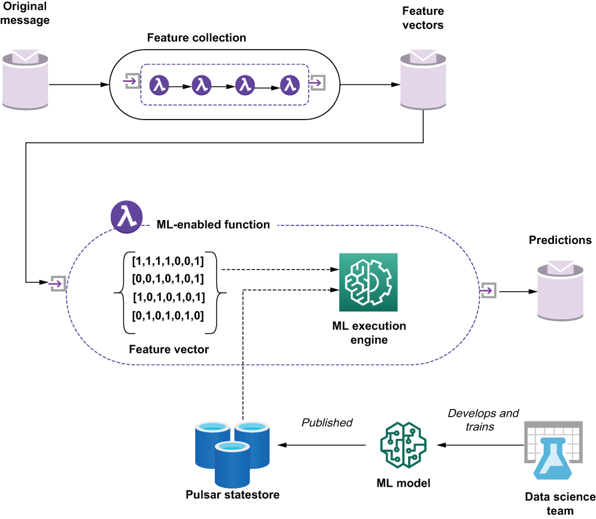

## 11.2 Near real-time model deployment

Because there are so many ML frameworks, and everything is evolving so quickly, I have decided to present a generic solution that provides all the essential elements required to deploy an ML model within a Pulsar Function. Pulsar Function’s broad programming language support enables you to deploy ML models from a variety of frameworks, provided there is a third-party library that supports the execution of those models. For instance, the existence of a Java library for TensorFlow allows you to deploy and execute any ML models that were developed using the TensorFlow toolkit. Similarly, if your ML model relies on the pandas library written in Python, you can easily write a Python-based Pulsar function that includes the pandas library. Regardless of the language of choice, the deployment of a near real-time model within a Pulsar function follows the same high-level pattern.

As you can see from figure 11.1, there is a sequence of one or more Pulsar functions that are responsible for the collection of data required by the feature vector of the model from external data sources based on the original message. This acts as a sort of data enrichment pipeline that augments the incoming data from the message with additional data elements that are needed by the ML model. In the delivery time estimation example, we might only be given the ID of the restaurant that is preparing the order. This pipeline would then be responsible for retrieving the geographical location of that restaurant so it can be given to the model.

Figure 11.1 The original message that necessitates the need for a prediction is enriched with a sequence of ancillary Pulsar functions to produce a feature vector suited for the ML model. The ML-enabled function can then further populate the feature vector with data from other low-latency data sources before sending it along with the ML model it retrieves from Pulsar’s internal state store to the ML execution engine for processing.

Once this data is collected, it is fed into the Pulsar function that will invoke the ML model using a third-party library to execute the model with the proper framework (e.g., TensorFlow, etc.). It is worth noting that the ML model itself is retrieved from the Pulsar function context object, which allows us to deploy the model independently of the function itself. This decoupling of the model from the packaged and deployed Pulsar function provides us the opportunity to dynamically adjust our models on the fly, and, more importantly, allows us to change models based on external factors and conditions.

For example, we might require an entirely different delivery time estimation model for high-volume periods, such as lunch and dinner, than for non-peak hours. An external process would then be used to rotate in the proper model for the current time. In fact, the data science team could train the same model with time-specific datasets to produce different models based on the time of day or day of the week. For instance, training the time-estimation model with data from only 4-5 p.m. could produce a model for that specific timeframe.

The ML-enabled function then sends the completed feature vector along with the correct version of the ML model that it retrieved from Pulsar’s internal state store to the ML execution engine (e.g., a third-party library), which produces both a prediction and an associated level of confidence in the prediction. For instance, the engine might produce a prediction of an ETA of seven minutes with an 84% degree of confidence. This information can then be used to provide an estimated time of arrival to the customer that placed the order.

While your Pulsar function might differ based on the ML framework you are using, the general outline remains the same. First, get the ML model from Pulsar’s state store, and keep a copy in memory. Next, take the incoming precomputed features from the incoming message and map them to the expected input fields of the feature vector. Compute and/or retrieve any additional features that weren’t already precomputed, and then call the ML library for your programming language to execute the model with the given dataset and publish the result.
