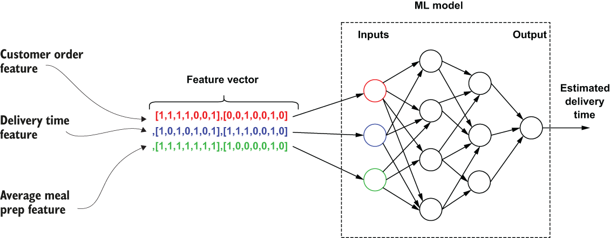

## 11.3 Feature vectors

In ML, the term *feature* refers to an individual numeric or symbolic property that represents a unique aspect of an object. These features are often combined into an *n*-dimensional vector of numerical features, or a *feature vector*, that is then used as an input to a predictive model.

Figure 11.2 The delivery time estimation model requires a feature vector comprised of features from multiple sources. Each feature is an array of numerical values between 0 and 1.

Every feature in the feature vector represents an individual piece of data that is used to generate the prediction. Consider the estimated time-to-delivery feature of the GottaEat food delivery service. Every time a user orders food from a restaurant, an ML model estimates when the food will be delivered. Features for the model include information from the request (e.g., the time of day or delivery location), historical features (e.g., the average meal prep time for the last seven days), and near real-time calculated features (e.g., the average meal prep time for the last hour). These features are then fed into the ML model to produce a prediction, as shown in figure 11.2. Many algorithms in ML require a numerical representation of features, since such representations facilitate processing and statistical analysis, such as linear regression. Therefore, it is common that each feature is represented as a numerical value, as it makes them useful across various ML algorithms.

## 子目录

- [11.3.1 Feature stores](<11.3-feature-vectors/11.3.1-feature-stores.md>)
- [11.3.2 Feature calculation](<11.3-feature-vectors/11.3.2-feature-calculation.md>)
