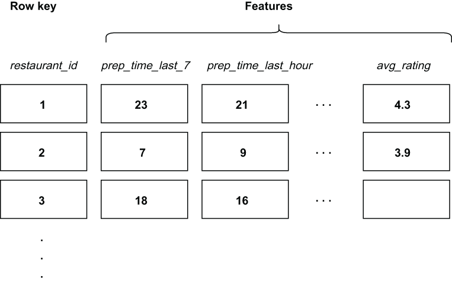

### 11.3.1 Feature stores

Models intended for deployment in near real-time mode have stringent latency requirements and cannot reliably be expected to compute features that require access to traditional data stores in a performant manner. You cannot consistently achieve sub-second query response times with a traditional relational database.

Therefore, it is necessary to establish ancillary processes to precompute and index these necessary model features. Once computed, these features should be stored in a low-latency datastore, known as a *feature store*, where they can be accessed quickly at prediction time, as shown in figure 11.3.

Figure 11.3 The restaurant feature store uses the unique restaurant_id field as the row key, and each row contains several features for each restaurant. Some of the features are specific to the delivery time estimation model, while others are not.

As I mentioned earlier, our feature store is kept inside a low-latency column-centric database, such as Apache Cassandra, which is designed to permit a large number of columns per row without incurring a performance penalty during the data retrieval process. This allows us to store features required by various ML models in the same table (e.g., delivery time estimation fields, such as average prep time, can be stored alongside features used by the restaurant recommendation model, such as the average customer rating). Consequently, we don’t need to maintain a separate table for each model we want to use (restaurant_time_delivery_features, etc.). Not only does this simplify the management of the feature store database, but it also promotes the usage of features across ML models.

In most organizations, the design of the tables within the feature store falls squarely on the data science team, since they are the primary consumers of the feature store. Therefore, you will often only be provided the ML model along with a list of the features it requires as input when your company is ready to roll out the model to production.
