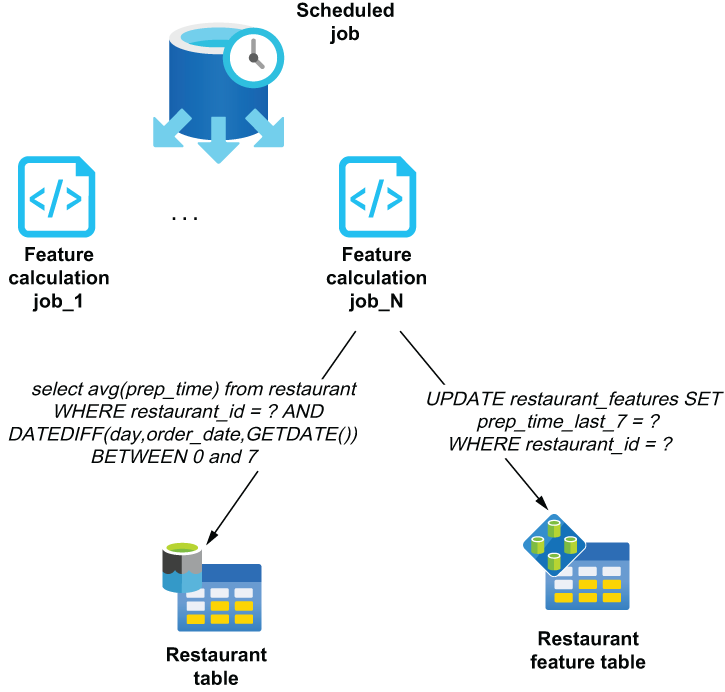

### 11.3.2 Feature calculation

Typically, features are associated with an entity type (restaurant, driver, customer, etc.) because each feature represents a “has a(n)” relationship with each particular entity—for instance, a restaurant has an average meal preparation time of 23 minutes, or a driver has an average customer review of 4.3 stars. The feature store is then populated via an ancillary process that precomputes the various features, such as the average meal prep time for the last seven days for every restaurant or the average delivery time in the city for the last hour.

These processes need to be scheduled to run periodically to cache the results in the feature store and ensure that these features can be retrieved with sub-second response times when the order arrives. A batch-oriented processing engine is best suited for performing the pre-calculation of the features, as it can process a large volume of data efficiently. For instance, a distributed query engine, such as Apache Hive or Spark, can execute multiple concurrent queries against a large dataset stored on HDFS, using standard SQL syntax, as shown in figure 11.4. These jobs can asynchronously compute the average meal prep time for all restaurants over a specific period of time and can be scheduled to run hourly to keep these features up to date.

As you can see in figure 11.4, a scheduled job can kick off multiple concurrent tasks to complete the work in a timely manner. For example, the scheduled job could first query the restaurant table itself to determine the exact number of restaurant IDs, and then split the work by providing each instance of the restaurant feature calculation job with a subset of restaurant IDs. This divide-and-conquer strategy will speed up the process considerably, allowing you to complete the work in a timely manner.

 

Figure 11.4 Feature calculation jobs will need to run periodically to update the features with new values based on the most recent data. A batch processing engine, such as Apache Hive or Spark, allows you to process many of these jobs in parallel.

It is also important that you coordinate with the proper team(s) to develop, deploy, and monitor these feature calculation jobs, as they are now business-critical applications that need to work continuously, or else the predictions made by your ML models will degrade if the feature data is not updated in a timely manner. Using stale data in your ML models will result in inaccurate predictions, which can lead to poor business outcomes and dissatisfied customers.
