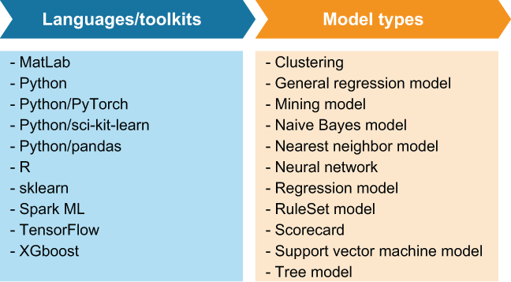

### 11.4.1 ML model export

Just like most data science teams, the data science team at GottaEat uses a variety of languages and frameworks to develop their ML models. One of the biggest challenges is finding a single execution framework that supports the models developed in different languages.

Fortunately, there several projects seeking to standardize ML model formats to support separate languages for model training and deployment. Projects such as the Predictive Model Markup Language (PMML) allow data scientists and engineers to export ML models developed from a variety of languages into a language-neutral XML format.

Figure 11.5 A list of programming languages, toolkits, and ML model types supported by the PMML. Any supported models developed in these languages can be exported to PMML and executed inside a Pulsar function.

As you can see from figure 11.5, the PMML format can be used to represent models developed in a variety of ML languages. Consequently, this approach can be used on any of the supported model types developed in one of the supported languages and/or frameworks.

In the case of the delivery time estimation model, the data science team used the R programming language to develop and train this model. However, since there isn’t direct support for running R code inside Pulsar Functions, the data science team must first translate their R-based ML model into the PMML format, which can easily be accomplished using the r2pmml toolkit, as shown in the following listing.

Listing 11.1 Exporting an R-based model to PMML

  // Model development code\
 \
  dte \<-(distance ~ ., data = df)                   ❶\
  \
  library(r2pmml)                                   ❷\
  r2pmml(dte, "delivery-time-estimation.pmml");     ❸

❶ Finalize the development of the ML model.

❷ Import the library that translates the R model into PMML.

❸ Perform the translation from R to PMML.

The r2pmml library does a direct translation of the R-based model object into the PMML format and saves it to a local file named delivery-time-estimation.pmml. The PMML file format specifies the data fields to use for the model, the type of calculation to perform (regression), and the structure of the model. In this case, the structure of the model is a set of coefficients, which is defined as shown in the following listing. We now have a model specification that we are ready to productize and apply to our production data set to generate delivery time predictions.

Listing 11.2 The delivery time estimation model in PMML format

\<?xml version="1.0" encoding="UTF-8" standalone="yes"?\>\
\<PMML version="4.2" xmlns="http://www.dmg.org/PMML-4_2"\>\
    \<Header description="deliver time estimation"\>\
       \<Application name="R" version="4.0.3"/\>\
       \<Timestamp\>2021-01-18T15:37:26\</Timestamp\>\
    \</Header\>\
    \<DataDictionary numberOfFields="4"\>\
       \<DataField name="distance" optype="continuous" dataType="double"/\>\
       \<DataField name="prep_last_hour" optype="continuous"  \
         dataType="double"/\>\
       \<DataField name="prep_last_7" optype="continuous" dataType="double"/\>\
            ...\
    \</DataDictionary\>\
    \<RegressionModel functionName="regression"\>\
      \<MiningSchema\>\
        \<MiningField name="distance"/\>\
            ...\
      \</MiningSchema\>\
      ...\
      \<NumericPredicitor name="travelTime" coefficient="7.6683E-4"/\>\
      \<NumericPredicitor name="avgPreptime" coefficient="-2.0459"/\>\
      \<NumericPredicitor name="avgDeliveryTime" coefficient="9.4778E-5"/\>\
            ..\
  \</RegressionModel\>\
\</PMML\>

Once the trained model has been exported to PMML, a copy of it should be published to the Pulsar state store so the Pulsar Function can access it at runtime. This can be accomplished by using the pulsar-admin putstate command, as shown in listing 11.3, which uploads the given file to a specified namespace inside Pulsar’s state store. It is critically important that the namespace be the same as the one you will use to deploy the Pulsar function that will be using the model in order for it to have read access to the PMML file.

Listing 11.3 Upload machine learning model to Pulsar’s state store

./bin/pulsar-admin functions putstate \\                               ❶\
  --name MyMLEnabledFunction \\\
  --namespace MyNamespace \\\
  --tenant MyTenant \\                                                 ❷\
  --state "{\\key\\:\\ML-Model\\, \
       \\byteValue\\: \<contents of delivery-time-estimation.pmml \>}"   ❸

❶ Using the pulsar-admin CLI tool to upload the PMML file

❷ You need to specify the correct tenant, namespace, and function name.

❸ Upload the contents of the generated PMML file.

Having the ability to automatically push model changes to production fits nicely within the emerging field of machine learning operations (ML ops), which applies the agile principles of continuous integration, delivery, and deployment to the ML process to accelerate and simplify ML model deployment. In this case, we use a script or CI/CD pipeline tool to check out the latest version of a model from source control and upload it to Pulsar using a simple shell script. Additionally, ancillary jobs can be scheduled to rotate different versions of the same model automatically based on a factor such as the time of day.
