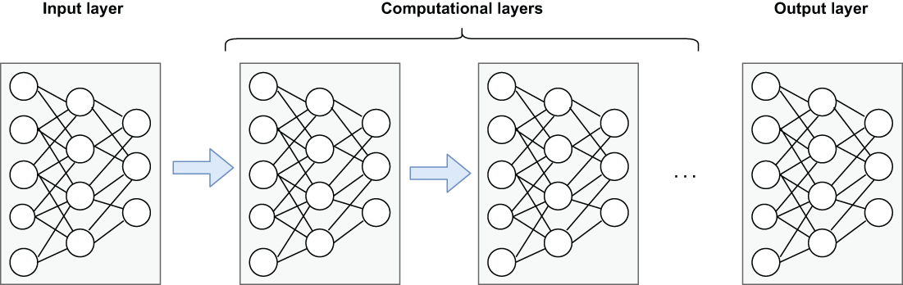

## 11.5 Neural nets

While the PMML format is very flexible and supports a wide variety of languages and ML models, there are instances when you will need to deploy an ML model that isn’t supported by PMML. Neural net models, which can be used to solve a variety of business problems, such as sales forecasting, data validation, or natural language processing, cannot be represented as PMML, and therefore a different approach is required for them to be deployed in near real-time mode.

Modeled loosely on the human brain, a neural net consists of thousands or even millions of artificial neurons (nodes) that are interconnected. Most of today’s neural nets are organized into multiple layers of nodes, as shown in figure 11.6. Each node gets weighted input data that is fed into the computing node function and outputs the result of the function to the subsequent layer in the network. The data is fed forward through the network until a single value is produced.

Figure 11.6 A neural net is comprised of an input layer, an output layer, and any number of hidden computational layers. The term deep learning refers to a neural network that is several computational layers deep.

The basic concept of layering is that each additional layer of the network increases the accuracy of the model itself. In fact, the term *deep learning* refers to the use of neural nets that are several layers deep. In this section, I will demonstrate the process of training and deploying a neural net using the popular high-level neural network API known as Keras, which is written in Python.

## 子目录

- [11.5.1 Neural net training](<11.5-neural-nets/11.5.1-neural-net-training.md>)
- [11.5.2 Neural net deployment in Java](<11.5-neural-nets/11.5.2-neural-net-deployment-in-java.md>)
