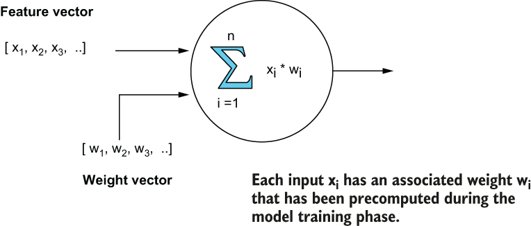

### 11.5.1 Neural net training

Neural nets are designed to recognize patterns in data, and they learn to do this by analyzing large training datasets. The process of training a neural net involves using a training dataset to determine the proper model weights for each node in the network. The training sets are often labelled, so the expected outputs are known in advance, and then the weights are adjusted until the model produces the expected results. Therefore, it is important to remember that these weights are critical to the performance and accuracy of the models.

The first step is to train a model using the Keras library in Python using your training data, as shown in listing 11.8. The input to the model shown is ten binary features that describe the various features of a food order, such as average order price of the customer, the distance between the customer’s home address and the delivery address of the order, and other features. The output is a single variable that describes the probability that the order is fraudulent.

Listing 11.8 Training the neural net using Python

import keras\
from keras import models, layers                         ❶\
\# Define the model structure\
model = models.Sequential()                              ❷\
model.add(layers.Dense(64, activation='relu', input_shape=(10,)))\
...\
model.add(layers.Dense(1, activation='sigmoid'))\
model.compile(optimizer='rmsprop',loss='binary_crossentropy',\
              metrics=\[auc\])\
 \
history = model.fit(x, y, epochs=100, batch_size=100,\
                    validation_split = .2, verbose=0)    ❸\
 \
model.save("games.h5")                                   ❹

❶ Use the Keras libraries.

❷ Define the model structure.

❸ Compile and fit the model.

❹ Save the model in H5 format.

As you can see in figure 11.7, each node inside a neural net takes in a feature vector as input along with a set of weights associated with each feature. These weights allow us to assign more importance to some features than to others when generating our prediction, such as the distance between the delivery address of the order and the customer’s home address. If that feature is a good indicator of a fraudulent transaction, then it should have a higher weight. The process of training and fitting the model yields a set of optimal weights for each input node in the neural net.

Figure 11.7 Each node in the neural net takes a feature vector as input along with a precomputed set of weights that are associated with each feature. These weights are calculated during the model training phase and are critical to the accuracy of the neural net.

Once the model has been properly trained (i.e., you have calculated the optimal weights for each input node) and is ready to deploy, you can save it in a specialized Keras-specific format known as *H5*. This format retains the complete models, including the architecture, weights and training configuration, whereas Keras models exported to JSON format only contain the model architecture but *not* the calculated weights. Therefore, be sure to always use the H5 format when exporting your Keras-based neural nets.
