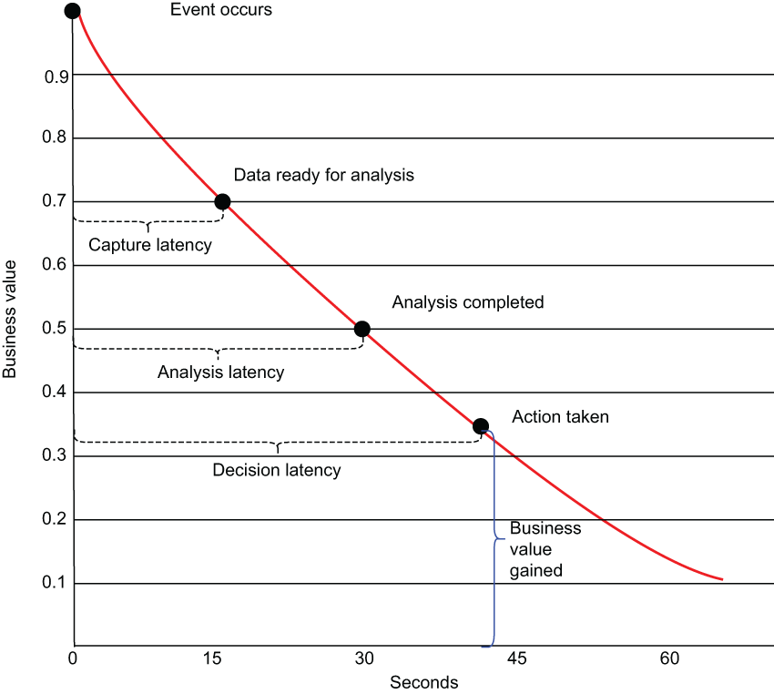

# 12 Edge analytics

This chapter covers

- Using Pulsar for edge computing

- Using Pulsar to perform edge analytics

- Performing anomaly detection on the edge using Pulsar Functions

- Performing statistical analytics on the edge using Pulsar Functions

If you are like most people, when you hear the term the *Internet of Things* (IoT), you tend to think of smart thermostats, internet-connected refrigerators, or personal data assistants, such as Alexa. While these consumer-oriented IoT devices tend to get a lot of attention, there is a subset of IoT called the *industrial internet of things* (IIoT), which focuses on the use of sensors that are connected to machinery and vehicles within the transport, energy, and industrial sectors. Companies use the information collected from sensors that are physically embedded inside industrial equipment to monitor, automate, and predict all kinds of industrial processes and outcomes.

The data collected from these IIoT sensors has several practical applications, including monitoring tens of thousands of miles of remote industrial equipment within the energy industry to ensure that there are no imminent failures that could lead to a catastrophic event resulting in a large environmental impact. Sensor data can also be gathered from non-stationary IIoT sensors, such as in a large fleet of refrigerated tractor trailers used to distribute a vaccine that must be kept below a certain temperature in order to remain effective across the globe. These sensors allow us to detect a gradual warming within any given refrigeration unit and reroute the cargo to a nearby maintenance facility for repairs.

In such a situation, it is important that we detect the change in temperature within the refrigeration units as soon as possible so we can react in time to preserve the heat-sensitive cargo. If we waited until the cargo arrived at its intended destination before we checked the temperature, it would be too late, and the vaccine would be useless. This phenomenon is often referred to as the diminishing time value of data, since the value obtained from the information is at its highest point immediately after the event occurs, and it rapidly diminishes over time. In the case of the refrigeration unit failure, the sooner we can react to that information, the better. If we are unaware of the failure for hours, the cargo is most likely going to spoil, and the information will no longer be actionable because it will be too late to do anything about it. As you can see in figure 12.1, the longer the response time to such a catastrophic event, the less impact any remedial action will have on the system.

Figure 12.1 The value of any piece of information diminishes rapidly over time, and the goal of edge computing is to reduce the overall decision latency by eliminating the capture latency produced by transmitting the data from the sensor to the cloud for analysis.

The amount of time between when an event occurs and when a corresponding action is taken in response is known as the decision latency and is comprised of two components: the *capture latency*, which is the amount of time required to transfer the data to your analysis software, and the *analysis latency*, which is the amount of time required to analyze the data to determine what action to take.

From a technological perspective, the IIoT provides the same basic capability as any other “smart” consumer IoT device, which refers to the automated instrumentation and reporting capabilities of physical devices that previously did not have those capabilities. For example, the defining characteristic of a “smart” thermostat is that it can communicate its current reading and be adjusted remotely via a smartphone app. That being said, the scale of a typical IIoT deployment is significantly larger than a simple system that lets you adjust your thermostat from your phone.

With potentially millions of sensors spread across a single factory plant floor or a large fleet of tractor trailers, each of which is producing a new metric every second, one can easily see that these IIoT datasets are both high volume and high frequency. A common approach to processing these datasets is to collect all of the individual data elements, transfer them to the cloud, and use traditional SQL-based data analysis tools, such as Apache Hive, or more traditional data warehouses. This ensures that the analysis is done on a complete dataset from all of the sensors, so any inter-sensor reading relationships can be observed and used for analysis (e.g., the correlation between a temperature sensor and the overall plant humidity from a different sensor can be tracked and analyzed).

However, this approach has some serious disadvantages, such as significant decision latency (the time between when the event occurred and when it gets processed), cost inefficiencies associated with having to provision sufficient network bandwidth and computing resources to process such large datasets, and the storage cost of retaining all of this information.

From a practical perspective, the amount of the time required to transfer data from most IIoT platforms to a cloud computing environment for analysis makes it nearly impossible to perform any real-time reaction to a potentially catastrophic event. While some of the most dramatic examples of such an event include the detection of faults in power plants or airplanes before they explode or crash, the speed of data analysis in most IIoT applications is critical as well.

In order to overcome this limitation, some of the data processing and analysis of IIoT data can be performed on infrastructure that is physically located closer to the source of the data itself. Bringing computation closer to the source of the data decreases the capture latency and allows applications to respond to data as it’s being created almost instantaneously rather than having to wait for the information to be transmitted over the internet before processing it. This practice of processing data near the edge of the network where the data is being generated, instead of in a centralized data collection point such as a data center or cloud, is often referred to as *edge computing*.

In this chapter, I’ll demonstrate how we can deploy Pulsar Functions inside an edge computing environment to provide near real-time data processing and analysis to react more quickly to events within an IIoT environment and minimize the decision latency between the time a high-value event is perceived and when the appropriate response is made.

## 子目录

- [12.1 IIoT architecture](<12-edge-analytics/12.1-iiot-architecture.md>)
- [12.2 A Pulsar-based processing layer](<12-edge-analytics/12.2-a-pulsar-based-processing-layer.md>)
- [12.3 Edge analytics](<12-edge-analytics/12.3-edge-analytics.md>)
- [12.4 Univariate analysis](<12-edge-analytics/12.4-univariate-analysis.md>)
- [12.5 Multivariate analysis](<12-edge-analytics/12.5-multivariate-analysis.md>)
- [12.6 Beyond the book](<12-edge-analytics/12.6-beyond-the-book.md>)
- [Summary](<12-edge-analytics/summary.md>)
