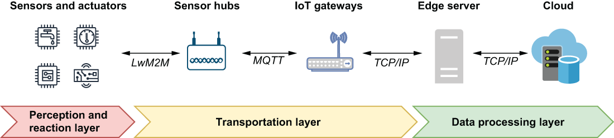

## 12.1 IIoT architecture

An IIoT platform acts as a bridge between the physical world of industrial equipment and the computational world of automated control systems used to monitor and react to it. As such, one of the primary goals of any IIoT system is the collection and processing of the data generated by all of the physical sensors distributed across various pieces of industrial equipment. While every IIoT deployment is different, they are all comprised of the three logical architectural layers, shown in figure 12.2, which play an important role in the data acquisition and analysis process.

Figure 12.2 The three logical layers of an IIoT architecture ingest data, analyze it, and then present the information so that can be used by humans or by autonomous systems for making contextually relevant decisions in real time.

Within an IIoT environment, there can be millions of sensors, controllers, and actuators distributed across various pieces of industrial equipment within a single factory location. All of these sensors and devices collectively form what is commonly referred to as the *perception and reaction layer* because they allow us to perceive what is going on within the physical world.

## 子目录

- [12.1.1 The perception and reaction layer](<12.1-iiot-architecture/12.1.1-the-perception-and-reaction-layer.md>)
- [12.1.2 The transportation layer](<12.1-iiot-architecture/12.1.2-the-transportation-layer.md>)
- [12.1.3 The data processing layer](<12.1-iiot-architecture/12.1.3-the-data-processing-layer.md>)
