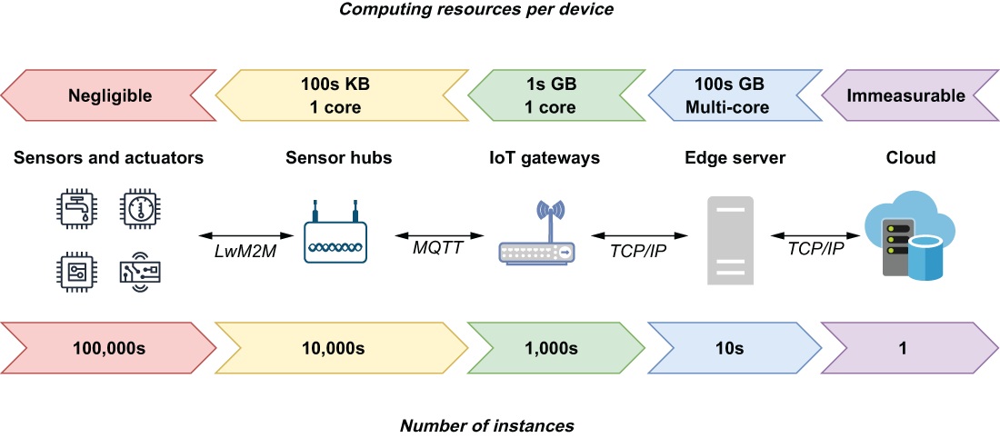
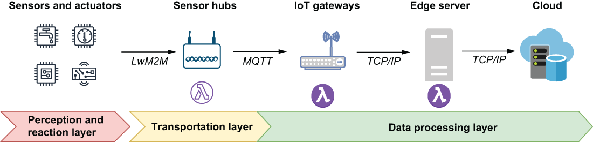
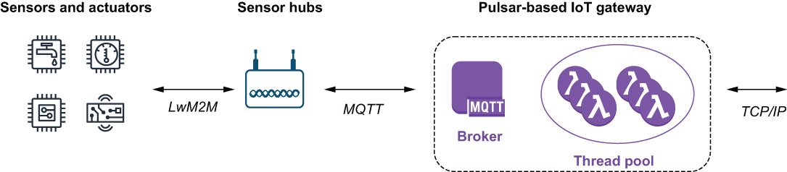

## 12.2 A Pulsar-based processing layer

Now that we have a basic understanding of an IIoT architecture, I want to demonstrate how we can use Apache Pulsar to enhance the processing capabilities of the architecture by extending the data processing layer in closer proximity to the sensors and actuators than in a traditional IIoT setting. First, let’s review the computing resources that are available on each of the hardware devices within the IIoT platform. As you can see, figure 12.3 shows that there is an inverse relationship between the available computing resources and their proximity to the industrial equipment. The sensors, actuators, and other smart devices located within the perception and reaction layer are microcontroller based with limited memory and processing power. They are primarily battery operated and, therefore, are not good candidates for performing any sort of computation. While these wireless devices can be augmented with energy-harvesting devices that convert ambient energy into electrical energy, their power is best reserved for wireless communication with the sensor hubs rather than for computation.

Figure 12.3 There is an inverse relationship between the number of devices deployed at each layer and the computing resources found within each device.

Sensor hubs are typically hosted on slightly larger devices, referred to as *systems on a chip* (SoCs), that can have some or all of the components of a traditional computer, including a CPU, RAM, and external storage, although at a smaller scale. But given the sheer number of these devices, their specifications are kept to a minimum to be economically feasible to deploy in large number. Since these devices are primarily used to receive and transmit data, they only require a limited amount of memory to buffer the messages before retransmitting them over a different protocol.

IoT gateways are also hosted on SoC hardware with one of the most popular platforms for these devices being the Raspberry Pi, which can have up to 8 GB of RAM, a quad-core CPU, and one MicroSD card slot for up to one terabyte (1 TB) of storage. These devices can also run traditional operating system software, such as Linux, which makes them an ideal candidate for running complex software applications, such as Pulsar.

The last physical piece of hardware is edge servers, which are an optional feature within the IIoT architecture. Depending on the nature of the industrial environment, these devices can range in size from multiple servers with terabytes of RAM, multiple cores, and terabytes of disk storage residing inside a server closet on a factory floor, to a single desktop computer on a remote drilling site. Just like the IoT gateways, devices at this layer run more traditional operating systems and resemble what most people think of when using the term *computer*.

From a computing perspective, any device that has sufficient computing resources (8 GB of RAM and a multi-core x86 CPU) to run a traditional operating system and an internet connection is a potential hardware platform for hosting a Pulsar broker. Within an IIoT architecture, this would include not only the edge servers and the IoT gateway devices, but also any sensor hub that is running on a sufficiently equipped SoC device as well.

Installing a Pulsar broker on these devices enables us to deploy Pulsar functions directly on them to perform the analysis much closer to the source of the data. Doing so effectively extends the data processing layer closer to the origin of the sensor data, as shown in figure 12.4. We are effectively extending the edge closer to the industrial equipment, and doing so creates a large distributed computational framework where Pulsar functions can be deployed across two tiers of the architecture to perform parallel computation on the data.

 

Figure 12.4 By installing Pulsar brokers on the IoT gateways and edge servers, we can extend the data processing layer closer to the source of the data itself, which will enable us to react to it much quicker.

The key takeaway from this is the fact that we can deploy our Pulsar functions on any of the devices inside the IIoT environment that are capable of hosting a Pulsar broker and have them perform complex data analysis on the edge, rather than just collecting the events and forwarding upstream for processing, as is done in a more traditional IIoT environment.

To be fair, some IIoT vendors do provide software packages that can be used to process data on IoT gateway devices as well, but the features are typically limited to more rudimentary capabilities, such as filtering and aggregation. Furthermore, these software packages are closed source and do not allow for you to extend the framework to add your own data processing functions. However, with Pulsar Functions, you can easily create and use your own functions to perform more complex data analysis.

It is also worth noting that Apache Pulsar provides support for the MQTT protocol via a plugin, which allows devices using the MQTT protocol, such as the sensor hubs, to publish messages directly to a topic on a Pulsar broker. This allows us to use Pulsar as an IoT gateway device without the need for another piece of software to act as the MQTT message broker to consume and process the sensor data directly on the gateway itself, as you can see in figure 12.5. A Pulsar-based IoT gateway supports bidirectional communications over the MQTT protocol, which allows the Pulsar functions to send messages to the actuators in response to potentially catastrophic events they detect.

Figure 12.5 The complete functionality of an IoT gateway can be performed using a Pulsar broker that has the MQTT plugin enabled, which allows it to receive messages from the sensor hubs, while the Pulsar functions can be administered via the TCP/IP connection.

The TCP/IP connection not only enables users to deploy, update, and administer Pulsar Functions directly on the IoT gateway device, but it also allows the Pulsar broker to communicate with an Apache BookKeeper-based storage layer hosted in a remote location. Last, and certainly not least, the TCP/IP connection allows us to communicate with other Pulsar clusters within the IIoT architecture—particularly ones that have been deployed on the edge servers. This allows us to forward data generated on all of the IoT gateways up to a centralized location for additional edge processing before finally being sent to the cloud for archival.
