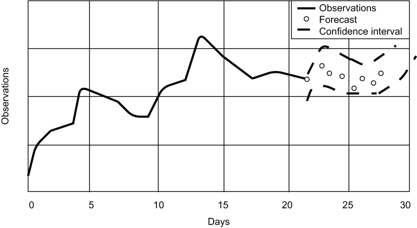

### 12.3.1 Telemetric data

In order to get a better understanding of the term *edge analytics* and what we are trying to accomplish by performing some of the data analysis on the edge, it is best to start with a basic understanding of the type of data we are processing in an IIoT environment. The overarching function of any IIoT system is the collection of sensor data so it can be used to monitor and manage the company’s industrial infrastructure. Once the data is collected, it can then be analyzed for any potential events of interest that might need to be addressed.

These sensors are constantly emitting a stream of observations obtained through repeated measurements of the same variable over time, such as a sensor that sends the temperature reading of a specific piece of equipment every second. These sequences of numerical data points taken at fixed intervals in chronological time order are referred to as time-series data. The entire process of collecting this time-series information in the form of measurements or statistical data and forwarding it to remote systems is often referred to as *telemetry*. Like nearly all time-series datasets, this telemetric data will often have one or more of the following characteristics:

- *Trend*—When referring to the *trend* in time series data, we are referring to the fact that the data has a pronounced trajectory in one direction (either up or down) over a specified timeframe. A good example of a trend would be a steady long-term increase in network traffic.

- *Cycles*—Repeating and predictable fluctuations in the data that are not at a fixed frequency and, thus, cannot be correlated to any specific time period or interval.

- *Seasonality*—If there are regular and predictable cycles within the data that are correlated with the calendar (e.g., daily, weekly, etc.), the data has a seasonality characteristic. This differs from a trend because the cycle fluctuates for a short period of time and is usually driven by outside factors, such as a spike in network traffic to a popular e-commerce site during Cyber Monday.

- *Noise*—This refers to randomness in the data points that cannot be correlated with any explained trends. Noise is unsystematic and short-term, and needs to be filtered out to minimize its detrimental impact on our predictions. Consider a temperature sensor that has consistently reported a value of 200 degrees Fahrenheit over the past hour. Any sensor reading that is significantly different than the previous values we have received is most likely just noise and should be ignored. For instance, a single sensor reading of 25 degrees Fahrenheit is mostly likely not an accurate reading and should be ignored.

Figure 12.6 Time series forecasting is the use of time-series data to predict future values based on previously observed values.

In the context of IIoT, edge analytics are used to detect these characteristics of the data so they can then be used to predict future values based on previously observed values, as shown in figure 12.6. The real observed values can then be compared to the predicted values to determine whether some sort of action needs to be taken. For instance, if a pressure reading is trending downward, this might indicate a loss of pressure in the line, and a maintenance team should be dispatched to investigate.
