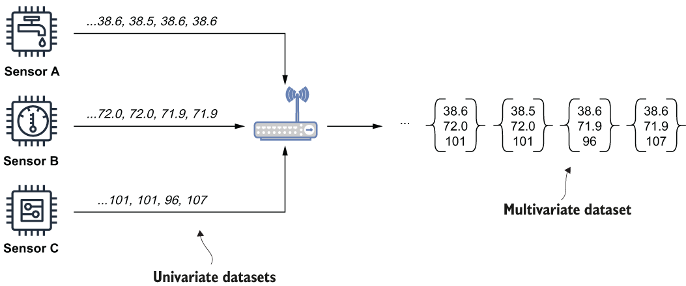

### 12.3.2 Univariate and multivariate

The other aspect of telemetric datasets is the number of variables that are being tracked within them. The most common scenario is when the data contains a set of observations of a single variable (e.g., the readings from the exact same sensor). The more formal term for this type of dataset is *univariate*, and for our purposes we will assume that all of the datasets collected at the IoT gateway layer are univariate. As you may have guessed, any dataset that tracks more than one variable is known as *multivariate* and allows us to track the relationship between multiple sensor readings over the same timeframe. Rather than containing a single value at a given point in time, these datasets contain several values. Within a Pulsar-enabled IIoT architecture, multivariate datasets are generated using Pulsar Functions by combining several univariate datasets together, as shown in figure 12.7, where the values from each sensor taken at the same time are combined into a tuple of three values.

Figure 12.7 Each sensor emits a sequence of readings at a predetermined interval. Upon receipt on the IoT gateway, these univariate datasets are combined into a multivariate dataset that contains the values of all three sensors at a given point in time. This allows us to detect patterns and correlations between these sensor values.

Multivariate datasets can be used to perform more complex and accurate analysis by including data from multiple sources that is strongly correlated. Since there is no limit to the number of variables that can be contained within these datasets, any number of readings may be combined as needed. In fact, these datasets are well suited to serve as feature stores for any ML model you wish to deploy on the edge. As you may recall from chapter 11, feature stores contain a set of precalculated values required by ML models. These feature sets are populated by external processes that rely on historical data to calculate the values. In a Pulsar-enabled IIoT environment, these multivariate datasets are populated from the univariate datasets being collected on the edge, which ensures that your ML models are using the most-recent data to make their predictions.
