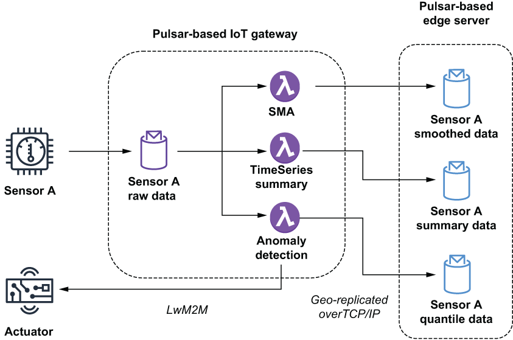

## 12.4 Univariate analysis

The endless streams of readings taken from the same sensor are the foundation of edge analytics. These univariate datasets represent the raw data used to perform the analysis of the IIoT data as a whole. Therefore, it is best to start by covering the type of analysis that can be performed on these univariate datasets. A summary of the various types of analytic processing commonly performed is depicted in figure 12.8.

Figure 12.8 The sensor publishes its readings to the Sensor A Raw Data topic that is used as input to three Pulsar functions. Two of the functions, SMA and TimeSeriesSummary, use the values to compute statistical values from the raw data before publishing these statistics to local topics that are configured to be geo-replicated to the Pulsar cluster running on the edge server. The third function determines whether the sensor value is anomalous and should activate an actuator in response to any potentially catastrophic event it detects.

This processing is accomplished using Pulsar functions deployed on the IoT gateways closest to the source of the data. Therefore, it is important that these functions minimize the amount of memory and CPU required to perform their analysis.

## 子目录

- [12.4.1 Noise reduction](<12.4-univariate-analysis/12.4.1-noise-reduction.md>)
- [12.4.2 Statistical analysis](<12.4-univariate-analysis/12.4.2-statistical-analysis.md>)
- [12.4.3 Approximation](<12.4-univariate-analysis/12.4.3-approximation.md>)
