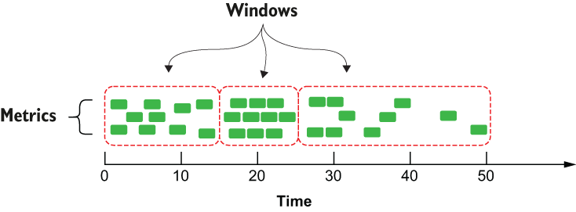
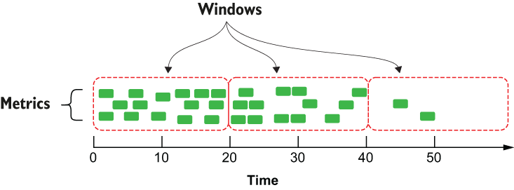

### 12.4.2 Statistical analysis

Moving averages aren’t the only meaningful statistic that can be calculated from univariate datasets. In fact, it is quite easy to calculate just about any of the statistics that are commonly used in statistical analysis using a Pulsar function. Take, for example, the function code shown in the next listing, which computes the following statistics in a single function: geometric mean, population variance, kurtosis, root mean square deviation, skewness, and standard deviation.

Listing 12.2 A Pulsar function to calculate multiple statistics

import org.apache.commons.math3.stat.descriptive.DescriptiveStatistics;\
import org.apache.commons.math3.stat.descriptive.SummaryStatistics;\
import org.apache.commons.math3.stat.regression.\*;                        ❶\
import org.apache.pulsar.functions.api.Context;\
import org.apache.pulsar.functions.api.Function;\
 \
public class TimeSeriesSummaryFunction implements \
  Function\<Collection\<Double\>, SensorSummary\>  {\
 \
   @Override\
    public SensorSummary process(Collection\<Double\> input, Context context) \
      throws Exception {                                                  ❷\
 \
      double\[\]\[\] data = convertToDoubleArray(input);                      ❸\
     SimpleRegression reg = calcSimpleRegression(data);\
     SummaryStatistics stats = calcSummaryStatistics(data);\
     DescriptiveStatistics dstats = calcDescriptiveStatistics(data);\
      double rmse = calculateRSME(data, reg.getSlope(), reg.getIntercept());\
        \
    SensorSummary summary = \
      SensorSummary.newBuilder()\
        .setStats(TimeSeriesSummary.newBuilder()\
          .setGeometricMean(stats.getGeometricMean())                     ❹\
             .setKurtosis(dstats.getKurtosis())\
             .setMax(stats.getMax())\
             .setMean(stats.getMean())\
             .setMin(stats.getMin())\
             .setPopulationVariance(stats.getPopulationVariance())\
             .setRmse(rmse)\
             .setSkewness(dstats.getSkewness())\
             .setStandardDeviation(dstats.getStandardDeviation())\
             .setVariance(dstats.getVariance())\
             .build())\
      .build();\
        \
      return summary;\
    }\
    \
    private SimpleRegression calcSimpleRegression(double\[\]\[\] input) {\
      SimpleRegression reg = new SimpleRegression();\
      reg.addData(input);\
      return reg;\
    }\
    \
    private SummaryStatistics calcSummaryStatistics(double\[\]\[\] input) {\
      SummaryStatistics stats = new SummaryStatistics();\
      for(int i = 0; i \< input.length; i++) {\
        stats.addValue(input\[i\]\[1\]);            \
      }\
      return stats;\
    }\
    \
    private DescriptiveStatistics calcDescriptiveStatistics(double\[\]\[\] in)\
 {\
      DescriptiveStatistics dstats = new DescriptiveStatistics();\
      for(int i = 0; i \< in.length; i++) {\
         dstats.addValue(in\[i\]\[1\]);            \
      }\
      return dstats;\
    }\
    \
    private double calculateRSME(double\[\]\[\] input, double slope, double intercept) {\
      double sumError = 0.0;\
      for (int i = 0; i \< input.length; i++) {\
        double actual = input\[i\]\[1\];\
        double indep = input\[i\]\[0\];\
        double predicted = slope\*indep + intercept;\
                sumError += Math.pow((predicted - actual),2.0);\
                }\
            return Math.sqrt(sumError/input.length);\
    }\
 \
        private double\[\]\[\] convertToDoubleArray(Collection\<Double\> in) \
          throws Exception {\
            double\[\]\[\] newIn = new double\[in.size()\]\[2\];\
            int i = 0; \
            for (Double d : in) {\
                newIn\[i\]\[0\] = i;\
                newIn\[i\]\[1\] = d;\
                i++;\
            }\
            return newIn;\
        }    \
    }

❶ This function relies on external libraries to perform the statistical calculations.

❷ The input collection contains all of the sensor readings within the specified window.

❸ Convert the data from a collection to a two-dimensional array.

❹ Use the various computed statistics to populate the result.

Obviously, these statistics cannot be computed from a single data point in the time-series data, but rather need to be computed from a larger collection of data elements. Attempting to calculate the geometric mean of a single number makes no sense. Therefore, we need to specify a strategy for splitting the endless stream of metric data into finite sets of data, known as *windows*, which we will use to calculate these statistics. So how do we go about defining the boundaries of a data window? Within Pulsar Functions, there are two policies used to control window boundaries:

- *Trigger policy*—Controls when our function code is executed. These are the rules that the Apache Pulsar Functions framework uses to notify our code that it is time to process all of the data collected in the window.

- *Eviction policy*—Controls the amount of data retained in the window. These are the rules used to decide if a data element should be retained or evicted from the window.

Both of these policies are driven by either time or the quantity of data in the window and can be defined in terms of time or length (number of data elements). Let’s explore the distinction between these two policies and how they work in concert with one another. While there are a variety of windowing techniques, the most prominent ones are tumbling and sliding windows.

Tumbling windows are contiguous, non-overlapping windows that are either of fixed-size, such as 100 elements, or taken at fixed intervals, such as every five minutes. The eviction policy for tumbling windows is *always* disabled to allow the window to become completely full. Therefore, you only need to specify the trigger policy you want to use as either count-based or time-based. Figure 12.9 shows the behavior of a tumbling window with a length-based trigger policy set to 10, which means that at the point in time at which 10 items are in the window, the Pulsar function code will be executed, and the window will be cleared. This behavior is irrespective of time; whether it takes five seconds or five hours for the window count to reach 10 items doesn’t matter—all that matters is when the count reaches the specified length. Therefore, the first window takes approximately 15 seconds to become full, while the last one requires 25 seconds to elapse before the window fills up.

Figure 12.9 When using a count-based trigger, each tumbling window will contain the exact same number of metrics, but may span different durations of time.

The sliding window technique, on the other hand, utilizes a combination of a trigger policy that defines the sliding interval and an eviction policy that limits the amount of data retained within the window for processing. Figure 12.10 shows the behavior of a sliding window with the eviction policy configured to be 20 seconds, meaning that any data older than 20 seconds will not be retained or used in the calculation. The trigger policy is also configured to be 20 seconds, which means that every 20 seconds the associated Pulsar function code will be executed, and we will have access to all of the data within the entire window length to perform our calculation.

Figure 12.10 When using a time-based sliding window, each window will span the exact same amount of time and will most likely contain different numbers of metrics.

Thus, in the scenario shown in figure 12.10, the first window contains 15 events, while the last one contains only two. In this example, both the eviction and trigger policies are defined in terms of time; however, it is also possible to define one or both of these in terms of length instead. Additionally, the window length and sliding interval don’t have to be the exact same value. For instance, if you wanted to perform the SMA using this technique, you could achieve that by setting the window length to 100 and the sliding interval to 1.

Once these statistical summaries have been calculated, they can be sent upstream to the edge servers to be compared to the stats computed for similar equipment within the industrial infrastructure to detect potential problems, or they could be forwarded to a database within the cloud for longer-term storage and future analysis. Performing the calculations before storing the data in the database will save us from having to recalculate these values during the analysis phase, which can be an expensive operation. Pulsar Functions provides the four different windowing configuration parameters shown in table 12.1, which enables you to implement all four variations of the windows discussed in this section when used in the proper combination.

Table 12.1 Configuring windowing for Pulsar functions

<table>
<colgroup>
<col style="width: 50%" />
<col style="width: 50%" />
</colgroup>
<tbody>
<tr>
<td>
Time-based tumbling window
</td>
<td>
—windowLengthDurationMS==xxx
</td>
</tr>
<tr>
<td>
Length-based tumbling window
</td>
<td>
—windowLengthCount==xxx
</td>
</tr>
<tr>
<td>
Time-based sliding window
</td>
<td>
—windowLengthDurationMS==xxx

—slidingIntervalDurationMs=xxx
</td>
</tr>
<tr>
<td>
Length-based sliding window
</td>
<td>
—windowLengthCount==xxx

—slidingIntervalCount=xxx
</td>
</tr>
</tbody>
</table>

Implementing either of these types of windowing functions in Pulsar Functions is straightforward and only requires that you specify a java.util.Collection as the input type. Therefore, if we wanted to run the Pulsar function shown in listing 12.2 to perform the statistic calculation on a sliding window of data, then all that we would have to do is submit it using the command shown in the following listing, and the Pulsar Functions framework would handle the rest for us.

Listing 12.3 Performing the statistical calculation on a sliding window of data

\$ bin/pulsar-admin functions create \\\
    --jar edge-analytics-functions-1.0.0.nar \\\
    --classname com.manning.pulsar.iiot.analytics.TimeSeriesSummaryFunction \\\
    --windowLengthDurationMS==20000 \\        ❶\
    --slidingIntervalDurationMs=20000.        ❷

❶ Defines an eviction policy of 20 seconds

❷ Defines a trigger policy of 20 seconds

This makes it easy to utilize either of these windowing techniques without having to write the significant amount of boilerplate code necessary to perform the collection and retention of the individual events. Instead, it allows you to write clean code that focuses solely on the business logic you are trying to implement.
