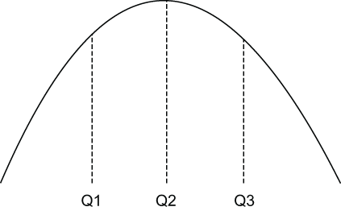

### 12.4.3 Approximation

When analyzing streaming data, there are certain types of queries that cannot be computed on the edge because they require huge amounts of both computing resources and time to generate exact results. Examples include count distinct, quantiles, most-frequent items, joins, matrix computations, and graph analysis. Therefore, these types of calculations are typically not performed on these streaming datasets at all. However, if an approximate answer will suffice, there is a specialized category of streaming algorithms for providing approximate values, estimates, and data samples for statistical analysis when the event stream is either too large to store in memory or the data is moving too fast to process.

These streaming algorithms utilize small data structures, known as sketches, which are usually only a few kilobytes in size, to store the information. Sketch-based algorithms perform *one-touch processing*, meaning they only need to read each element in the stream once. Both these properties make these algorithms ideal candidates for deployment on edge devices. There are four families of sketching algorithms, each focused on solving a different type of problem:

- *Cardinality sketches*—Provides approximate counts for each distinct value in the stream, such as the number of page views across a number of different web pages in a given timeframe.

- *Frequent item sketches*—Provides a list of the most frequently seen values in the stream, such as the top 10 web pages viewed in a given timeframe.

- *Sampling sketches*—Uses reservoir sampling to provide a uniform random sample of data from the stream that can be used for analysis.

- *Quantile sketches*—Provides a frequency histogram that contains information about the distribution of the data stream values that can be used for anomaly detection.

There is an open source library called Apache DataSketches that contains implementations of these algorithms in Java, which makes them easy to use inside a Pulsar function, such as the one shown in listing 12.4, which uses the quantile sketch to detect anomalies in the sensor data.

Quantiles

The word *quantile* is derived from the word *quantity* and simply refers to equal-sized groupings of something—typically a probability distribution or a series of observed values. You are already familiar with some of the more common quantiles that are referred to by their more common names, such as halves, thirds, quarters, etc. In statistics and probability, quantiles are more formally defined as cut points that divide a probability distribution into continuous, adjacent intervals with an equal number of elements.

For example, in figure 12.11 there are three values—Q1, Q2, and Q3—which splits the dataset into equally weighted sections. The areas under the graph between each of these points are the quantiles, in this case thirds, which contain an equal number of data points.

Figure 12.11 A dataset that is divided into three equal-sized sections known as quantiles. Values less than or equal to Q1 are considered part of the first quantile; values between Q1 and Q2 are part of the second quantile; and those greater than or equal to Q3 are part of the third quantile.

For our use case, we will be processing an endless stream of metric data values and using them to dynamically construct a quantile. This allows us to make our decisions based solely on the actual observed values when determining whether or not a value is anomalous by comparing it to previous values of the same metric. When a new metric reading comes into our Pulsar function, we will first add it to the quantile to update the distribution model, and then we will calculate the *rank* of the metric reading. The rank is best described as the proportion of values in the distribution that the given value is greater than or equal to. For instance, if a metric reading is higher than 79% of the previously observed values, then its rank would be 79. Ranking a value helps us determine whether a given metric reading is commonplace or not, and we have decided to use a configurable value to define the threshold that we consider anomalous.

Listing 12.4 A Pulsar function for anomaly detection

import org.apache.datasketches.quantiles.DoublesSketch;\
import org.apache.datasketches.quantiles.\
\[CA\]UpdateDoublesSketch;                                  ❶\
. . .\
public class AnomalyDetector implements Function\<Double, Void\> {\
 \
    private UpdateDoublesSketch sketch;\
    private double alertThreshold;\
    private boolean initalized = false;\
 \
    @Override\
    public Void process(Double input, Context ctx) throws Exception {\
      if (!initalized) {\
        init(ctx);\
      }\
      sketch.update(input);                               ❷\
 \
      if (sketch.getRank(input) \>= alertThreshold) {      ❸\
        react();                                          ❹\
      }\
      return null;\
    }\
 \
    protected void init(Context ctx) {\
      sketch = DoublesSketch.builder().build();\
      alertThreshold = (double) ctx.getUserConfigValue ("threshold");\
      initalized = true;\
    }\
 \
    protected void react() {\
      // Implementation specific                          ❺\
    }\
}

❶ This function relies on the DataSketches library to perform the statistical calculations.

❷ Add the metric reading to the sketch.

❸ Get the metric reading’s rank value, and compare that to the alert threshold.

❹ If the metric is above the configured threshold, then react.

❺ This will vary based on the LwM2M protocol being used by the actuator.

The logic for the function is fairly straightforward. First, we update the quantile sketch by adding the data element to it. Then, we request the relative rank of the value in the overall distribution. Next, we determine whether the value is an outlier or not by comparing the metric reading’s rank to the preconfigured alert threshold. If an outlier is detected, then we use an LwM2M client to send a message to an actuator in the perception and reaction layer to perform some sort of preventative action, such as turning off a machine or opening a pressure valve. The logic of the react function shown in listing 12.4 will vary based on the LwM2M protocol being used and the command(s) we need to send in response to the event.
