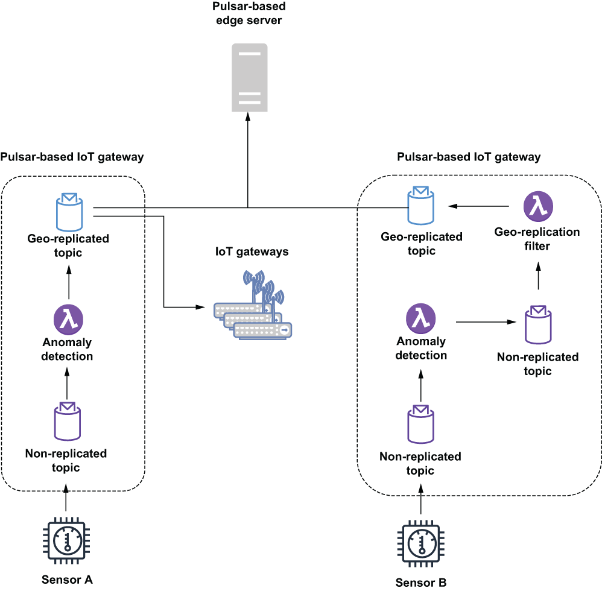

### 12.5.1 Creating a bidirectional messaging mesh

Creating a messaging framework that can be used to transmit messages up from the IoT gateways to the edge servers involves an initial configuration phase to add all of the Pulsar clusters to the same Pulsar instance. As you may recall from chapter 2, a Pulsar instance can contain multiple Pulsar clusters. Being part of the same Pulsar instance is also a prerequisite for enabling geo-replication of data between Pulsar clusters, which, as you saw in figure 12.8, is the preferred mechanism for forwarding the calculated statistical sensor data from the IoT gateways to the edge server.

The first phase of this configuration is adding each of the individual IoT gateway-based Pulsar clusters to the same Pulsar instance as the Pulsar cluster running on the edge server. This can be easily achieved using the pulsar-admin command line interface or REST API, as shown in the following listing, which shows the command used to add a single IoT gateway cluster to the Pulsar instance.

Listing 12.5 Adding an IoT gateway cluster to the Pulsar instance

\$ pulsar-admin clusters create iot-gateway-1 \\    ❶\
    --broker-url http://\<IoT-Gateway-IP\>:6650 \\   ❷\
    --url http://\<IoT-Gateway-IP\>:8080             ❸\
 \
\$ pulsar-admin clusters list                       ❹

❶ Each name has to be unique.

❷ URL address of the TCP broker on the gateway

❸ Service URL for the gateway

❹ Confirm that the cluster was added to the list.

This command has to be run just once for every IoT gateway-based Pulsar cluster in your IIoT environment. Once a cluster has been added to the Pulsar instance, it is able to have messages delivered to it asynchronously via Pulsar’s geo-replication mechanism rather than having to write additional code to perform the data replication.

The next step in establishing geo-replication between the IoT gateways and the edge servers is to define a tenant that can be used for bidirectional communication. This can be easily achieved using the pulsar-admin command line interface or REST API, as shown in the following listing, which shows the command to create a new Pulsar tenant that can be accessed by all of the IoT gateway clusters as well as the Pulsar cluster running on the edge servers.

Listing 12.6 Creating a geo-replicated tenant

\$ pulsar-admin tenants create iiot-analytics-tenant \\\
    --allowed-clusters  iot-gateway-1, iot-gateway-2, ...  \\  ❶\
    --admin-roles analytics-role                               ❷

❶ Provide a complete list of all the IoT gateway clusters you created.

❷ Specifies the admin role for this namespace

The last step of the configuration process is the creation of a namespace that can be used specifically for the geo-replication of the data between the IoT Gateways and the edge servers. This can be easily achieved using the pulsar-admin command line interface or REST API, as shown in listing 12.7, which shows the command to create a new Pulsar namespace that can be accessed by all of the IoT gateway clusters as well as the Pulsar cluster running on the edge servers. Please note that this replicated namespace has to be within the tenant we created previously. (See appendix B for details on configuring geo-replication between Pulsar clusters.)

Listing 12.7 Creating a geo-replicated namespace

\$ pulsar-admin namespaces create \\\
  iiot-analytics-tenant/analytics-namespace \\\
  --clusters iot-gateway-1, iot-gateway-2, ...     ❶

❶ Provide a complete list of all the IoT Gateway clusters you created.

Once you create a geo-replicated namespace, any topics that producers or consumers create within that namespace are automatically replicated across all of the clusters. Therefore, any messages published to topics within the geo-replicated namespace on the IoT gateways will automatically be sent asynchronously to the edge server. Unfortunately, this would also result in the message being replicated to all of the other IoT gateways within the IIoT infrastructure, which is not what we want at all. Not only would this inter-gateway replication waste precious network bandwidth, but it would also waste disk space on the gateways themselves, as they would have to store the messages they receive. Since these messages will never be consumed on the other gateways, storing them just wastes disk space.

Therefore, we need to enable selective replication to ensure that the outbound messages that are only intended to be consumed by the edge server are only replicated to the edge server and not across all of the IoT gateways. This can be accomplished by writing a simple Pulsar function that consumes from a local, non-geo-replicated topic on the gateway and publishes it to a geo-replicated topic but restricts the replication to only the edge servers, as shown on the left side of figure 12.12.

Figure 12.12 Without the use of a geo-replication filter, the data for sensor A is automatically replicated to all of the IoT gateway clusters in addition to the edge server, whereas data for sensor B is only replicated to the Pulsar cluster running on the edge servers.

As you can see in listing 12.8, the Pulsar function used to forward these messages would use the existing producer Java API to restrict the replication of the messages to only the edge cluster, resulting in the message flow shown on the right side of figure 12.12, where the message first goes to a local topic before getting forwarded to a geo-replicated topic, but only to the edge server rather than all of the clusters.

Listing 12.8 Geo-replication message filter function

public class GeoReplicationFilterFunction implements Function\<byte\[\],Void\> {\
 \
  private boolean initialized = false;\
  private List\<String\> restrictReplicationTo;\
        \
  private Producer\<byte\[\]\> producer; \
  private PulsarClient client;\
  private String serviceUrl;\
  private String topicName;\
 \
  @Override\
  public Void process(byte\[\] input, Context ctx) throws Exception {\
    if (!initialized) {\
      init(ctx);\
    }\
    getProducer().newMessage()\
          .value(input)                                                     ❶\
          .replicationClusters(restrictReplicationTo)                       ❷\
          .send();\
 \
    return null;\
  }\
 \
  private void init(Context ctx) {\
    serviceUrl = "pulsar://localhost:6650";                                 ❸\
    topicName = ctx.getUserConfigValue("replicated-topic").get().toString();❹\
    restrictReplicationTo = Arrays.asList(\
       ctx.getUserConfigValue("edge").get().toString());                    ❺\
    initalized = true;\
  }\
 \
  private Producer\<byte\[\]\> getProducer() throws PulsarClientException {\
    if (producer == null) {\
        producer = getClient().newProducer()\
                .topic(topicName)\
                .create();\
    }\
    return producer;\
  }\
 \
  private PulsarClient getClient() throws PulsarClientException {\
    if (client == null) {\
      client = PulsarClient.builder().serviceUrl(serviceUrl).build();\
    }\
    return client;\
  }\
}

❶ Create a new message using the input bytes.

❷ Restrict the clusters that the message will be replicated to.

❸ We are publishing to a local geo-replicated topic.

❹ The destination topic should be in the replicated namespace.

❺ This should be the name of the Pulsar cluster running on the edge servers.

The Pulsar function is writing to a geo-replicated topic on the local machine to allow the Pulsar geo-replication mechanism to handle the forwarding of the message rather than sending it directly to the edge server to avoid the synchronous call over the network for each message. Now that we have covered the up direction of the messaging mesh, let’s focus on the down direction of the bidirectional mesh, which is focused on delivering the insights discovered on the edge servers through the analysis of data from multiple sensors back down to the Pulsar functions running on the IoT gateways. In reality, this process is fairly straightforward because all that is required is for the edge servers to publish to a geo-replicated topic and have the interested parties subscribe to the topic to have the messages delivered. Even though the topics are geo-replicated, the messages will *not* be sent to the IoT gateways unless there is an active consumer of the topic on the gateway node.
