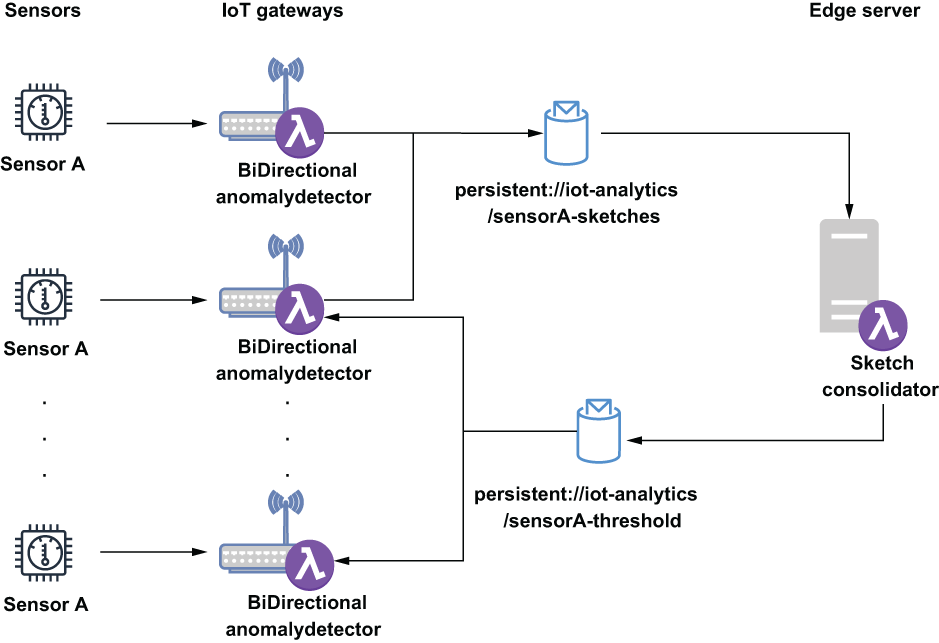

### 12.5.2 Multivariate dataset construction

Consider the scenario in which you have multiple temperature sensors measuring the ambient temperature across your entire data center. Rather than comparing the current reading of a given individual sensor to its previous readings, you want to see how it compares to the previous readings of all of the other temperature sensors deployed across your data center. Obviously, this would provide a much more meaningful comparison, particularly in the case where the sensor readings gradually drifted higher or lower rather than suddenly, such as if one of your pieces of equipment was gradually overheating, and the temperature readings slowly rose from a safe range to a more dangerous level. In such a scenario, there might not be any single reading that is significantly large enough to be considered an anomaly, but compared to other similar sensors, all of the readings would be considered high.

To perform a comparison across a much broader set of data would require the combination of data from potentially hundreds of different sensors. Therefore, we must first gather all of the data into a single location to calculate the statistics for the sensor group as a whole rather than individually. Fortunately, the data sketches used inside the AnomalyDetector function can be merged together rather easily to provide these types of statistics. A data sketch generated from a series of readings from a single sensor can be used to determine the ranking of any given sensor reading relative to all of the readings recorded in the sketch thus far. But if you combine 100 sketches, then you can use the resulting sketch to determine the ranking of any given sensor reading relative to all the readings across 100 sensors. This is a much more meaningful value and would solve the issue we are trying to address because we are comparing each sensor reading to all others across the entire factory.

To achieve this, we must first modify the existing AnomalyDetector function, as shown in the following listing, to periodically send a copy of its sketch to the edge servers so it can be merged with the sketches from all the other BiDirectionalAnomalyDetector function instances running on different IoT gateways.

Listing 12.9 Update AnomalyDetection function

public class BiDirectionalAnomalyDetector \
➥ implements Function\<Double, Void\> {\
 \
  private boolean initialized = false;\
  private long publishInterval;                                           ❶\
  private String reportingTopic;                                          ❷\
  private String alertThresholdTopic;                                     ❸\
  private double alertThreshold;                                          ❹\
  private String remotePulsarUrl;                                         ❺\
 \
  private PulsarClient client;\
  private Producer\<byte\[\]\> producer;                                      ❻\
  private Consumer\<Double\> consumer;                                      ❼\
  private ExecutorService service = Executors.newFixedThreadPool(1);      ❽\
  private ScheduledExecutorService executor =\
    Executors.newScheduledThreadPool(1);                                  ❾\
  private UpdateDoublesSketch sketch;   \
 \
  @Override\
  public Void process(Double input, Context ctx) throws Exception {\
    if (!initialized) {\
      init(ctx);\
      launchReportingThread();                                            ❿\
      launchFeedbackConsumer();                                           ⓫\
    }\
 \
     synchronized(sketch) {                                               ⓬\
      getSketch().update(input);\
                \
      if (getSketch().getRank(input) \>= alertThreshold) {\
         react();  \
       }\
     }\
    return null;\
  }\
 \
  private void launchReportingThread() {\
    Runnable task = () -\> {\
      synchronized(sketch) {                                              ⓭\
        try {\
          if (getSketch() != null) {\
            getProducer().newMessage().value(getSketch().toByteArray()).send();\
            sketch.reset();                                               ⓮\
          }\
        } catch(final PulsarClientException ex) { /\* Handle \*/}\
       }\
    };\
    executor.scheduleAtFixedRate(task, \
      publishInterval, publishInterval, TimeUnit.MINUTES);                ⓯\
  }\
    \
  private void launchFeedbackConsumer() {\
     Runnable task = () -\> {\
       Message\<Double\> msg;\
       try {\
        while ((msg = getConsumer().receive()) != null) {                 ⓰\
         alertThreshold = msg.getValue();                                 ⓱\
         getConsumer().acknowledge(msg);\
        }\
       } catch (PulsarClientException ex) {\*/ Handle \*/ }\
     };\
     service.execute(task);                                               ⓲\
  }\
    \
  private UpdateDoublesSketch getSketch() {\
    if (sketch == null) {\
      sketch = DoublesSketch.builder().build();\
     }\
     return sketch;\
  }\
        \
  private Producer\<byte\[\]\> getProducer() throws PulsarClientException {\
     if (producer == null) {\
       producer = getEdgePulsarClient().newProducer(Schema.BYTES)\
         .topic(reportingTopic).create();\
     }\
     return producer;\
  }\
        \
  private Consumer\<Double\> getConsumer() throws PulsarClientException {\
    if (consumer == null) {\
      consumer = getEdgePulsarClient().newConsumer(Schema.DOUBLE)\
        .topic(alertThresholdTopic).subscribe();\
    }\
    return consumer;\
  }\
        \
  private void react() {\
    // Implementation specific\
  }\
    \
  private PulsarClient getEdgePulsarClient() throws PulsarClientException {\
     ...\
  }\
    \
  protected void init(Context ctx) {\
     ...\
  }\
}

❶ Property that defines how often the local data sketch gets published (in minutes)

❷ Property that defines the topic name used to send the local data sketch to the edge server

❸ Property that defines the topic name used to receive the updated alert threshold from the edge server

❹ Calculated alert threshold provided by the edge server

❺ The URL for the Pulsar broker running on the edge server

❻ Producer for sending the data sketched to the edge server

❼ Consumer for receiving updated alert threshold values from the edge server

❽ Local thread pool where the consumer thread can run in the background

❾ Local thread pool that invokes the publishing thread at a fixed interval (e.g., every five minutes)

❿ Start the data sketch publishing thread just once.

⓫ Start the alert threshold consuming thread just once.

⓬ Create an exclusive lock on the data sketch when writing the data.

⓭ Create an exclusive lock on the data sketch when publishing the data.

⓮ Clear all of the data from the sketch.

⓯ Schedule the publishing task to run at the fixed interval specified by the configuration properties.

⓰ Wait for incoming alert threshold messages.

⓱ Update the alert threshold with the provided value.

⓲ Launch the alert threshold consuming thread in the background.

The BiDirectionalAnomalyDetector function still listens for incoming sensor readings and adds them to a local data sketch object before comparing the sensor reading to the anomaly threshold to determine whether immediate action must be taken. However, it also creates two additional background threads to communicate with the SketchConsolidator function running on the edge server. This function relies on the Java ScheduledThreadExecutor to ensure that the local data sketches are published at a periodic interval (e.g., every five minutes), while the other thread is used to continuously monitor the feedback topic for any updates to the alert threshold value. Next, we must create a new Pulsar function, like the one shown in listing 12.10, that will run on the edge servers and will receive these inbound sketches and merge them together to produce a larger, more accurate sketch that encompasses data from all of the sensors within a given sensor family.

Listing 12.10 Data sketch merging function

import org.apache.datasketches.memory.Memory;\
import org.apache.datasketches.quantiles.DoublesSketch;\
import org.apache.datasketches.quantiles.DoublesUnion;\
import org.apache.pulsar.functions.api.Context;\
import org.apache.pulsar.functions.api.Function;\
 \
public class SketchConsolidator implements Function\<byte\[\], Double\> {\
 \
  private DoublesSketch consolidated;                         ❶\
 \
  @Override\
  public Double process(byte\[\] bytes, Context ctx) throws Exception {\
    DoublesSketch iotGatewaySketch = \
      DoublesSketch.wrap(Memory.wrap(bytes));                 ❷\
 \
    DoublesUnion union = DoublesUnion.builder().build();      ❸\
    union.update(iotGatewaySketch);                           ❹\
    union.update(consolidated);                               ❺\
    consolidated = union.getResult();                         ❻\
    return consolidated.getQuantile(0.99);                    ❼\
  }\
}

❶ Data sketch that contains data from all of the sensors

❷ Convert the incoming bytes to a data sketch.

❸ Build a new object used to merge multiple data sketches.

❹ Add the incoming data sketch to the union object.

❺ Add the existing consolidated data sketch to the union object.

❻ Update the consolidated data sketch to be equal to the result of the merge.

❼ Publish the newly calculated threshold value for the 99th percentile.

The interaction between these two Pulsar functions is depicted in figure 12.13, which shows both of the communication channels used to send data up from the BiDirectionalAnomalyDetector functions running on all of the IoT gateways to the SketchConsolidator function running on the edge servers, and the channel used to send the newly calculated threshold from the SketchConsolidator function back down to the BiDirectionalAnomalyDetector function instances running on the IoT gateways.

Figure 12.13 A copy of the BiDirectionalAnomalyDetector function will run on each IoT gateway and publish its locally calculated data sketches to the same geo-replicated topic. The SketchConsolidator function will consume these sketches and merge them together before publishing the cutoff value for the 99th percentile value to a different geo-replicated topic. The BiDirectionalAnomalyDetector functions will consume messages from this topic and use the published value as the new anomaly threshold for the sensor reading.

The SketchConsolidator function should be configured to listen to the geo-replicated topic where all of the BiDirectionalAnomalyDetector functions will be publishing their respective sketches. As you can see from the code in listing 12.10, once the data sketches have been merged, we use the newly created object to determine the exact value that represents the threshold of the 99th percentile of all sensor readings. We then send this value back to the BiDirectionalAnomalyDetector functions rather than the entire sketch (to save space and bandwidth) so they can use this newly calculated value as their alert threshold instead of the locally calculated threshold.
