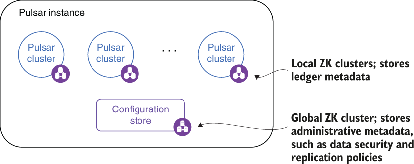

## 2.1 Pulsar’s physical architecture

Other messaging systems consider the cluster the highest level from an administrative and deployment perspective, which necessitates managing and configuring each cluster as an independent system. Fortunately, Pulsar provides an even higher level of abstraction known as a *Pulsar instance*, which is comprised of one or more Pulsar clusters that act together as a single unit and can be administered from a single location, as shown in figure 2.1.

Figure 2.1 A Pulsar instance can consist of multiple geographically dispersed clusters.

One of the biggest reasons for using a Pulsar instance is to enable geo-replication. In fact, only clusters within the same instance can be configured to replicate data amongst themselves.

A Pulsar instance employs an instance-wide ZooKeeper cluster called the *configuration store* to retain information that pertains to multiple clusters, such as geo-replication and tenant-level security policies. This allows you to define and manage these policies in a single location. In order to provide resiliency to the configuration store, each of the nodes within the Pulsar instance’s ZooKeeper ensemble should be deployed across multiple regions to ensure its availability in the event of a region failure.

It is important to note that the availability of the ZooKeeper ensemble used by the Pulsar instance for the configuration store is required by the individual Pulsar clusters to operate even when geo-replication is enabled. When geo-replication is enabled, if the configuration store is down, messages published to the respective clusters will be buffered locally and forwarded to the other regions when the ensemble becomes operational again.

## 子目录

- [2.1.1 Pulsar’s layered architecture](<2.1-pulsar’s-physical-architecture/2.1.1-pulsar’s-layered-architecture.md>)
- [2.1.2 Stateless serving layer](<2.1-pulsar’s-physical-architecture/2.1.2-stateless-serving-layer.md>)
- [2.1.3 Stream storage layer](<2.1-pulsar’s-physical-architecture/2.1.3-stream-storage-layer.md>)
- [2.1.4 Metadata storage](<2.1-pulsar’s-physical-architecture/2.1.4-metadata-storage.md>)
