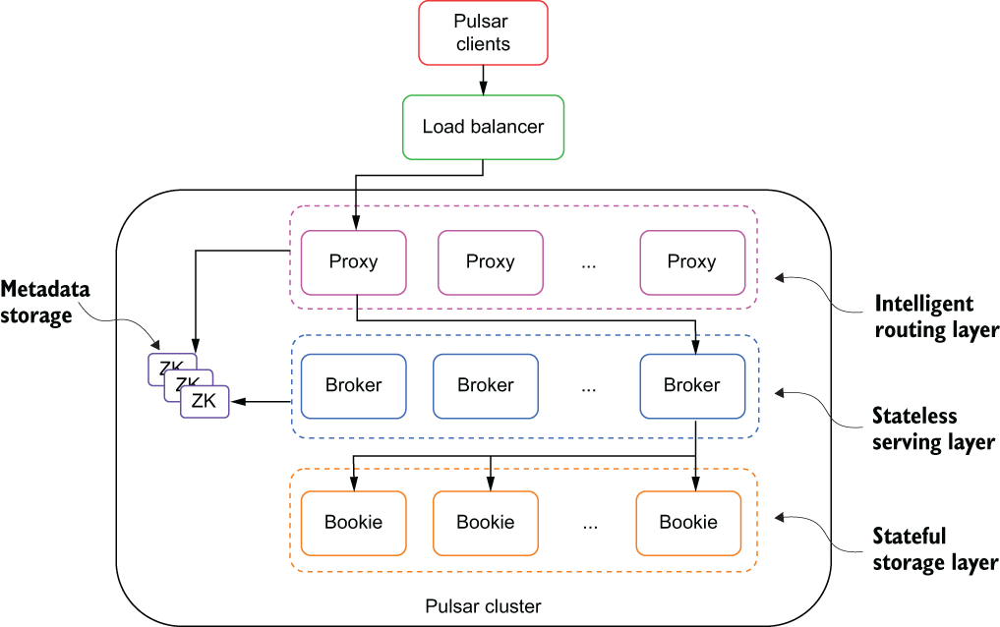

### 2.1.1 Pulsar’s layered architecture

As you can see in figure 2.2, each Pulsar cluster is made up of a stateless serving layer of multiple Pulsar message *broker instances*, a stateful storage layer of multiple BookKeeper *bookie instances*, and an optional routing layer of multiple Pulsar proxies. When hosted inside a Kubernetes environment, this decoupled architecture enables your DevOps team to dynamically scale the number of brokers, bookies, and proxies to meet peak demand and to scale down to save cost during slower periods. Message traffic is spread across all the available brokers as evenly as possible to provide maximum throughput.

Figure 2.2 A Pulsar cluster consists of multiple layers: an optional proxy layer that routes incoming client requests to the appropriate message broker, a stateless serving layer consisting of multiple brokers that serve client requests, and a stateful storage layer consisting of multiple bookies that retains multiple copies of the messages.

When a client accesses a topic that has not yet been used, a process is triggered to select the broker best suited to acquire ownership of the topic. Once a broker assumes ownership of a topic, it is responsible for handling all requests for that topic, and any clients wishing to publish to or consume data from the topic need to interact with the corresponding broker that owns it. Therefore, if you want to publish data to a particular topic, you will need to know which broker owns that topic and connect to it. However, the broker assignment information is only available in the ZooKeeper metadata and is subject to change based on load rebalancing, broker crashes, etc. Consequently, you cannot connect directly to the brokers themselves and hope that you are communicating with the one you want. This is exactly why the Pulsar proxy was created—to act as an intermediary for all the brokers in the cluster.

The Pulsar proxy

If you are hosting your Pulsar cluster inside of a private and/or virtual network environment, such as Kubernetes, and you want to provide inbound connections to your Pulsar brokers, then you will need to translate their private IP addresses to public IP addresses. While this can be accomplished using traditional load balancing technologies and techniques such as physical load balancers, virtual IP addresses, or DNS-based load balancing that distributes client requests across a group of brokers, it is not the best approach for providing redundancy and failover capabilities for your clients.

The traditional load-balancer approach is not efficient, as the load-balancer will not know which broker is assigned to a given topic and instead will direct the request to a random broker in the cluster. If a broker receives a request for a topic it isn’t serving, it will automatically reroute the request over to the appropriate broker for processing, but this incurs a nontrivial penalty in terms of time. This is why it is recommended to use the Pulsar proxy instead, which acts as an intelligent load balancer for Pulsar brokers.

When using the Pulsar proxy, all client connections will first travel through the proxy, rather than directly to the brokers themselves. The proxy will then use Pulsar’s built-in service discovery mechanism to determine which broker is hosting the topic you are trying to reach and automatically route the client request to it. Furthermore, it will cache this information in memory for future requests to streamline the lookup process even more. For performance and failover purposes, it is recommended to run more than one Pulsar proxy behind a traditional load balancer. Unlike the brokers, Pulsar Proxies *can* handle any request, so they can be load balanced without any issue.
