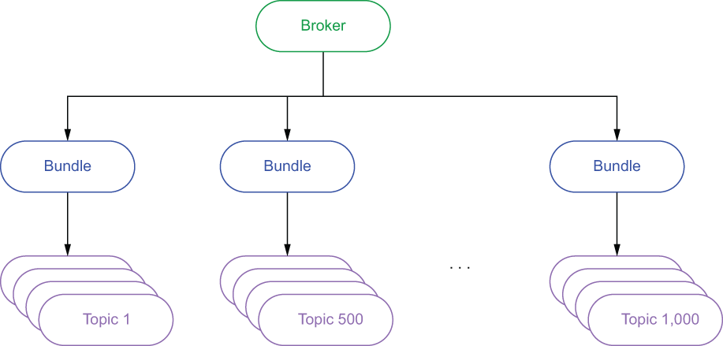
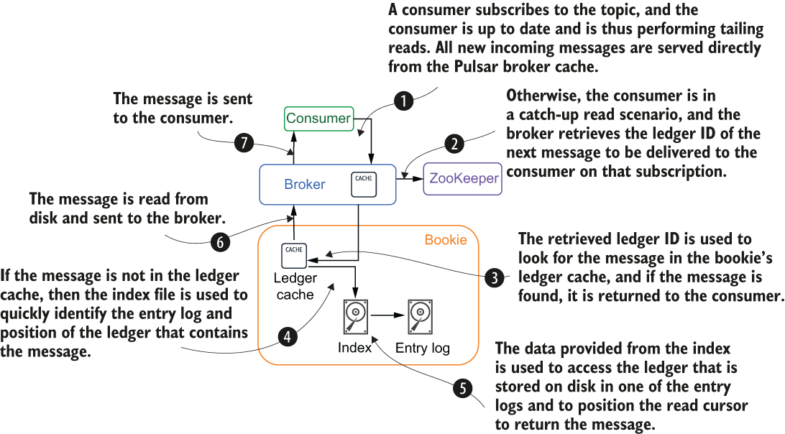

### 2.1.2 Stateless serving layer

Pulsar’s multi-layered design ensures that message data is stored separately from the brokers, which guarantees that any broker can serve data from any topic at any time. This also allows the cluster to assign ownership of a topic to any broker in the cluster at any time, unlike other messaging systems that co-locate the broker and the topic data they are serving. Hence, we use the term “stateless” to describe the serving layer, since there is no information stored on the brokers themselves that is necessary to handle client requests.

The stateless nature of the brokers not only allows us to dynamically scale them up and down based on demand, but also makes them cluster-resilient to multiple broker failures. Lastly, Pulsar has an internal load-shedding mechanism that rebalances the load amongst all the active brokers based on the ever-changing message traffic.

Bundles

The assignment of a topic to a particular broker is done at what is referred to as the *bundle* level. All the topics in a Pulsar cluster are assigned to a specific bundle with each bundle assigned to a different broker, as shown in figure 2.3. This helps ensure that all topics in a namespace are evenly distributed across all the brokers.

Figure 2.3 From a serving perspective, each broker is assigned a set of bundles that contain multiple topics. Bundle assignment is determined by hashing the topic name, which allows us to determine which bundle it belongs to without having to keep that information in ZooKeeper.

The number of bundles created is controlled by the defaultNumberOfNamespaceBundles property inside the broker configuration file, which has a default value of 4. You can override this setting on a per-namespace level when you create the namespace by providing a different value when you create the namespace using the Pulsar admin API. In general, you want the number of bundles to be a multiple of the number of brokers to ensure that they are evenly distributed. For instance, if you have three brokers and four bundles, then one of the brokers will be assigned two of the bundles, while the others only get one each.

Load balancing

While the message traffic might initially be spread as evenly as possible across the active brokers, several factors can change over time, resulting in the load becoming unbalanced. Changes in the message traffic patterns might result in a broker serving several topics with heavy traffic, while others aren’t being utilized at all. When an existing bundle exceeds some preconfigured thresholds defined by the following properties in the broker configuration file, the bundle will be split into two new bundles with one of them being offloaded to a new broker:

- loadBalancerNamespaceBundleMaxTopics

- loadBalancerNamespaceBundleMaxSessions

- loadBalancerNamespaceBundleMaxMsgRate

- loadBalancerNamespaceBundleMaxBandwidthMbytes

This mechanism identifies and corrects scenarios when some bundles are experiencing a heavier load than others by splitting these overloaded bundles in two. Then one of these bundles can be offloaded to a different broker in the cluster.

Load shedding

The Pulsar brokers have another mechanism to detect when a particular broker is overloaded, and automatically have it shed or offload some of its bundles to other brokers in the cluster. When a broker’s resource utilization exceeds the preconfigured threshold defined by the loadBalancerBrokerOverloadedThresholdPercentage property in the broker configuration file, the broker will offload one or more bundles to a new broker. This property defines the maximum percentage of the total available CPU, network capacity, or memory that the broker can consume. If any of these resources cross this threshold, then the offload is triggered.

The bundle selected is left intact and assigned to a different broker. This is because the load shedding process solves a different problem than the load balancing process does. With load balancing, we are correcting the distribution of the topics across the bundles because one of them has much more traffic than the others, and we are attempting to spread that load out across all the bundles.

Load shedding, on the other hand, corrects the distribution of the bundles across the brokers based on the number of resources required to service them. Even though each broker can be assigned the same number of bundles, the message traffic handled by each broker could be dramatically different if the load is unbalanced across the bundles.

To illustrate this point, consider the scenario where there are 3 brokers and a total of 60 bundles with each broker serving 20 bundles each. Furthermore, 20 of the bundles are currently handling 90% of the total message traffic. Now, if most of these bundles happen to be assigned to the same broker, it could easily exhaust that broker’s CPU, network, and memory resources. Therefore, offloading some of these bundles to another broker will help alleviate the problem, whereas splitting the bundles themselves would only shed approximately half of the message traffic, while leaving 45% of it still on the original broker.

Data access patterns

There are generally three I/O patterns in a streaming system: *writes*, where new data is written to the system; *tailing reads*, where the consumer is reading the most recently published messages immediately after they have been published; and *catch-up reads*, where a consumer reads a large number of messages from the beginning of the topic in order to catch up, such as when a new consumer wants to access data beginning at a point much earlier than the latest message.

When a producer sends a message to Pulsar, it is immediately written to BookKeeper. Once BookKeeper acknowledges that the data was committed, the broker stores a copy of the message in its local cache before it acknowledges the message publication to the producer. This allows the broker to serve tailing read consumers directly from memory and avoid the latency associated with disk access.

Figure 2.4 Message consumption steps in Pulsar

It becomes more interesting when looking at catch-up reads, which access data from the storage layer. When a client consumes a message from Pulsar, the message will go through the steps shown in figure 2.4. The most common example of a catch-up read is when a consumer goes offline for an extended period and then starts consuming again, although any scenario in which a consumer is *not* directly served from the broker’s in-memory cache would be considered a catch-up read, such as topic reassignment to a new broker.
