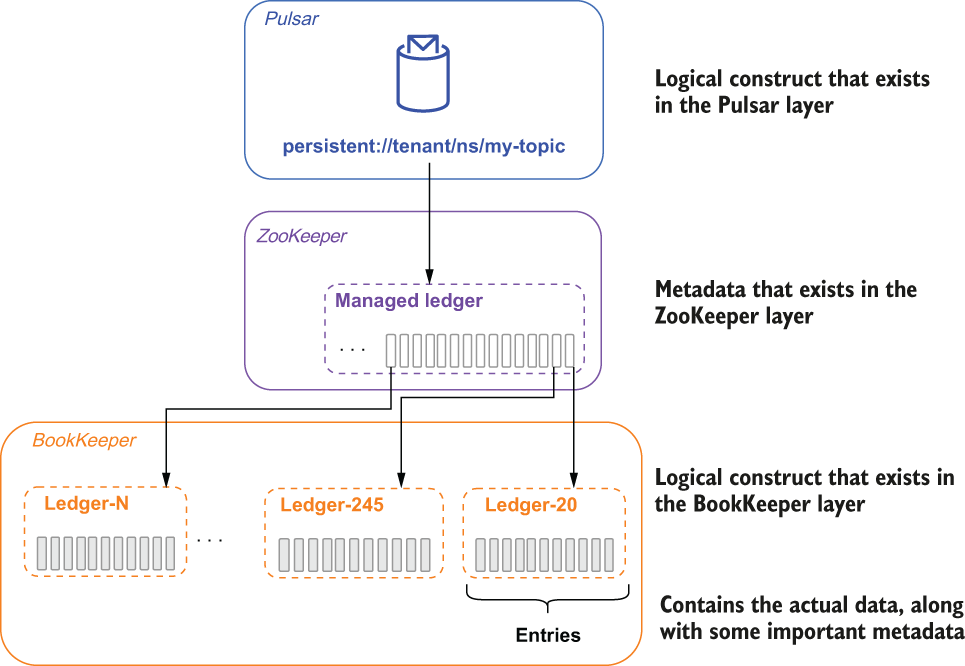
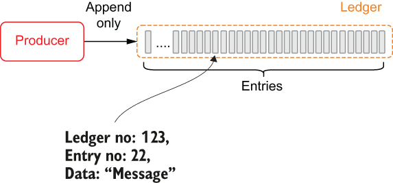
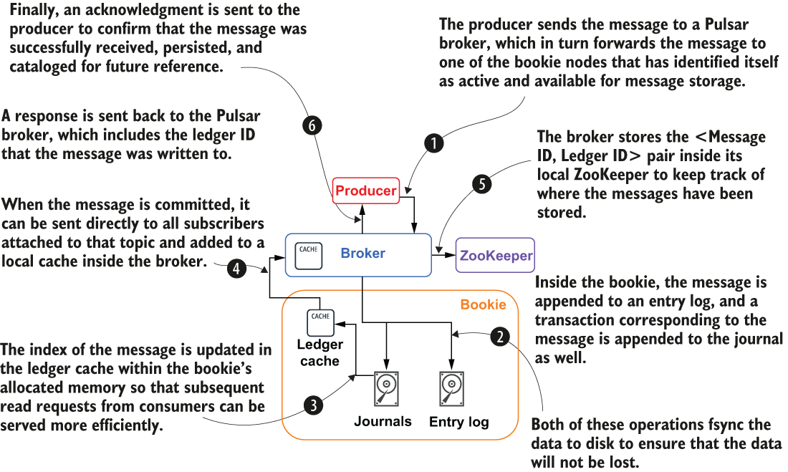

### 2.1.3 Stream storage layer

Pulsar guarantees message delivery for all message consumers. If a message successfully reaches a Pulsar broker, you can rest assured it will be delivered to its intended target. In order to provide this guarantee, all non-acknowledged messages must be persisted until they can be delivered to and acknowledged by consumers. As I mentioned earlier, Pulsar uses a distributed write-ahead log (WAL) system called Apache BookKeeper for persistent message storage. BookKeeper is a service that provides persistent storage of streams of log entries in sequences called ledgers.

Logical storage architecture

Pulsar topics can be thought of as infinite streams of messages that are stored sequentially in the order the messages are received. Incoming messages are appended to the end of the stream, while consumers read messages further up the stream based on the data access patterns that I discussed earlier. While this simplified view makes it easy for us to reason about a consumer’s position within the topic, such an abstraction cannot exist in reality due to the space limitations of storage devices. Eventually this abstract infinite stream concept must be implemented on a physical system where such a limitation exists.

Apache Pulsar takes a dramatically different approach from traditional messages systems, such as Kafka, when it comes to implementing stream storage. Within Kafka, each stream is separated into multiple replicas that are each stored entirely on a broker’s local disk. The great thing about this approach is that it is simple and fast because all writes are sequential, which limits the amount of disk head movement required to access the data. The downside to Kafka’s approach is that a single broker must have sufficient storage capacity to hold the partition data, as I discussed in chapter 1.

So how is Apache Pulsar’s approach different? For starters, each topic is *not* modeled as a collection of partitions, but rather as a series of segments. Each of these segments can contain a configurable number of messages, with the default being 50,000. Once a segment is full, a new one is created to hold new messages. Therefore, a Pulsar topic can be thought of as an unbounded list of segments with each containing a subset of the messages, as shown in figure 2.5, which shows both the logical architecture of the stream storage layer and how it maps to the underlying physical implementation.

Figure 2.5 The data for a Pulsar topic is stored as a sequence of ledgers inside the BookKeeper layer. A list of these ledger IDs is stored inside a logical construct known as a managed ledger on ZooKeeper. Each ledger holds 50,000 entries that store a copy of the message data. Note that persistent://tenant/ns/my-topic will be discussed as a concept later in the book.

A Pulsar topic is nothing more than an addressable endpoint that is used to uniquely identify a specific topic within Pulsar and is analogous to a URL in the sense that it is merely used to uniquely identify the resource that the client is attempting to connect to. The topic name must be decoded by the Pulsar broker to determine the storage location of the data.

Pulsar adds an additional layer of abstraction on top of BookKeeper’s ledgers, known as managed ledgers, that retains the IDs of the ledgers that hold the data published to the topic. As we can see in figure 2.5, when data was first published to topic A, it was written to ledger-20. After 50,000 records had been published to the topic, the ledger was closed and another one (ledger-245) was created to take its place. This process is repeated every 50,000 records to store the incoming data, and the managed ledger retains this unique sequence of ledger IDs inside of ZooKeeper.

Later, when a consumer attempts to read the data from topic A, the managed ledger is used to locate the data inside of BookKeeper and return it to the consumer. If the consumer is performing a catch-up read starting at the oldest message, then it would first get all the data from ledger-20, followed by ledger-245, and so on. The traversal of these ledgers from oldest to youngest is transparent to the end user and creates the illusion of a single sequential stream of data. Managed ledgers allow this to happen and retain the ordering of the BookKeeper ledgers to ensure the messages are read in the same order they were published.

BookKeeper physical architecture

In BookKeeper, each unit of a ledger is referred to as an entry. These entries contain the actual raw bytes from the incoming messages, along with some important metadata that is used to track and access the entries. The most critical piece of metadata is the ID of the ledger to which it belongs, which is kept in the local ZooKeeper instance, so the message can be retrieved quickly from BookKeeper when a consumer attempts to read it in the future. Streams of log entries are stored in append-only data structures, known as ledgers, as shown in figure 2.6.

Figure 2.6 In BookKeeper, incoming entries get stored together as ledgers on servers known as bookies.

Ledgers have append-only semantics, meaning that entries are written to a ledger sequentially and cannot be modified once they’ve been written to a ledger. From a practical perspective, this means

- A Pulsar broker first creates a ledger, then appends entries to the ledger, and finally closes the ledger. There are no other interactions permitted.

- After the ledger has been closed, either normally or because the process crashed, it can then be opened only in read-only mode.

- Finally, when entries in the ledger are no longer needed, the whole ledger can be deleted from the system.

The individual BookKeeper servers that are responsible for the storage of ledgers (more specifically, fragments of ledgers) are known as bookies. Whenever entries are written to a ledger, those entries are written across a subgroup of bookie nodes known as an ensemble. The size of the ensemble is equal to the replication factor (R) you specify for your Pulsar topic and ensures that you have exactly R copies of the entry saved to disk to prevent data loss.

Bookies manage data in a log-structured way, which is implemented using three types of files: journals, entry logs, and index files. The journal file retains all of the BookKeeper transaction logs. Before any update to a ledger takes place, the bookie ensures that a transaction describing the update is written to disk to prevent data loss.

Figure 2.7 Message persistence steps in Pulsar

The entry log file contains the actual data written to BookKeeper. Entries from different ledgers are aggregated and written sequentially, while their offsets are kept as pointers in a ledger cache for fast lookup. An index file is created for each ledger, which contains several indexes that record the offsets of data stored in entry log files. The index file is modelled after index files in traditional relational databases and allows for quick lookups for ledger consumers. When a client publishes a message to Pulsar the message will go through the steps shown in figure 2.7 to persist it to disk within a BookKeeper ledger.

By distributing the entry data across multiple files on different disk devices, bookies are able to isolate the effects of read operations from the latency of ongoing write operations, allowing them to handle thousands of concurrent reads and writes.
