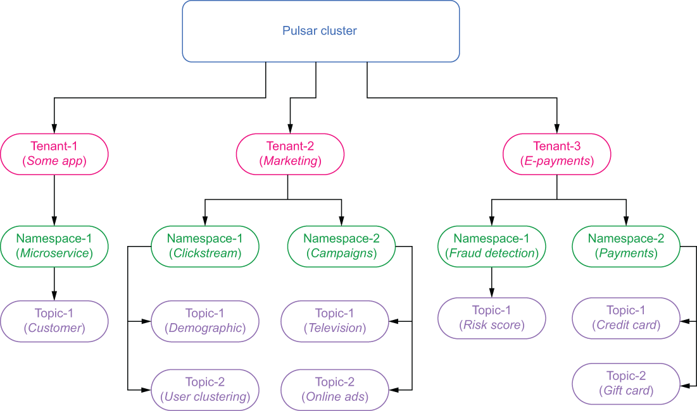
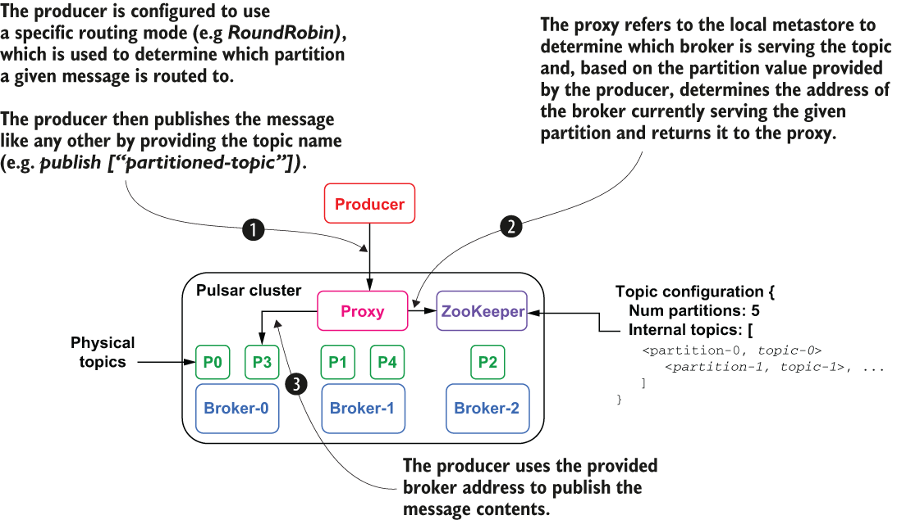

### 2.2.1 Tenants, namespaces, and topics

In this section we will cover the logical constructs that describe how data is structured and stored inside the cluster. Pulsar was designed to serve as a multi-tenant system, allowing it to be shared across multiple departments within your organization by providing each its own secure and exclusive messaging environment. This design enables a single Pulsar instance to effectively serve as the messaging platform-as-a-service across your entire enterprise. The logical architecture of Pulsar supports multitenancy via a hierarchy of tenants, namespaces, and, finally, topics, as shown in figure 2.8.

Figure 2.8 Pulsar’s logical architecture consists of tenants, namespaces, and topics.

Tenants

At the top of the Pulsar hierarchy sit the tenants, which can represent a specific business unit, a core feature, or a product line. Tenants can be spread across clusters and can each have their own authentication and authorization scheme applied to them, thereby controlling who has access to the data stored within. They are also the administrative unit at which storage quotas, message time to live, and isolation policies can be managed.

Namespaces

Each tenant can have multiple *namespaces*, which are logical grouping mechanisms for administering related topics via policies. At the namespace level, you can set access permissions, fine-tune replication settings, manage geo-replication of message data across clusters, and control message expiry for all the topics in the namespace.

Let’s consider how we would structure Pulsar’s namespace for an e-commerce application. To provide isolation for the sensitive incoming payment data and limit access to only members of the finance team, you may configure a separate tenant named E-payments, as shown in figure 2.8, and apply an access policy that restricts full access to only members of the finance group so they can perform audits and process credit card transactions.

Within the E-payments tenant you might create two namespaces: one named payments that will hold the incoming payments, including credit card payments and gift card redemptions, and another named fraud detection, which will contain those transactions that are flagged as suspicious for further processing. In such a deployment, you would limit the user-facing application to write-only access to the payments namespace, while granting read-only access to the fraud detection application, so it can evaluate them for potential fraud.

On the fraud detection namespace you would configure write access for the fraud detection application, so it can place potentially fraudulent payments into the “risk score” topic. You would also grant read-only access to the e-commerce application to the same namespace, so it can be notified of any potential fraud and react accordingly, such as by blocking the sale.

Topics

Topics are the only communication channel type available in Pulsar. All messages are written to and read from topics. Other messaging systems support more than one communication channel type (e.g., topics and queues that are differentiated by the type of message consumption they support). As I discussed in chapter 1, queues support first in, first out exclusive message consumption, while topics support pub-sub, one-to-many message consumption. Pulsar makes no such distinction and, instead, relies on various subscription types to control the message consumption pattern.

In Pulsar, non-partitioned topics are served by a single broker, which is responsible for receiving and delivering all the messages for the topic. Therefore, the throughput of a single topic is bound by the computing power of the broker serving it.

Partitioned topics

Pulsar also supports the notion of partitioned topics that can be served by multiple brokers, which allows for much higher throughput as the load is distributed across multiple machines. Behind the scenes, a partitioned topic is implemented as N internal topics, where N is the number of partitions. The distribution of partitions across brokers is handled automatically by Pulsar, effectively making the process transparent to the end user.

Implementing partitioned topics as a series of individual topics allows a user to increase the number of partitions without having to rebalance the entire topic. Instead, internal topics are created for the new partitions and will be able to receive incoming messages immediately without impacting the other internal topics at all (e.g., consumers will still be able to read/write messages to the existing partitions without interruption).

From a consumer perspective, these is no difference between partitioned topics and normal topics. All consumer subscriptions work exactly as they do on non-partitioned topics. But there is a big difference in what happens when a message is published to a partitioned topic. The message producer is responsible for determining which internal topic the message is ultimately published to. If the message has a value in its key metadata field, then the producer will hash that value to determine which topic to publish to. This ensures that all messages with the same key get stored in the same topic and will be in the order in which they were published.

When publishing a message without a key, the producer should be configured with a routing mode that specifies how to route messages across the partitions in the topic. The default routing mode is called RoundRobinPartition, which as the name implies, publishes messages across all partitions in round-robin fashion. This approach evenly distributes the messages across the partitions, which maximizes the publish throughput. Alternatively, you could use the SinglePartition routing mode, which randomly selects a single partition to publish all its messages into. This approach can be used to group messages from a specific producer together to maintain message ordering when you don’t have a key value. You can also provide your own routing implementation as well if you need more control over message distribution across your partitioned topic.

Let’s look at the message flow depicted in figure 2.9 in which the producer is configured to use the RoundRobinPartition publish mode. In this scenario, the producer connects to the Pulsar proxy and expects back the IP address of the broker assigned to the topic it is writing to. The proxy, in turn refers to the local metastore for this information and discovers that the topic is partitioned and needs to translate the specified partition number into the name of the internal topic that is serving that partition.

Figure 2.9 Publishing to a partitioned topic

In figure 2.9, the producer’s round-robin routing strategy determined that the message should be published to partition number 3, which is implemented as internal topic p3. The proxy can also determine that internal topic p3 is currently being served by broker-0. Therefore, the message is routed to that broker and written to the p3 topic. Since the routing mode is round robin, a subsequent call by the same producer will result in the message being routed to the p4 internal topic on broker-1.
