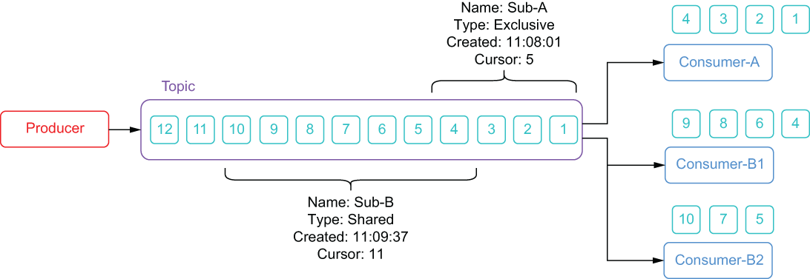

### 2.2.3 Producers, consumers, and subscriptions

Pulsar is built on the publish-subscribe (pub-sub) pattern. In this pattern, producers publish messages to topics. Consumers can then subscribe to those topics, process incoming messages, and send an acknowledgment when processing is complete.

A producer is any process that connects to a Pulsar broker, either directly or via the Pulsar proxy, and publishes messages to a topic, while a consumer is any process that connects to a Pulsar broker to receive messages from a topic. When a consumer has successfully processed a message, it needs to send an acknowledgment to the broker so the broker knows that it has been received and processed. If no such acknowledgment is received within a preconfigured timeframe, the broker will redeliver it to consumers on that subscription.

When a consumer connects to a Pulsar topic, it establishes what is referred to as a *subscription*, which specifies how messages will be delivered to a group of one or more consumers. There are four available subscription modes in Pulsar: exclusive, failover, key-shared, and shared. Regardless of the subscription type, messages are delivered in the order they are received.

Information about these subscriptions is retained in the local Pulsar ZooKeeper metadata and includes the http addresses of all the consumers, among other things. Each subscription also has a cursor associated with it that represents the position of the last message which was consumed and acknowledged for the subscription. To prevent message redelivery, these subscription cursors are retained on the bookies to ensure they will survive any broker level failures.

Pulsar supports multiple subscriptions per topic, which allows multiple consumers to read data from a topic. As you can see in figure 2.11, the topic has two different subscriptions: Sub-A and Sub-B. Consumer-A connected to the topic first and is operating in exclusive consumer mode, which means that all the messages in the topic will be consumed by Consumer-A. Thus far, Consumer-A has only acknowledged the first four messages, so its cursor position for the subscription, Sub-A is currently set to 5.

Figure 2.11 Pulsar supports multiple subscriptions per topic, which allows multiple consumers to read the same data. Consumer-A has consumed the first four messages on the exclusive subscription named Sub-A, whereas messages 4 through 10 have been distributed across the two consumers on the shared subscription named Sub-B.

The subscription named Sub-B was created after the first three messages were produced; therefore, none of those messages were delivered to the consumers for that subscription. It is a common misconception that any subscriptions created on a topic will start at the very first message for that topic, which is why I chose to illustrate that point here and show that you will only receive messages that are published to the topic *after* you subscribe to it.

We can also see that, since Sub-B is operating in shared mode, the messages have been distributed across *all* the consumers in the group with each message only being processed by a single consumer in the group. You can also see that Sub-B’s cursor is farther ahead than Sub-A’s cursor, which is not uncommon when you distribute the messages across multiple consumers.
