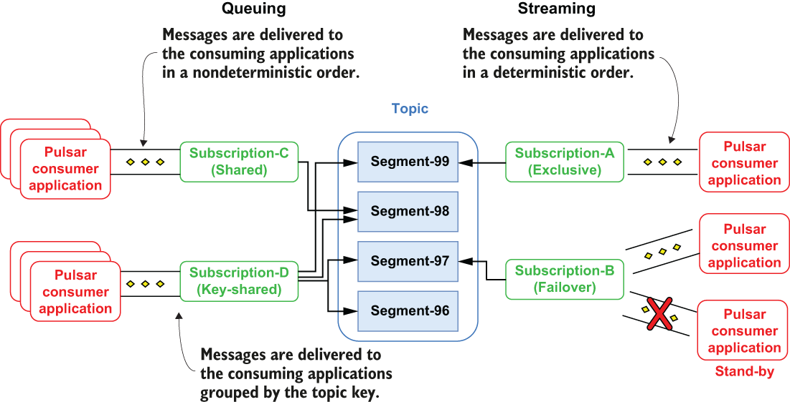
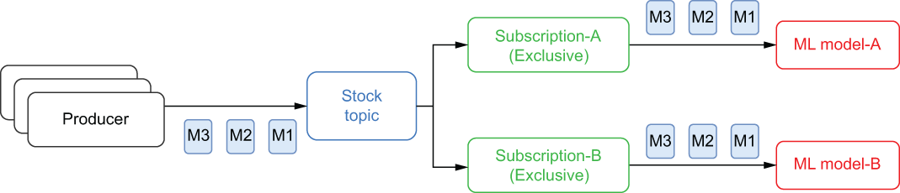
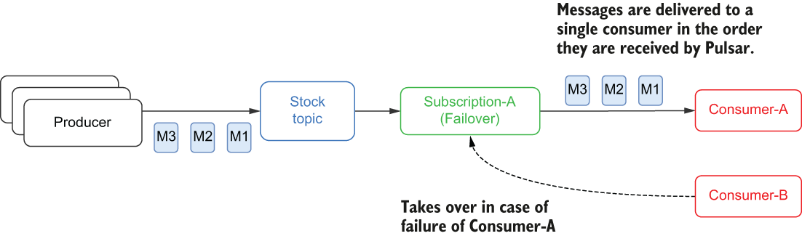
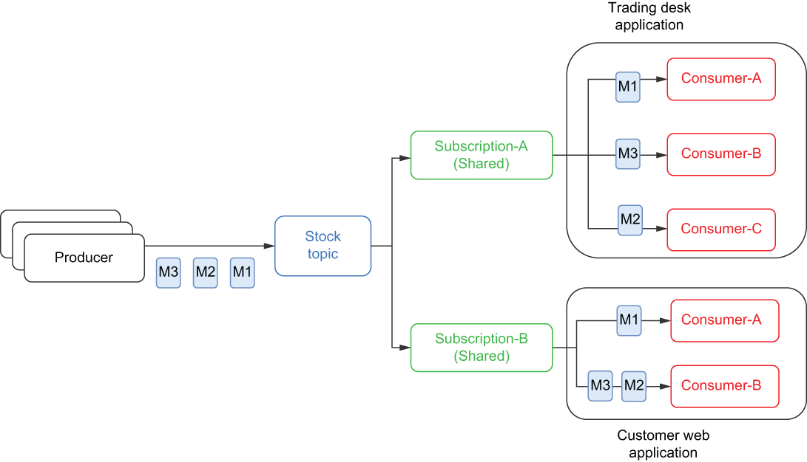
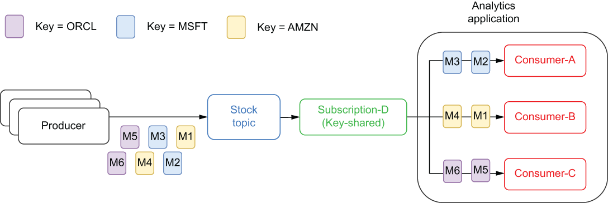

### 2.2.4 Subscription types

In Pulsar, all consumers use subscriptions to consume data from a topic. Subscriptions are just configuration rules that define how messages are delivered to consumers of a given topic. Pulsar subscriptions can be shared across multiple applications, and in fact, most subscription types are designed specifically for that usage pattern. Pulsar supports four different types of subscriptions: exclusive, failover, shared, and key-shared, as shown in figure 2.12.

Figure 2.12 Pulsar’s subscription modes

A Pulsar topic can support multiple subscriptions concurrently, allowing you to use a single topic to serve applications with vastly different consumption patterns. It is also important to point out that different subscriptions on the same topic don’t have to be of the same subscription type. This allows you to use a single topic to serve both queuing and streaming use cases simultaneously.

Each of Pulsar’s subscription types serve a different type of use case, so it is important to understand them in order to use them properly. Let’s revisit the scenario where a financial services company that streams stock market quote information in real time into a topic named stock quotes wants to share that information across the entire enterprise and see how each of these subscription modes would be used for the same use cases.

Exclusive

An exclusive subscription only permits a single consumer to the messages for that subscription. If any other consumer attempts to subscribe to a topic using the same subscription, an exception will be thrown, and it won’t be able to connect. This mode is used when you want to ensure that each message is processed exactly once and by a known consumer.

Figure 2.13 An exclusive subscription permits only a single consumer to consume the messages.

Within our financial services organization, the data science team would use this type of subscription to feed the stock topic data through their machine learning models to train or validate them. This would allow them to process the records in exactly the order they were received to provide a stream of stock quotes in the proper time sequence. Each model would require its own exclusive subscription, as shown in figure 2.13, to receive its own copy of the data.

Failover subscriptions

Failover subscriptions allow multiple consumers to attach to the subscription, but only one consumer is selected to receive the messages. This configuration allows you to provide a failover consumer to continue processing the messages in the topic in the event of a consumer failure. If the active consumer fails to process a message, Pulsar automatically fails over to the next consumer in the list and continues delivering the messages.

This type of subscription is useful when you want single processing semantics with high availability of the consumers. This is useful if you want your application to continue processing messages in the event of a system failure and another consumer to take over if the first consumer were to fail for any reason. Typically, these consumers are spread across different hosts and/or data centers to ensure that the application can survive multiple outages. As you can see in figure 2.14, Consumer-A is the active consumer, while Consumer-B is the standby consumer that would be the next in line to receive messages if Consumer-A disconnected for any reason.

Figure 2.14 A failover subscription has only one active consumer at a time, but it permits multiple standby consumers.

One such example would be if the data science team from our financial services company had deployed one of their models using data from the stock quotes topic that generates market volatility scores that are combined with scores from other models to produce an overall recommendation for the trading team. It would be critical that exactly one instance of this model remain up and always running to help the trading team make informed trading decisions. Having multiple instances running and generating recommendations could skew the overall recommendation.

Shared subscriptions

Shared subscriptions also allow multiple consumers to attach to the subscription; each of which can actively receive messages, unlike failover subscriptions that support only one active consumer at a time. Messages are delivered in a round-robin fashion to all the registered consumers, and any given message is delivered to only one consumer, as shown in figure 2.15.

Figure 2.15 Messages are distributed across all consumers of a shared subscription.

This subscription type is useful for implementing work queues, where message ordering isn’t important, as it allows you to scale up the number of consumers on the topic quickly to process the incoming messages. There are no upper limits on the number of consumers per shared subscription, which allows you to scale up consumption by increasing the number of consumers beyond some artificial limit that is imposed by the storage layer.

Within our fictitious financial services organization, the business-critical applications, such as our internal trading platforms, algorithmic trading systems, and customer facing website would all benefit from such a subscription. Each of these applications would use their own shared subscription, as shown in figure 2.15, to ensure that they each received all the messages published to the stock topic.

Key-shared subscriptions

The key-shared subscription also permitted multiple concurrent consumers, but unlike the shared subscription which distributes the messages in a round-robin manner amongst the consumers, it adds a secondary key index, which ensures that messages with the same key get delivered to the same consumer. This subscription acts as a distributed GROUP BY in SQL, where data with similar keys is grouped together. This is particularly useful in cases where you want to presort the data prior to consumption.

Consider the scenario of the business analytics team needing to perform some analytics on the data in the stock topic. By having using a key-shared subscription, they are assured that all the data for a given ticker symbol will be processed by the same consumer, as depicted in figure 2.16, making it easier for them to join this data with other data streams.

Figure 2.16 Messages are grouped together by the specified key in a shared-key subscription.

In summary, exclusive and failover subscriptions allow only one consumer per topic partition per subscription, which ensures that messages are consumed in the order they are received. They are best applied to streaming use cases where strict ordering is required.

Shared subscriptions, on the other hand, allow multiple consumers per topic partition. Each consumer within the subscription receives only a portion of the messages published to a topic. Shared subscriptions are best for queuing use cases, where strict message ordering is not required but high throughput is.
