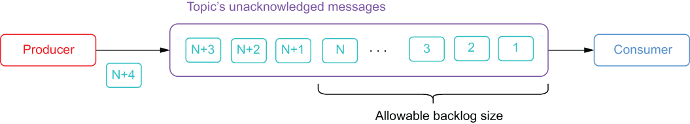

### 2.3.2 Backlog quotas

*Backlog* is the term used for all the unacknowledged messages in a topic that must be stored on bookies until they are delivered to all the intended recipients. By default, Pulsar retains all unacknowledged messages indefinitely. However, Pulsar supports namespace-level backlog quota policies that allow you to override this behavior to reduce the space consumed by these unacknowledged messages in situations where one or more of the consumers goes offline for an extended period due to a system crash.

These backlog quotas are designed to solve a very specific situation in which the topic producers have sent more messages than the consumer can possibly process without falling even further behind. Under these circumstances, you would want to prevent the consumer from getting so far behind that it will never catch up. When this situation occurs, you need to consider the timeliness of the data that the consumer is processing and ensure that the consumer abandons older, less-recent data in favor of more recent messages that can still be processed within the agreed upon SLA. If the data in your topic becomes “stale” by sitting there for an extended period, then implementing a backlog quota will help you focus your processing efforts on only the more recent data by limiting the size of the backlog.

Figure 2.17 Pulsar’s backlog quota allows you to dictate what action the broker should take when the volume of unacknowledged messages exceeds a certain size. This prevents the backlog from growing so large that the consumer is processing data that is of little or no value.

Unlike the message retention policies I discussed in the previous section, which are intended to extend the lifespan of acknowledged messages inside a Pulsar topic, these backlog quota policies are designed to reduce the lifespan of unacknowledged messages.

You can limit the allowable size of these message backlogs by configuring a backlog policy that specifies the maximum allowable size of the topic backlog and the action to take when this threshold is exceeded, as shown in figure 2.17. There are three distinct options for the backlog retention policy, which dictate the behavior the broker should take to alleviate the condition:

- The broker can reject inbound messages by sending an exception to the producers to indicate that they should hold off sending new messages by specifying the producer_request_hold retention policy.

- Rather than requesting that the producers hold off, the broker will forcibly disconnect any existing producers when the producer_exception policy is specified.

- If you want the broker to discard existing, unacknowledged messages from the topic, then you should specify the consumer_backlog_eviction policy.

Each of these provide you with three very different approaches to handling the situation shown in figure 2.17. The first one, producer_request_hold, would leave the producer connected but throw an exception to slow it down. This policy would be applicable in a scenario where you want the client application to catch the thrown exception and resend the message at a later point. So, it would be best to use this policy when you don’t want to reject any messages sent from the consumer, and the clients will buffer the rejected messages for a period of time before resending them.

The second policy, producer_exception, would forcibly disconnect the producer entirely, which would stop the messages from getting published and would require the producer code to detect this condition and reconnect. With this policy there is the distinct possibility of losing messages sent from the client producers during the period they are disconnected. This policy is best used when you know the producers aren’t capable of buffering messages (e.g., they are running inside a resource-constrained environment, such as an IoT device), and you don’t want Pulsar’s inability to receive messages to cause the client application to crash.

The last policy, consumer_backlog_eviction, does not impact the functionality of the producer whatsoever, and it will continue to produce messages at the current rate. However, older messages that haven’t been consumed will be discarded, resulting in message loss.
