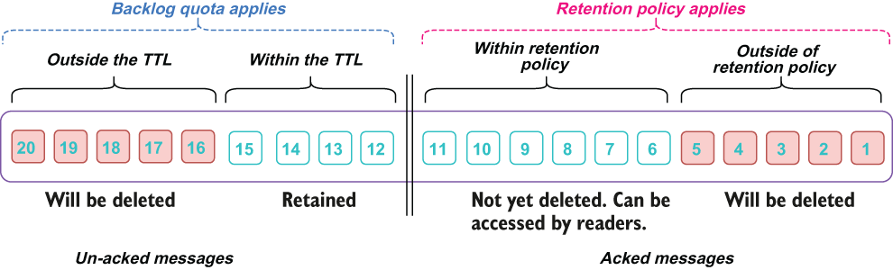

### 2.3.4 Message backlog vs. message expiration

Message retention and message expiration solve two fundamentally different problems. As you can see in figure 2.18, message retention policies only apply to acknowledged messages, and those messages that fall within the retention policy are retained. Message expiration only applies to unacknowledged messages and is controlled by the TTL setting, meaning any messages that are not processed and acked within that timeframe are discarded and not processed.

Message retention policies can be used in conjunction with tiered storage to support infinite message retention for critical datasets you want to retain indefinitely for backup/recovery, event sourcing, or SQL exploration.

Figure 2.18 The backlog quota applies to messages that have not been acknowledged by all subscriptions and is based on the TTL setting, while the retention policy applies to acknowledged messages and is based on the volume of data to retain.
