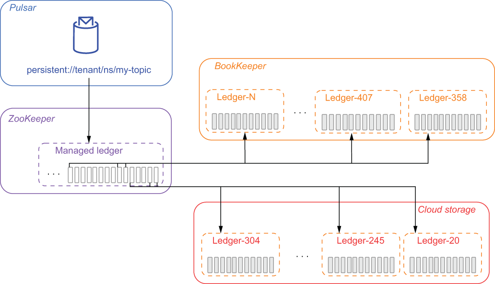

## 2.4 Tiered storage

Pulsar’s tiered storage feature allows older topic data to be offloaded to more cost-effective long-term storage, thereby freeing up disk space inside of the bookies. To the end user, there is no difference between consuming a topic whose data is stored inside Apache BookKeeper or one whose data is on tiered storage. The clients still produce and consume messages in the same way, and the entire process is handled transparently behind the scenes.

As we discussed earlier, Apache Pulsar stores topics as an ordered list of ledgers that are spread across the bookies in the storage layer. Because these ledgers are append-only, new messages are only written to the final ledger in the list. All the previous ledgers are sealed, so the data within the segment is immutable. Because the data is immutable, it can be easily be copied to another storage system, such as cloud storage.

Once the copy is complete, the managed ledger information can be updated to reflect the new storage location of the data, as shown in figure 2.19, and the original copy of the data stored in Apache BookKeeper can be deleted. When a ledger is offloaded to an external storage system, the ledgers are copied to that storage system one by one, from oldest to newest.

Figure 2.19 When using tiered storage, ledgers that have been closed can be copied over to cloud storage and removed from the bookies to free up space. The managed ledger entries are updated to reflect the new location of the ledgers, which can still be read by the topic consumers.

Apache Pulsar currently supports multiple cloud storage systems for tiered storage, but I will focus on using AWS in this section. Please consult the documentation for more details on how to use other cloud vendors’ storage systems.

AWS offload configuration

The first steps you need to perform are to create the S3 bucket you will be using to store the offloaded ledgers and to ensure that the AWS account you are going to use has sufficient permissions to read and write data to the bucket. Once those are completed, you will need to modify the broker configuration settings again, as shown in the following listing.

Listing 2.6 Configuring AWS tiered storage in Pulsar

managedLedgerOffloadDriver=aws-s3                          ❶\
s3ManagedLedgerOffloadBucket=offload-test-aws              ❷\
s3ManagedLedgerOffloadRegion=us-east-1                     ❸\
s3ManagedLedgerOffloadRole=\<aws role arn\>                  ❹\
s3ManagedLedgerOffloadRoleSessionName=pulsar-s3-offload    ❺

❶ Specifies the offload driver type as AWS S3

❷ The S3 bucket name used for ledger storage

❸ The AWS Region where the bucket is located

❹ If you want the offloader to assume an IAM role to perform its work, use this property.

❺ Specify the session name to use when assuming an IAM role.

You will need to add the AWS-specific settings to tell the Pulsar where to store the ledgers inside of S3. Once these settings are added, you can save the file and restart the Pulsar brokers for the changes to take effect.

AWS authentication

For Pulsar to offload data to S3, it must authenticate with AWS using a valid set of credentials. As you may have already noticed, Pulsar doesn’t provide any means of configuring authentication for AWS. Instead, it relies on the standard mechanisms supported by the DefaultAWSCredentialsProviderChain, which searches for AWS credentials in various predefined locations.

If you are running your broker on an AWS instance with an instance profile that provides credentials, Pulsar will use these credentials if no other mechanism is provided. Alternatively, you can provide your credentials via environment variables. The easiest way to do this is to edit the conf/pulsar_env.sh file and export the environment variables AWS_ACCESS_KEY_ID and AWS_SECRET_ACCESS_KEY by adding the statements shown in the following listing.

Listing 2.7 Providing AWS credentials via environment variables

\# Add these at the beginning of the pulsar_env.sh\
export AWS_ACCESS_KEY_ID=ABC123456789\
export AWS_SECRET_ACCESS_KEY=ded7db27a4558e2ea8bbf0bf37ae0e8521618f366c\
 \
\# or you can set them here instead.\
PULSAR_EXTRA_OPTS="\${PULSAR_EXTRA_OPTS} \${PULSAR_MEM} \${PULSAR_GC} \
-Daws.accessKeyId=ABC123456789 \
-Daws.secretKey=ded7db27a4558e2ea8bbf0bf37ae0e8521618f366c \
-Dio.netty.leakDetectionLevel=disabled \
-Dio.netty.recycler.maxCapacity.default=1000 \
-Dio.netty.recycler.linkCapacity=1024"

You only need to use one of the two methods shown in listing 2.7. Both options work equally well, so you can take your pick. However, both methods pose a security risk, as these AWS credentials will be visible in the process if you run a linux ps command. If you would prefer to avoid that scenario, you can store your credentials in the traditional location for AWS credentials files, ~/.aws/credentials (shown in listing 2.8), which can be modified to have read-only permissions for the user account that will be launching the Pulsar broker (e.g., root). However, this approach does require you to store your unencrypted credentials on disk, which introduces some security risks, so it is not recommend for production use.

Listing 2.8 Contents of the ~/.aws/credentials file

\[default\]\
aws_access_key_id=ABC123456789\
aws_secret_access_key=ded7db27a4558e2ea8bbf0bf37ae0e8521618f366c

Configuring offload to run automatically

Simply because we have configured the managed ledger offloader does not mean that the offloading will occur. We still need to define a namespace-level policy to have the data offloaded automatically once a certain threshold is reached. The threshold is based on the total volume of data that a Pulsar topic has stored in the BookKeeper storage layer.

Listing 2.9 Configuring automatic offloads to tiered storage

/pulsar/bin/pulsar-admin namespaces set-offload-threshold \\\
-size 10GB \\\
E-payments/payments

You can define a policy such as the one shown in listing 2.9, which sets a threshold of 10 GB for all topics in the namespace. Once a topic reaches 10 GB of storage, an offload of all closed segments is triggered. Setting the threshold to zero will cause the broker to offload ledgers as aggressively as it can and can be used to minimize the amount of topic data stored on BookKeeper. Specifying a negative value for the threshold effectively disables automatic offloading entirely and can be used for topics with tight SLA response times that cannot tolerate the additional latency required to read data from tiered storage.

Tiered storage should be used when you have a topic for which you want to retain the data for a very long time. One example would be clickstream data for a customer-facing website. This information should be retained for a long period of time in case you want to perform user behavioral analytics on your customer's interactions in order to detect patterns of behavior.

While tiered storage is often used in conjunction with topics that have retention policies that encompass enormous amounts of data, there is no such requirement. It can, in fact, be used with any topic.
