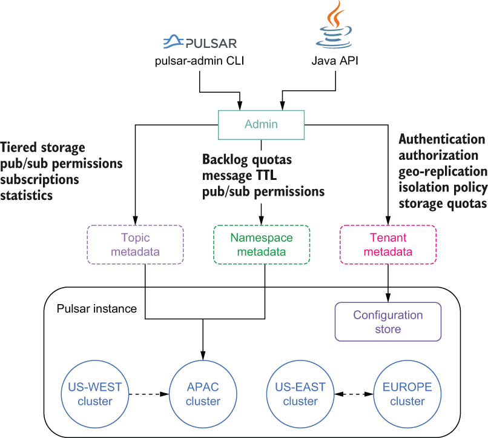

## 3.2 Administering Pulsar

Pulsar provides a single administrative layer that allows you to administer the entire Pulsar instance, including all the subclusters, from a single endpoint. Pulsar’s admin layer controls authentication and authorization for all tenants, resource isolation policies, storage quotas, and more, as shown in figure 3.1.

Figure 3.1 Administrative view of Pulsar

This administrative interface allows you to create and manage all the various entities within a Pulsar cluster, such as tenants, namespaces, and topics, and configure their various security and data retention policies. Users can interact with this administrative interface via the pulsar-admin command-line interface tool or programmatically via a Java API, as shown in figure 3.1

When you start a local standalone cluster, Pulsar automatically creates a *public tenant* with a namespace named default that can be used for development purposes. However, this is not a realistic production scenario, so I will demonstrate how to create a tenant and namespace.

## 子目录

- [3.2.1 Creating a tenant, namespace, and topic](<3.2-administering-pulsar/3.2.1-creating-a-tenant,-namespace,-and-topic.md>)
- [3.2.2 Java Admin API](<3.2-administering-pulsar/3.2.2-java-admin-api.md>)
