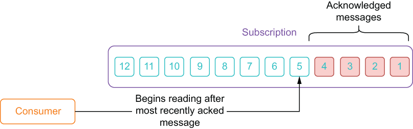
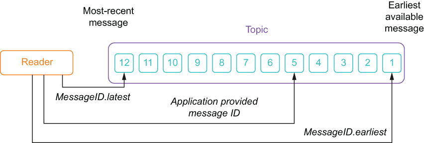

### 3.3.1 The Pulsar Java client

In addition to the Java Admin API we looked at earlier in the chapter, Pulsar also provides a Java client that can be used to create producers, consumers, and message readers. The latest version of the Pulsar Java client library is available in the Maven central repository. To use the latest version, simply add the Pulsar client library to your build configuration, as shown in the next listing. Once you have added the Pulsar client library to your project, you can start using it to interact with Pulsar by creating clients, producers, and consumers inside your Java code, as we’ll see in the next section.

Listing 3.8 Adding the Pulsar client library to your Maven project

\<!--- Inside your pom.xml --\>\
\<properties\>\
   \<pulsar.version\>2.7.2\</pulsar.version\>\
\</properties\>\
 \
\<dependency\>\
  \<groupId\>org.apache.pulsar\</groupId\>\
  \<artifactId\>pulsar-client\</artifactId\>\
  \<version\>\${pulsar.version}\</version\>\
\</dependency\>

Pulsar client configuration in Java

When an application wants to create either a producer or a consumer, you first need to instantiate a PulsarClient object, using code like that shown in the following listing. In this object, you will provide the URL of the Pulsar broker along with any other connection configuration information that may be required, such as security credentials.

Listing 3.9 Creating a PulsarClient in Java

PulsarClient client = PulsarClient.builder()\
        .serviceUrl("pulsar://localhost:6650")      ❶\
        .build();

❶ The connection URL to the Pulsar broker

The PulsarClient object handles all the low-level details involved in creating a connection to the Pulsar broker, including automatic retries and connection security if the Pulsar broker has TLS configured. Client instances are thread safe and can be reused for creating and managing multiple producers and consumers.

Pulsar producers in Java

In Pulsar, producers are used to write messages to topics. Listing 3.10 shows how you can create a producer in Java by specifying the name of the topic you are going to send messages to. While there are several configuration settings that can be used when creating a producer, all that is required is the topic name itself.

Listing 3.10 Creating a Pulsar producer in Java

Producer\<byte\[\]\> producer = client.newProducer()\
        .topic("persistent://manning/chapter03/example-topic")\
        .create();

It is also possible to attach metadata to a given message, as shown in listing 3.11, which shows how to specify the message key that is used for routing with a key-shared subscription, along with some message properties. This capability can be used to tag the message with useful information, such as when the message was sent, who sent the message, the device ID if the message is from an embedded sensor, and other information.

Listing 3.11 Specifying metadata in Pulsar messages

Producer\<byte\[\]\> producer = client.newProducer()\
        .topic("persistent://manning/chapter03/example-topic")\
        .create();\
 \
producer.newMessage()\
    .key("tempurture-readings")                      ❶\
    .value("98.0".getBytes())                        ❷\
    .property("deviceID", "1234")                    ❸\
    .property("timestamp", "08/03/2021 14:48:24.1")\
    .send();

❶ You can specify a message key.

❷ Send the message content as a byte array.

❸ You can attach as many properties as you like.

The metadata values you attach to the message will be available to the message consumers who can then use that information when performing their processing logic. For example, a property containing a timestamp value that represents when the message was sent could be used to sort the incoming messages into chronological order of occurrence or to correlate it with messages from another topic.

Pulsar consumers in Java

In Pulsar, the consumer interface is used to listen on a specific topic and process the incoming messages. After a message has been successfully processed, an acknowledgment should be sent back to the broker to indicate that we are done processing the message within the subscription. This allows the broker to know which message in the topic needs to be delivered to the next consumer on the subscription. In Java, you can create a consumer by specifying a topic and a subscription, as shown in the following listing.

Listing 3.12 Creating a Pulsar consumer in Java

Consumer consumer = client.newConsumer()\
    .topic("persistent://manning/chapter03/example-topic")    ❶\
    .subscriptionName("my-subscription")                      ❷\
    .subscribe();

❶ Specify the topic you want to consume from.

❷ You must specify the unique name of your subscription.

The subscribe method will attempt to connect the consumer to the topic using the specified subscription, which may fail if the subscription already exists and isn’t one of the shared subscription types (e.g., you attempt to connect to an exclusive subscription that already has an active consumer). If you are connecting to the topic for the first time using the specified subscription name, a subscription is created for you automatically. Whenever a new subscription is created, it is initially positioned at the end of the topic by default, and consumers on that subscription will begin reading the first message created after the subscription was created. If you are connecting to a preexisting subscription, it will begin reading from the earliest unacknowledged message within the subscription, as shown in figure 3.2. This ensures that you pick up from where you left off in the event that your consumer is unexpectedly disconnected from the topic.

Figure 3.2 The consumer starts reading messages immediately after the most recently acknowledged message in the subscription. If the subscription is new, then it starts reading the messages that are added to the topic after the subscription was created.

One common consumption pattern is to have the consumer listen on the topic inside a while loop. In listing 3.13, the consumer continuously listens for messages, prints the contents of any message that’s received, and then acknowledges that the message has been processed. If the processing logic fails, we use negative acknowledgement to have the message redelivered at a later point in time.

Listing 3.13 Consuming Pulsar messages in Java

while (true) {\
  // Wait for a message\
  Message msg = consumer.receive();                   ❶\
 \
  try {\
      System.out.println("Message received: " + \
                         new String(msg.getData()));  ❷\
      consumer.acknowledge(msg);                      ❸\
  } catch (Exception e) {\
      consumer.negativeAcknowledge(msg);              ❹\
  }\
}

❶ Wait for a message.

❷ Process the message.

❸ Acknowledge the message so it can be deleted by the broker.

❹ Mark the message for redelivery.

The message consumer shown in listing 3.13 processes the messages in a synchronous manner because the receive() method it is using to retrieve messages is a blocking method (i.e., it waits indefinitely for a new message to arrive). While this might be fine for some use cases where the message volume is low, or we are not concerned about the latency between when a message is published and when it is processed, generally synchronous processing is not the best approach. A better approach is to process these messages in an asynchronous manner, which relies on the MessageListener interface provided by the Java API, as shown in the following listing.

Listing 3.14 Asynchronous message processing in Java

package com.manning.pulsar.chapter3.consumers;\
  \
import java.util.stream.IntStream;\
        \
import org.apache.pulsar.client.api.ConsumerBuilder;\
import org.apache.pulsar.client.api.PulsarClient;\
import org.apache.pulsar.client.api.PulsarClientException;\
import org.apache.pulsar.client.api.SubscriptionType;\
  \
public class MessageListenerExample {\
  \
public static void main() throws PulsarClientException {\
 \
  PulsarClient client = PulsarClient.builder()              ❶\
        .serviceUrl(PULSAR_SERVICE_URL)\
        .build();\
  \
  ConsumerBuilder\<byte\[\]\> consumerBuilder =                 ❷\
     client.newConsumer()\
        .topic(MY_TOPIC)\
        .subscriptionName(SUBSCRIPTION)\
        .subscriptionType(SubscriptionType.Shared)\
        .messageListener((consumer, msg) -\> {               ❸\
           try {\
            System.out.println("Message received: " +  \
                 new String(msg.getData()));\
             consumer.acknowledge(msg);\
          } catch (PulsarClientException e) {\
            \
          }\
    })\
 \
  IntStream.range(0, 4).forEach(i -\> {                      ❹\
    String name = String.format("mq-consumer-%d", i);\
    try {\
       consumerBuilder\
        .consumerName(name)\
        .subscribe();                                       ❺\
   } catch (PulsarClientException e) {\
     e.printStackTrace();\
   }\
 });\
  \
  ...\
  }\
}

❶ The Pulsar client used to connect to Pulsar

❷ The consumer factory that will be used to create the consumer instances later

❸ The business logic to execute when a message is received

❹ Create five consumers on the topic, each with the same MessageListener implementation.

❺ Connects the consumer to the topic to start receiving messages

When using the MessageListener interface, as shown in listing 3.14, you pass in the code that you want executed whenever a message is received. In this case I used a Java Lambda to provide the code inline, and you can see that I still have access to the consumer that I can use to acknowledge the message. Using the listener pattern allows you to separate the business logic from the management of the threads because the Pulsar consumer automatically creates a thread pool for running the MessageListeners instances and handles all the threading logic for you. Putting this all together, we have a Java program in the following listing that instantiates a Pulsar client and uses it to create a producer and a consumer that exchange messages over the my-topic topic.

Listing 3.15 Endless Pulsar producer and consumer pair

import org.apache.pulsar.client.api.Consumer;\
import org.apache.pulsar.client.api.Message;\
import org.apache.pulsar.client.api.Producer;\
import org.apache.pulsar.client.api.PulsarClient;\
import org.apache.pulsar.client.api.PulsarClientException;\
 \
public class BackAndForth {\
 \
  public static void main(String\[\] args) throws Exception {\
    BackAndForth sl = new BackAndForth();\
    sl.startConsumer();\
    sl.startProducer();\
  }\
  private String serviceUrl = "pulsar://localhost:6650";\
  String topic = "persistent://manning/chapter03/example-topic";;\
  String subscriptionName = "my-sub";\
 \
  protected void startProducer() {\
      Runnable run = () -\> {\
        int counter = 0;\
        while (true) {\
          try {\
           getProducer().newMessage()\
              .value(String.format("{id: %d, time: %tc}", \
               ++counter, new Date()).getBytes())     \
              .send();\
            Thread.sleep(1000);\
          } catch (final Exception ex) { }\
        }};\
      new Thread(run).start();\
  }\
 \
  protected void startConsumer() {\
    Runnable run = () -\> {\
      while (true) {\
        Message\<byte\[\]\> msg = null;  \
        try {\
          msg = getConsumer().receive();    \
          System.out.printf("Message received: %s \n",\
          new String(msg.getData()));\
       getConsumer().acknowledge(msg);    \
    } catch (Exception e) {\
      System.err.printf(\
        "Unable to consume message: %s \n", e.getMessage()); \
      consumer.negativeAcknowledge(msg);\
    }\
   }};\
   new Thread(run).start();\
 }\
 \
 protected Consumer\<byte\[\]\> getConsumer() throws PulsarClientException {\
   if (consumer == null) {\
      consumer = getClient().newConsumer()\
          .topic(topic)\
          .subscriptionName(subscriptionName) \
          .subscriptionType(SubscriptionType.Shared)\
          .subscribe();\
   }\
   return consumer;\
 }\
 \
 protected Producer\<byte\[\]\> getProducer() throws PulsarClientException {\
    if (producer == null) {\
      producer = getClient().newProducer()\
        .topic(topic).create();\
    }\
    return producer;\
 }\
 \
 protected PulsarClient getClient() throws PulsarClientException {\
    if (client == null) {\
      client = PulsarClient.builder()\
       .serviceUrl(serviceUrl)   \
       .build();\
    }\
    return client;\
  }\
}

As you can see, this code creates both a producer and consumer on the same topic and runs them simultaneously in separate threads. If you run this code, you should see output like the following listing.

Listing 3.16 Endless Pulsar producer and consumer pair output

Message received: {id: 1, time: Sun Sep 06 16:24:04 PDT 2020} \
Message received: {id: 2, time: Sun Sep 06 16:24:05 PDT 2020} \
Message received: {id: 3, time: Sun Sep 06 16:24:06 PDT 2020} \
...

Notice how the first two messages we sent earlier are not included in the output, since the subscription was created *after* those messages were published. This is in direct contrast to the Reader interface, which we will examine shortly.

Dead letter policy

While there are several configuration options for a Pulsar consumer that are described in the online documentation (https://pulsar.apache.org/docs/en/client-libraries-java/#configure-consumer), I wanted to highlight the dead-letter-policy configuration, which is useful when you encounter messages that cannot be processed successfully, such as when you are parsing unstructured messages from a topic. Under normal processing conditions, these messages would cause an exception to be thrown.

At this point you have a couple of options; the first is to trap any exceptions, and simply acknowledge these messages as successfully processed, which effectively ignores them. Another option is to have them redelivered by negatively acknowledging them. However, this approach might result in an infinite redelivery loop for these messages if the underlying issue with the messages cannot be resolved (e.g., a message that cannot be parsed will always throw an exception no matter how many times you process it). A third option is to route these problematic messages to a separate topic, known as a dead-letter topic. This allows you to avoid the infinite redelivery loop, while retaining the messages for further processing and/or examination at a later point in time.

Listing 3.17 Configure the dead letter topic policy on a consumer

Consumer consumer = client.newConsumer()\
    .topic("persistent://manning/chapter03/example-topic")\
    .subscriptionName("my-subscription")\
    .deadLetterPolicy(DeadLetterPolicy.builder()\
       .maxRedeliverCount(10)                                       ❶\
       .deadLetterTopic("persistent://manning/chapter03/my-dlq”))   ❷\
    .subscribe();

❶ Set the max redelivery count.

❷ Set the dead-letter topic name.

To configure a dead-letter policy for a particular consumer, Pulsar requires you to specify a few properties, such as the max redelivery count, when you first build it, as shown in listing 3.17. When a message exceeds the user-specified maximum redelivery count, it will be sent to the dead-letter topic and acknowledged automatically. These messages can then be examined at a later point in time.

Pulsar readers in Java

The reader interface allows applications to manage the positions from which they will consume messages. When you connect to a topic using a reader, you must specify which message the reader will begin consuming messages from when it connects to the topic. In short, the reader interface provides Pulsar clients with a low-level abstraction that allows them to manually position themselves within a topic, as shown in figure 3.3.

Figure 3.3 When connecting to a topic, the reader interface enables you to begin with the earliest available message, the latest available message, or an application provided message ID.

The reader interface is helpful for use cases like using Pulsar to provide effectively-once processing semantics for a stream processing system. For this use case, it’s essential that the stream processing system is able to rewind topics to a specific message and begin reading there. If you choose to explicitly provide a message ID, your application will be responsible for knowing this message ID in advance, perhaps fetching it from a persistent data store or cache. Once you’ve instantiated a PulsarClient object, you can create a Reader, as shown in the following listing.

Listing 3.18 Creating a Pulsar reader

Reader\<byte\[\]\> reader = client.newReader()\
    .topic("persistent://manning/chapter03/example-topic")     ❶\
    .readerName("my-reader")\
    .startMessageId(MessageId.earliest)                        ❷\
    .create();\
 \
while (true) {\
  Message msg = reader.readNext();\
  System.out.printf("Message received: %s \n", new String(msg.getData()));\
}

❶ Specify the topic you want to read from.

❷ Specify that we want to read from the earliest message.

If you run this code, you should see output like the following listing. You would start reading from the very first messages that were published to the topic, which were the two “Hello Pulsar” messages we send from the CLI tool.

Listing 3.19 Earliest message reader output

Message read: Hello Pulsar \
Message read: Hello Pulsar \
Message read: {id: 1, time: Sun Sep 06 18:11:59 PDT 2020} \
Message read: {id: 2, time: Sun Sep 06 18:12:00 PDT 2020} \
Message read: {id: 3, time: Sun Sep 06 18:12:01 PDT 2020} \
Message read: {id: 4, time: Sun Sep 06 18:12:02 PDT 2020} \
Message read: {id: 5, time: Sun Sep 06 18:12:04 PDT 2020} \
Message read: {id: 6, time: Sun Sep 06 18:12:05 PDT 2020} \
Message read: {id: 7, time: Sun Sep 06 18:12:06 PDT 2020}

In the example shown in listing 3.18, a reader is created on the specified topic and iterates over each message in the topic, starting with the oldest message in the topic. There are several configuration options for a Pulsar reader that are described in the online documentation (https://pulsar.apache.org/docs/en/client-libraries-java/#reader), but for most cases the default options are sufficient.
