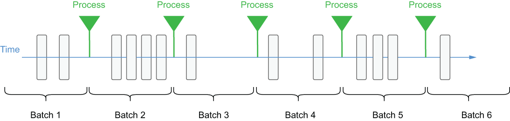

### 4.1.2 Micro-batching

One technique that was introduced to address the processing latency that plagued these traditional batch processing engines was to dramatically reduce either the batch size or the processing interval. In micro-batch processing, newly arriving data elements are still collected into batches, as shown in figure 4.1, but the size of the batches is dramatically reduced by adjusting the time interval to a few seconds. Even though the processing may occur more frequently, the data is still processed one batch at a time, so it is often referred to as micro-batching and is used by such processing frameworks as Spark Streaming.

Figure 4.1 With batch processing, the message processing occurs at predetermined intervals and follows a consistent cadence.

While this approach does decrease the processing latency between when a data element arrives and when it is processed, it still introduces artificial delays into the process that compound as the complexity of the data pipeline increases. Consequently, even micro-batch processing applications cannot rely on consistent response times and need to account for delays between when the data arrives and when it is processed. This makes micro-batch processing more appropriate for use cases that do not require having the most recent data and can tolerate slower response times, whereas stream native processing is better suited for use cases that require near real-time responsiveness, such as fraud detection, real-time pricing, and system monitoring.
