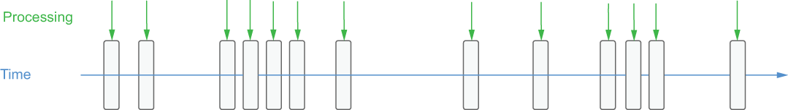

### 4.1.3 Stream native processing

With stream native processing, each new piece of data is processed as soon as it arrives, as illustrated in figure 4.2. Unlike batch processing, there are no arbitrary processing intervals, and each individual data element is processed separately.

Figure 4.2 With stream processing, the processing is triggered by the arrival of each message, so the processing cadence is irregular and unpredictable.

Although it may seem as though the differences between stream processing and micro-batching are just a matter of timing, there are implications for both the data processing systems and the applications that rely on them. The business value of data decreases rapidly after it is created, particularly in use cases such as fraud prevention or anomaly detection. The high-volume, high-velocity datasets used to feed these use cases often contain valuable, but perishable, insights that must be acted upon immediately. A fraudulent business transaction, such as transferring money or downloading licensed software, must be identified and acted upon before the transaction completes; otherwise it will be too late to prevent the thief from obtaining the funds illegally. To maximize the value of their data for these use cases, developers must fundamentally change their approach to processing real-time data by focusing on reducing the processing latency introduced from traditional batch processing frameworks and utilizing a more reactive approach, such as stream-native processing.
