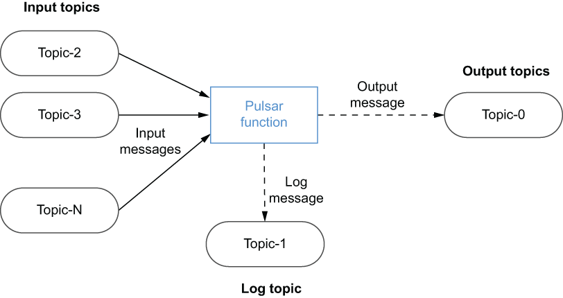

## 4.2 What is Pulsar Functions?

Included with Apache Pulsar is a lightweight computing engine named Pulsar Functions, which allows developers to deploy a simple function implementation in Java, Python, or Golang. This feature allows users to enjoy the benefits of serverless computing similar to those provided by AWS Lambda within an open source messaging platform, rather than being tied to a cloud provider’s proprietary API.

Pulsar Functions allows you to apply processing logic to data as it is routed through the messaging system itself. These lightweight compute processes execute natively within the Pulsar messaging system itself as close to the message as they can be and without the need for another processing framework such as Spark, Flink, or Kafka Streams. Unlike other messaging systems, which act as “dumb pipes” for moving data from system to system, Pulsar Functions provides the capability to perform simple computations on messages before they are routed to consumers. Pulsar Functions consumes messages from one or more Pulsar topics, applies a user-supplied function (processing logic) to each incoming message, and publishes the results to one or more Pulsar topics, as shown in figure 4.3.

Figure 4.3 Pulsar Functions executes user-defined code on data published to Pulsar topics.

Pulsar functions can be best characterized as Lambda-style functions that are specifically designed to use Pulsar as the underlying message bus. This is because they take several design cues from the popular AWS Lambda framework that allows you to run code without provisioning or managing servers to host the code. Hence, the common term for this programming model is *serverless*.

The Pulsar function framework allows users to develop self-contained pieces of code and then deploy them with a simple REST call. Pulsar takes care of the underlying details required to run your code, including creating the Pulsar consumer and producers for the function’s input and output topics. Developers can focus on the business logic itself and not have to worry about the boilerplate code necessary to send messages with Pulsar. In short, the Pulsar Functions framework provides a ready-made computing infrastructure on your existing Pulsar cluster.

## 子目录

- [4.2.1. Programming model](<4.2-what-is-pulsar-functions_/4.2.1.-programming-model.md>)
