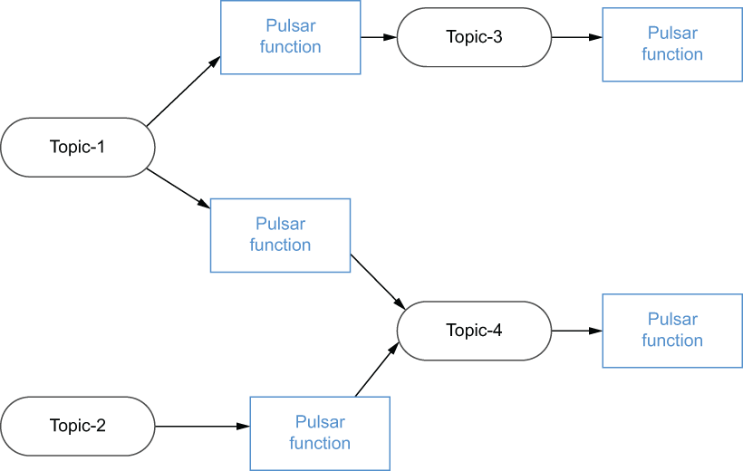

### 4.2.1. Programming model

The programming model behind Pulsar Functions is very straightforward. Pulsar functions receive messages from one or more *input* topics, and every time a message is published to the topic, the function code is executed. Upon being triggered, the function code executes its processing logic upon the incoming message and writes its (optional) output to an *output* topic. Although all functions are required to have an input topic, they are not strictly required to produce any output to an output topic.

It is possible to have the output topic of one Pulsar function be the input topic of another, allowing us to effectively create a directly acyclic graph (DAG) of the Pulsar functions, as shown in figure 4.4. In such a graph, each edge represents a flow of data, and each vertex represents a Pulsar function that applies the user-defined logic to process the data. The combinations of Pulsar functions into these DAGs are endless, and it is possible to write an application that is entirely composed of Pulsar functions and structured as a DAG if you so choose.

Figure 4.4 Pulsar functions can be logically structured into a processing network.
