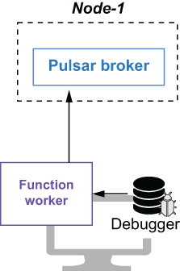

### 4.4.2 Integration testing

After we are satisfied with our unit testing results, we will want to see how the Pulsar function will perform on a Pulsar cluster. The easiest way to test a Pulsar function is to start a Pulsar server and run the Pulsar function locally, using the LocalRunner helper class. In this mode, the function runs as a standalone process on the machine it is submitted from. This option is best when you are developing and testing your functions, as it allows you to attach a debugger to the function process on the local machine, as shown in figure 4.5.

Figure 4.5 When you run a Pulsar function using LocalRunner, the function runs on the local machine, allowing you to attach a debugger and step through the code.

To use the LocalRunner, you must first add a few dependencies to your Maven project, as shown in the following listing. This brings in the LocalRunner class that is used to test the function against a running Pulsar cluster.

Listing 4.15 Including the LocalRunner dependencies

\<dependencies\>\
  . . .\
  \<dependency\>\
        \<groupId\>com.fasterxml.jackson.core\</groupId\>\
        \<artifactId\>jackson-core\</artifactId\>\
        \<version\>\${jackson.version}\</version\>\
    \</dependency\>\
  \<dependency\>\
    \<groupId\>org.apache.pulsar\</groupId\>\
    \<artifactId\>pulsar-functions-local-runner-original\</artifactId\>\
    \<version\>\${pulsar.version}\</version\>\
  \</dependency\>\
\</dependencies\>

Next, we need to write a class to configure and launch the LocalRunner, as shown in the following listing. As you can see, this code must first configure the Pulsar function to execute on the LocalRunner, and it specifies the address of the actual Pulsar cluster instance that will be used for the testing.

Listing 4.16 Testing the KeywordFilterFunction with the LocalRunner

public class KeywordFilterFunctionLocalRunnerTest {\
  final static String BROKER_URL = "pulsar://localhost:6650";\
  final static String IN = "persistent://public/default/raw-feed"; \
  final static String OUT = "persistent://public/default/filtered-feed";\
    \
  private static ExecutorService executor;\
  private static LocalRunner localRunner;\
  private static PulsarClient client;\
  private static Producer\<String\> producer;\
  private static Consumer\<String\> consumer;\
  private static String keyword = "";\
    \
  public static void main(String\[\] args) throws Exception {\
    if (args.length \> 0) {\
    keyword = args\[0\];                                               ❶\
   }\
   startLocalRunner();\
   init();\
   startConsumer();\
   sendData();\
   shutdown();\
  }\
 \
  private static void startLocalRunner() throws Exception {\
    localRunner = LocalRunner.builder()\
            .brokerServiceUrl(BROKER_URL)                            ❷\
            .functionConfig(getFunctionConfig())                     ❸\
            .build();\
   localRunner.start(false);                                         ❹\
  }\
 \
  private static FunctionConfig getFunctionConfig() {\
    Map\<String, ConsumerConfig\> inputSpecs = \
       new HashMap\<String, ConsumerConfig\> ();\
  \
    inputSpecs.put(IN, ConsumerConfig.builder()                      ❺\
           .schemaType(Schema.STRING.getSchemaInfo().getName())\
           .build());\
 \
    Map\<String, Object\> userConfig = new HashMap\<String, Object\>();\
    userConfig.put(KeywordFilterFunction.KEYWORD_CONFIG, keyword);\
    userConfig.put(KeywordFilterFunction.IGNORE_CONFIG, true);       ❻\
        \
    return FunctionConfig.builder()\
          .className(KeywordFilterFunction.class.getName())          ❼\
          .inputs(Collections.singleton(IN))                         ❽\
          .inputSpecs(inputSpecs)                                    ❾\
          .output(OUT)                                               ❿\
          .name("keyword-filter")\
          .tenant("public")\
          .namespace("default")\
          .runtime(FunctionConfig.Runtime.JAVA)                      ⓫\
          .subName("keyword-filter-sub")\
          .userConfig(userConfig)                                    ⓬\
          .build();\
  }\
 \
  private static void init() throws PulsarClientException {          ⓭\
    executor = Executors.newFixedThreadPool(2);\
    client = PulsarClient.builder()\
              .serviceUrl(BROKER_URL)\
              .build();\
    producer = client.newProducer(Schema.STRING).topic(IN).create();    \
    consumer = client.newConsumer(Schema.STRING).topic(OUT)\
                .subscriptionName("validation-sub").subscribe();\
  }\
    \
  private static void startConsumer() {                              ⓮\
    Runnable runnableTask = () -\> {\
      while (true) {\
        Message\<String\> msg = null;\
        try {\
           msg = consumer.receive();\
           System.out.printf("Message received: %s \n", msg.getValue());\
           consumer.acknowledge(msg);\
        } catch (Exception e) {\
           consumer.negativeAcknowledge(msg);\
        }\
       }};\
    executor.execute(runnableTask);\
  }\
    \
  private static void sendData() throws IOException {                ⓯\
    InputStream inputStream = Thread.currentThread().getContextClassLoader()\
       .getResourceAsStream("test-data.txt");\
 \
   InputStreamReader streamReader = new InputStreamReader(inputStream,\
      StandardCharsets.UTF_8);\
 \
    BufferedReader reader = new BufferedReader(streamReader);\
    for (String line; (line = reader.readLine()) != null;) {\
      producer.send(line);\
    }\
  }\
        \
  private static void shutdown() throws Exception {                  ⓰\
    executor.shutdown();\
    localRunner.stop();\
   . . .\
  }   \
}

❶ Get the user-provided keyword.

❷ The service URL for the Pulsar cluster the function will run on

❸ Pass in the function configuration to the LocalRunner.

❹ Start the LocalRunner and function.

❺ Specifies that the data inside the input topic will be strings

❻ Initialize the user configuration properties with the user-provided keyword.

❼ Specifies the class name of the function to run locally

❽ Specifies the input topic

❾ Pass in the input topic configuration properties.

❿ Specifies the output topic

⓫ Specifies that we want to use a Java Runtime environment for the function

⓬ Pass in the user configuration properties.

⓭ Initialize a producer and consumer to use for testing.

⓮ Launch the consumer in a background thread to read messages from the function output topic.

⓯ Send data to the function input topic.

⓰ Stop the LocalRunner, consumer, etc.

The easiest way to gain access to a Pulsar cluster is to launch the Pulsar Docker container like we did in chapter 3 by running the following command in a bash window, which will start a Pulsar cluster in standalone mode inside the container. Note that we are also mounting the directory where you cloned the GitHub project associated with this book onto the local machine:

\$ export GIT_PROJECT=\<CLONE_DIR\>/pulsar-in-action/chapter4\
\$ docker run --name pulsar -id \\\
  -p 6650:6650 -p 8080:8080 \\\
  -v \$GIT_PROJECT:/pulsar/dropbox\
  apachepulsar/pulsar:latest bin/pulsar standalone

Typically, you would run the LocalRunner test from inside your IDE to attach a debugger and step through the function code to identify and resolve any errors you have encountered. However, in this scenario I want to run the LocalRunner test using the command line. Therefore, I must first bundle the test class that is located under the chapter4/src/main/test folder of the GitHub repo associated with this book into a JAR file along with all the necessary dependencies, including the LocalRunner class, by running the Maven assemble command. Once that is complete, we can start the LocalRunner commands, as shown in the following listing.

Listing 4.17 Starting the LocalRunner and entering some data

mvn clean compile test-compile assembly:single                        ❶\
...\
\[INFO\] ----------------------------------------------------------\
\[INFO\] BUILD SUCCESS\
\[INFO\] ----------------------------------------------------------\
\[INFO\] Total time:  29.279 s\
\[INFO\] Finished at: 2020-08-15T15:43:58-07:00\
 \
java -cp ./target/chapter4-0.0.1-fat-tests.jar  com.manning.pulsar.chapter4.functions.sdk.KeywordFilter\
        ➥ FunctionLocalRunnerTest Director                              ❷\
 \
org.apache.pulsar.functions.runtime.thread.ThreadRuntime - ThreadContainer \
➥ starting function with instance config InstanceConfig(instanceId=0, \
➥ functionId=0bc39b7d-fb08-4549-a6cf-ab641d583edd,\
➥ functionVersion=7786da28-\
0bb6-4c11-97d9-3d6140cc4261, functionDetails=tenant: "public"\
namespace: "default"\
name: "keyword-filter"\
className: "com.manning.pulsar.chapter4.functions.\
➥ sdk.KeywordFilterFunction"                                         ❸\
userConfig: "{\\keyword\\:\\Director\\,\\ignore-case\\:true}"\
autoAck: true\
parallelism: 1\
source {                                                              ❹\
  typeClassName: "java.lang.String"\
  subscriptionName: "keyword-filter-sub"\
  inputSpecs {\
    key: "persistent://public/default/raw-feed"\
    value {\
      schemaType: "String"\
    }\
  }\
  cleanupSubscription: true\
}\
sink {                                                                ❺\
  topic: "persistent://public/default/filtered-feed"\
  typeClassName: "java.lang.String"\
  forwardSourceMessageProperty: true\
}\
. . .\
 \
Message received: At the end of the room a loud speaker projected from the \
➥ wall. The Director walked up to it and pressed a switch.           ❻\
Message received: The Director pushed back the switch. The voice was \
➥ silent. Only its thin ghost continued to mutter from beneath the \
➥ eighty pillows.\
Message received: Once more the Director touched the switch.

❶ Builds the fat jar containing the LocalRunner test and all its dependencies

❷ Run the LocalRunner test, and specify a keyword of Director to filter on.

❸ The output should indicate that the function was deployed as expected.

❹ The output should display the function’s input topic.

❺ The output should display the function’s output topic.

❻ The output should contain only sentences with the keyword Director in them.

Let’s review the steps that just occurred. An instance of the KeywordFilterFunction was launched locally inside a JVM on my laptop and was connected to the Pulsar instance that was running inside the Docker container we launched earlier. Next, the input and output topics specified in the function configuration were created inside that Pulsar instance automatically. Then all of the data published by the producer running inside the KeywordFilterFunctionLocalRunnerTest’s sendData method was published to the Pulsar topic inside the Docker container.

The KeywordFilterFunction was listening on this same topic, and the processing logic was applied to each line published to that topic. Only those messages that contained the keyword, which in this case was Director, were written to the function’s configured output topic. The consumer running inside the KeywordFilterFunctionLocalRunnerTest’s startConsumer method was also reading messages from this output topic and writing them to standard out so that we could verify the results.
